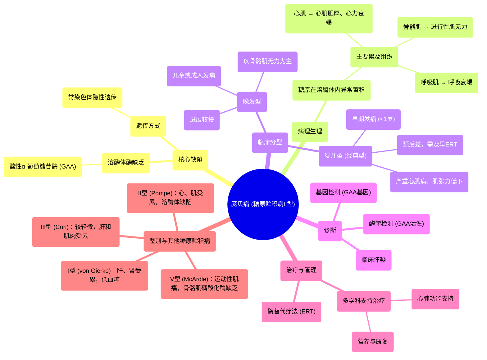

# 99 Pompe Disease (with a mnemonic) -Glycogen Storage Disease Type II (GSD-II) - Biochemistry & Genetics

  <video controls preload="metadata" playsinline>
    <source src="https://helly.s3.bitiful.net/心血管学科/%E4%B8%93%E8%BE%91%2018%EF%BC%9A%E5%BF%83%E5%86%85%E7%A7%91%E7%BB%88%E6%9E%81%E7%99%BE%E7%A7%91%E8%BE%9E%E5%85%B8%20%28The%20Cardiology%20Encyclopedia%29/99%20Pompe%20Disease%20%28with%20a%20mnemonic%29%20-Glycogen%20Storage%20Disease%20Type%20II%20%28GSD-II%29%20-%20Biochemistry%20%26%20Genetics.mp4" type="video/mp4">
    
您的浏览器不支持播放，请升级。

  </video>

::: tip ⚡️ 核心考点 (30s速读)
*   **核心考点**：庞贝病（糖原贮积病II型）是由于溶酶体内酸性α-葡萄糖苷酶（GAA）缺乏，导致糖原在溶酶体内（尤其是心肌和骨骼肌）异常堆积，引起进行性心肌病和肌无力。
*   **临床意义**：典型表现为婴儿期起病的心肌肥厚、心力衰竭、肌张力低下（“松软儿”），是糖原贮积病中唯一累及心脏的类型。记住口诀：“**庞贝病影响你的泵（心脏）**”。
:::

## 🧠 深度精讲

*   **疾病本质**：庞贝病是一种常染色体隐性遗传的溶酶体贮积症。其根本缺陷在于**酸性α-葡萄糖苷酶（GAA）** 的活性缺失或严重降低。该酶位于溶酶体内，负责分解糖原为葡萄糖。酶缺乏导致糖原无法被正常降解，从而在全身多个组织（尤其是心肌、骨骼肌和平滑肌）的溶酶体内异常蓄积，造成细胞损伤和器官功能障碍。

*   **关键病理生理**：与其它主要在细胞质中代谢糖原的糖原贮积病不同，庞贝病的糖原堆积发生在**溶酶体**内。这种“细胞垃圾处理站”的故障，导致糖原在心肌细胞中大量积累，引起心脏显著肥厚（尤其是左心室），最终发展为**扩张型心肌病、心力衰竭和心律失常**。在骨骼肌中则导致进行性肌无力。

*   **分型与表现**：
    *   **婴儿型（经典型）**：最严重，在出生后几个月内发病。表现为喂养困难、发育迟缓、严重肌张力低下（松软儿）、心脏显著肥大、心力衰竭、肝脏肿大和呼吸窘迫。若不治疗，常于1-2岁内死于心肺功能衰竭。
    *   **晚发型**：儿童期或成年后发病，病情进展较慢。主要表现为进行性近端肢体肌无力、呼吸肌受累（可导致睡眠呼吸障碍和呼吸衰竭），心脏受累较婴儿型轻或无。

*   **诊断与治疗**：
    *   **诊断**：临床怀疑后，可检测血液中GAA酶活性（干血片法或白细胞检测）进行初筛。基因检测（*GAA*基因突变分析）可确诊并指导遗传咨询。
    *   **治疗**：**酶替代疗法（ERT）** 是标准治疗方法，通过静脉输注重组人酸性α-葡萄糖苷酶，以补充体内缺乏的酶。早期开始ERT可显著改善预后，尤其是对婴儿型患者。此外，需多学科管理，包括心肺功能支持、营养支持和康复治疗。

*   **糖原代谢背景回顾**：理解庞贝病需置于糖原代谢整体框架中。在**进食（胰岛素主导）** 状态下，身体合成糖原（糖原生成）储存能量；在**空腹（胰高血糖素主导）** 状态下，分解糖原（糖原分解）释放葡萄糖。庞贝病的缺陷在于溶酶体这条“回收通路”，而非细胞质中的主要合成或分解通路。

## 📚 双语术语表 (Terminology)
| 英文术语 | 中文翻译 | 定义/解释 |
| :--- | :--- | :--- |
| Pompe Disease | 庞贝病 | 糖原贮积病II型，由酸性α-葡萄糖苷酶缺乏引起的溶酶体贮积症。 |
| Glycogen Storage Disease Type II (GSD-II) | 糖原贮积病II型 | 即庞贝病。 |
| Acid Alpha-Glucosidase (GAA) | 酸性α-葡萄糖苷酶 | 位于溶酶体内的酶，负责将糖原分解为葡萄糖。其缺乏导致庞贝病。 |
| Lysosomal Storage Disease | 溶酶体贮积症 | 一类因溶酶体功能缺陷导致大分子物质无法降解而贮积的遗传代谢病。 |
| Cardiomyopathy | 心肌病 | 心肌结构和功能异常，庞贝病常表现为肥厚型和扩张型心肌病。 |
| Enzyme Replacement Therapy (ERT) | 酶替代疗法 | 通过静脉输注重组酶来治疗酶缺乏疾病的方法，是庞贝病的标准疗法。 |
| Glycogen | 糖原 | 动物体内储存葡萄糖的多糖大分子。 |
| Glycogenesis | 糖原生成 | 由葡萄糖合成糖原的过程。 |
| Glycogenolysis | 糖原分解 | 将糖原分解为葡萄糖-1-磷酸的过程（主要发生在细胞质）。 |
| Insulin | 胰岛素 | 促进合成代谢（如糖原生成）的激素，主导进食状态。 |
| Glucagon | 胰高血糖素 | 促进分解代谢（如糖原分解、糖异生）的激素，主导空腹状态。 |

## 🗺️ 知识图谱

