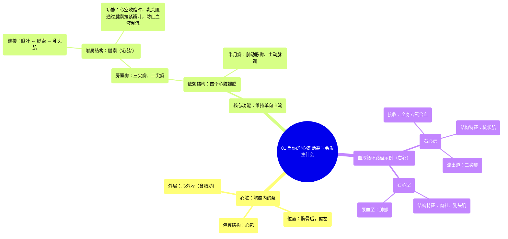

# 01 What Happens When Your Heartstrings Tear

  <video controls preload="metadata" playsinline>
    <source src="https://helly.s3.bitiful.net/心血管学科/%E4%B8%93%E8%BE%91%2019%EF%BC%9A%E5%BF%83%E5%86%85%E7%A7%91%E7%BB%88%E6%9E%81%E8%BE%9E%E5%85%B8%E5%9F%BA%E7%A1%80%E7%A7%91%E5%AD%A6%E7%AF%87/01%20What%20Happens%20When%20Your%20Heartstrings%20Tear.mp4" type="video/mp4">
    
您的浏览器不支持播放，请升级。

  </video>

::: tip ⚡️ 核心考点 (30s速读)
*   **核心考点**：心脏瓣膜（特别是三尖瓣和二尖瓣）通过“心弦”（即腱索）与乳头肌相连，防止血液在心室收缩时倒流回心房。
*   **临床意义**：腱索断裂或功能不全会导致瓣膜关闭不全，引起血液反流，可能引发心力衰竭、心律失常等严重后果。
:::

## 🧠 深度精讲

*   **心脏的位置与结构**：心脏位于胸腔中部，胸骨后方，约三分之二的质量偏向左胸。它被一个称为“心包”的囊状结构包裹，其外层可见“心外膜”及“心外膜脂肪”。
*   **心脏的功能与瓣膜**：心脏是一个单向泵，其核心功能是推动血液向前流动，防止倒流。这一功能依赖于四个心脏瓣膜。其中，三尖瓣（右心房与右心室之间）和二尖瓣（左心房与左心室之间）上附有“心弦”。
*   **“心弦”的解剖学本质**：“心弦”的医学名称是**腱索**。它们是坚韧的纤维条索，一端连接在瓣膜的瓣叶（瓣尖）上，另一端连接在心室壁的**乳头肌**上。
*   **“心弦”的工作原理**：当心室收缩时，乳头肌同时收缩，通过腱索“牵拉”瓣叶，使其紧密对合，从而防止血液从心室倒流回心房。视频中形象地比喻为“是什么在牵动你的心弦？答案是乳头肌。”
*   **右心房的角色**：右心房接收来自全身的、富含二氧化碳的“去氧合血液”，并通过三尖瓣将其送入右心室，最终泵入肺部进行气体交换。

## 📚 双语术语表 (Terminology)
| 英文术语 | 中文翻译 | 定义/解释 |
| :--- | :--- | :--- |
| Heartstrings / Chordae Tendineae | 心弦 / 腱索 | 连接心脏瓣膜瓣叶与乳头肌的纤维条索，防止血液反流。 |
| Tricuspid Valve | 三尖瓣 | 位于右心房和右心室之间的瓣膜，有三个瓣叶。 |
| Papillary Muscle | 乳头肌 | 心室壁上的锥形肌肉突起，通过收缩牵拉腱索以固定瓣膜。 |
| Right Atrium | 右心房 | 心脏右上方的腔室，接收全身回流的去氧合血液。 |
| Pericardium | 心包 | 包裹并保护心脏的纤维浆膜囊。 |
| Epicardium | 心外膜 | 心脏壁的最外层，常包含脂肪组织。 |
| Pectinate Muscle | 梳状肌 | 位于心房壁内的肌性隆起，形似梳齿。 |
| Trabeculae Carnae | 肉柱 | 心室壁内表面交织的肌性小梁。 |
| Aorta | 主动脉 | 人体最大的动脉，将含氧血从左心室输送至全身。 |

## 🗺️ 知识图谱

