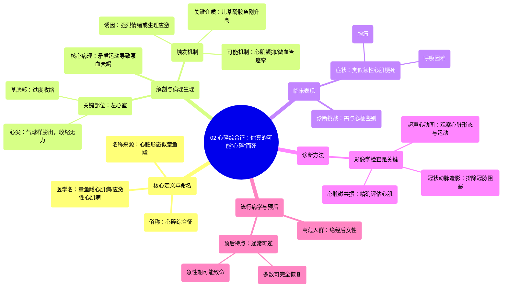

# 02 You Can Literally Die From a Broken Heart Broken Heart Syndrome

  <video controls preload="metadata" playsinline>
    <source src="https://helly.s3.bitiful.net/心血管学科/%E4%B8%93%E8%BE%91%2019%EF%BC%9A%E5%BF%83%E5%86%85%E7%A7%91%E7%BB%88%E6%9E%81%E8%BE%9E%E5%85%B8%E5%9F%BA%E7%A1%80%E7%A7%91%E5%AD%A6%E7%AF%87/02%20You%20Can%20Literally%20Die%20From%20a%20Broken%20Heart%20Broken%20Heart%20Syndrome.mp4" type="video/mp4">
    
您的浏览器不支持播放，请升级。

  </video>

::: tip ⚡️ 核心考点 (30s速读)
*   **核心考点**：应激性心肌病（心碎综合征）是一种由强烈情绪或生理应激触发的、可逆的心脏综合征，其特点是左心室心尖部出现短暂性、气球样膨出，导致泵血功能下降，症状与急性心肌梗死相似。
*   **临床意义**：该病好发于绝经后女性，诊断需依赖影像学检查（如超声心动图、心脏MRI）以区别于心肌梗死。虽然可能致命，但多数患者心脏功能可在数周至数月内完全恢复。
:::

## 🧠 深度精讲

*   **概念1：疾病定义与命名**
    *   应激性心肌病，俗称“心碎综合征”，医学上更准确的名称是**章鱼罐心肌病**。这个名字来源于日语“Takotsubo”，指一种捕捉章鱼的罐子。因为在该病中，心脏的左心室心尖部会像气球一样膨出，而心室基底部则过度收缩，使得心脏在影像学上的形态酷似这种底部宽大、颈部狭窄的章鱼罐。

*   **概念2：解剖基础与病理生理**
    *   **心脏结构回顾**：心脏分为左右两侧，每侧有上下两个腔室（心房和心室）。左心室是心脏最主要的泵血腔室，它将富含氧气的血液通过主动脉泵向全身。
    *   **关键解剖部位**：
        *   **心尖**：左心室最下端的尖部。
        *   **基底部**：左心室的上部，靠近主动脉出口。
    *   **病理过程**：在应激性心肌病中，心尖部心肌暂时性“麻痹”并向外膨出，无法有效收缩；而基底部心肌则代偿性过度收缩。这种“上紧下松”的矛盾运动导致心脏泵血效率急剧下降，引发心力衰竭症状。

*   **概念3：病因与触发因素**
    *   **核心触发**：强烈的情绪或生理应激事件是典型诱因，例如亲人离世、重大惊吓、激烈争吵、严重躯体疾病或手术等。
    *   **关键介质**：目前认为，应激事件导致体内**儿茶酚胺**（如肾上腺素、去甲肾上腺素）水平急剧、过度升高，这些“压力激素”可能对心肌细胞产生直接毒性作用或引起冠状动脉微血管痉挛，从而导致上述特征性的心脏形态和功能改变。确切机制仍在研究中，可能是多因素共同作用的结果。

*   **概念4：临床表现与诊断**
    *   **症状**：与急性心肌梗死高度相似，包括突发剧烈胸痛、呼吸困难、心悸，甚至出现心源性休克或猝死。
    *   **诊断挑战**：因其症状和心电图改变与心梗类似，极易误诊。**鉴别诊断至关重要**。
    *   **诊断金标准**：主要依靠影像学检查。
        *   **超声心动图**：可实时观察到左心室心尖部的气球样膨出和运动异常。
        *   **冠状动脉造影**：通常显示冠状动脉**没有**明显的阻塞性病变，这是与心肌梗死的关键区别。
        *   **心脏磁共振**：能更精确地评估心肌水肿和功能，并排除心肌坏死。

*   **概念5：流行病学与预后**
    *   **高危人群**：绝大多数患者为**绝经后女性**，具体原因尚不完全清楚，可能与雌激素水平变化、微血管功能差异及对儿茶酚胺的反应性不同有关。
    *   **预后**：虽然急性期可能危及生命，但本病通常是**可逆的**。在支持治疗下（如处理心力衰竭、心律失常），大多数患者的心脏结构和功能可在数周至数月内**完全或接近完全恢复**，这也是其与心肌梗死（通常造成永久性心肌损伤）的另一重要区别。

## 📚 双语术语表 (Terminology)
| 英文术语 | 中文翻译 | 定义/解释 |
| :--- | :--- | :--- |
| Takotsubo Cardiomyopathy | 章鱼罐心肌病 / 应激性心肌病 | 由应激触发，以左心室心尖部气球样膨出为特征的可逆性心肌病。 |
| Broken Heart Syndrome | 心碎综合征 | 章鱼罐心肌病的俗称。 |
| Left Ventricle | 左心室 | 心脏的主要泵血腔室，将氧合血泵入主动脉。 |
| Apex of the heart | 心尖 | 心脏左心室最下端的尖端部分。 |
| Base of the left ventricle | 左心室基底部 | 左心室的上部，靠近主动脉出口。 |
| Catecholamines | 儿茶酚胺 | 一类应激激素，包括肾上腺素和去甲肾上腺素。 |
| Epinephrine / Adrenaline | 肾上腺素 | 主要的“战斗或逃跑”激素，由肾上腺分泌。 |
| Norepinephrine | 去甲肾上腺素 | 一种神经递质和激素，也参与应激反应。 |
| Echocardiogram | 超声心动图 | 利用超声波成像显示心脏结构和功能的检查。 |
| Angiogram | 血管造影 | 通过注入造影剂在X光下显示血管形态的检查。 |
| MRI (Magnetic Resonance Imaging) | 磁共振成像 | 利用磁场和无线电波生成详细身体结构图像的检查。 |

## 🗺️ 知识图谱

