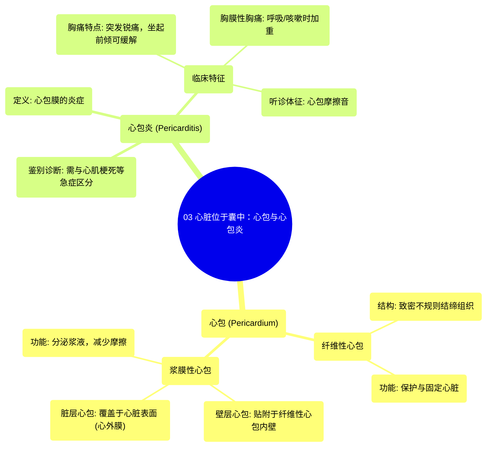

# 03 Your Heart Sits In a Sac Pericardium & Pericarditis

  <video controls preload="metadata" playsinline>
    <source src="https://helly.s3.bitiful.net/心血管学科/%E4%B8%93%E8%BE%91%2019%EF%BC%9A%E5%BF%83%E5%86%85%E7%A7%91%E7%BB%88%E6%9E%81%E8%BE%9E%E5%85%B8%E5%9F%BA%E7%A1%80%E7%A7%91%E5%AD%A6%E7%AF%87/03%20Your%20Heart%20Sits%20In%20a%20Sac%20Pericardium%20%26%20Pericarditis.mp4" type="video/mp4">
    
您的浏览器不支持播放，请升级。

  </video>

::: tip ⚡️ 核心考点 (30s速读)
*   **核心考点**：心包是包裹心脏的双层囊状结构，分为坚韧的纤维性心包和内衬的浆膜性心包。浆膜性心包又分为壁层和脏层，其间的浆液可减少心脏跳动时的摩擦。
*   **临床意义**：心包炎是心包的炎症，典型表现为突发性锐痛、坐起前倾可缓解、胸痛随呼吸/咳嗽加重（胸膜性胸痛），听诊可闻及心包摩擦音，需与心肌梗死等急症鉴别。
:::

## 🧠 深度精讲

*   **心包的结构与功能**：心包是一个包裹并保护心脏的囊。它由两层融合而成：外层是坚韧的**纤维性心包**，由致密不规则结缔组织构成，起到固定和保护心脏的作用；内层是光滑的**浆膜性心包**，能分泌**浆液**。浆膜性心包进一步分为紧贴纤维性心包内壁的**壁层心包**，以及直接覆盖在心脏表面的**脏层心包**。壁层与脏层之间的潜在腔隙（心包腔）内有少量浆液，起到润滑作用，显著减少心脏搏动时的摩擦。
*   **心包炎的临床特征**：当心包发生炎症（心包炎）时，患者常出现胸痛。其疼痛特点有助于鉴别诊断：① **性质与发作**：多为突发、尖锐的疼痛；② **体位影响**：坐起并身体前倾时疼痛常可减轻；③ **呼吸影响**：疼痛在深呼吸或咳嗽时加剧，称为**胸膜性胸痛**。此外，医生听诊时可在心前区听到一种特殊的**心包摩擦音**，这是由于发炎、粗糙的心包壁层和脏层在心脏搏动时相互摩擦产生的声音。

## 📚 双语术语表 (Terminology)
| 英文术语 | 中文翻译 | 定义/解释 |
| :--- | :--- | :--- |
| Pericardium | 心包 | 包裹心脏的双层纤维浆膜囊，具有保护、固定和润滑心脏的功能。 |
| Fibrous Pericardium | 纤维性心包 | 心包的外层，由坚韧的致密不规则结缔组织构成，起主要保护和固定作用。 |
| Serous Pericardium | 浆膜性心包 | 心包的内层，为光滑的浆膜，能分泌浆液。进一步分为壁层和脏层。 |
| Parietal Pericardium | 壁层心包 | 浆膜性心包的一部分，紧贴并附着于纤维性心包的内表面。 |
| Visceral Pericardium | 脏层心包 | 浆膜性心包的一部分，直接覆盖并附着于心脏肌肉（心肌）的表面，即心外膜。 |
| Serous Fluid | 浆液 | 由浆膜性心包分泌的油性液体，存在于心包腔内，用于减少心脏搏动时的摩擦。 |
| Pericarditis | 心包炎 | 心包膜的炎症性疾病。 |
| Pleuritic Chest Pain | 胸膜性胸痛 | 一种随深呼吸或咳嗽而加重的胸痛，是心包炎的典型特征之一。 |
| Pericardial Friction Rub | 心包摩擦音 | 心包炎时，听诊器在胸壁可听到的一种由发炎的心包层相互摩擦产生的粗糙搔刮样声音。 |

## 🗺️ 知识图谱

