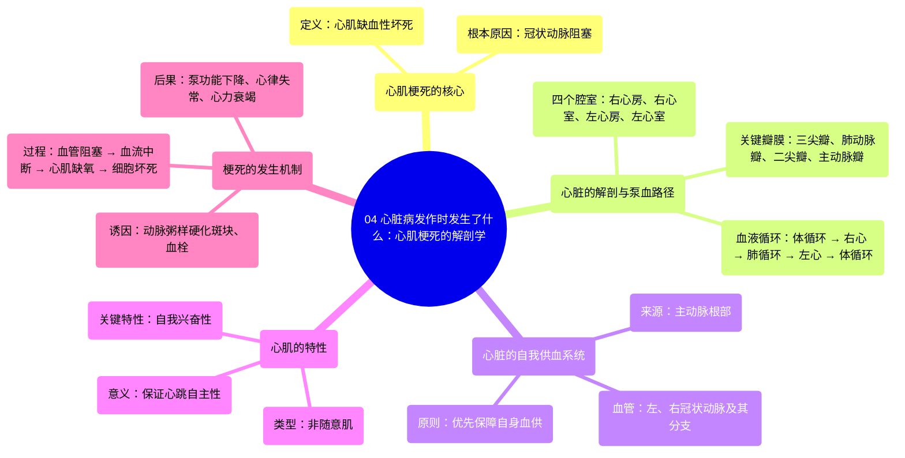

# 04 What Happens During a Heart Attack Anatomy of a Heart Attack

  <video controls preload="metadata" playsinline>
    <source src="https://helly.s3.bitiful.net/心血管学科/%E4%B8%93%E8%BE%91%2019%EF%BC%9A%E5%BF%83%E5%86%85%E7%A7%91%E7%BB%88%E6%9E%81%E8%BE%9E%E5%85%B8%E5%9F%BA%E7%A1%80%E7%A7%91%E5%AD%A6%E7%AF%87/04%20What%20Happens%20During%20a%20Heart%20Attack%20Anatomy%20of%20a%20Heart%20Attack.mp4" type="video/mp4">
    
您的浏览器不支持播放，请升级。

  </video>

::: tip ⚡️ 核心考点 (30s速读)
*   **核心考点**：心肌梗死（心脏病发作）的本质是心肌因冠状动脉阻塞而缺血缺氧，导致的心肌组织坏死。
*   **临床意义**：这是全球最主要的死亡原因之一。理解其解剖和生理基础（心脏血供、冠状动脉作用）是预防和急救的关键。
:::

## 🧠 深度精讲

*   **概念1：心肌梗死的定义与本质**
    *   心肌梗死（Myocardial Infarction），俗称“心脏病发作”，其核心是“梗死”（Infarction），即任何组织因缺氧而发生的坏死。
    *   对于心脏而言，缺氧的直接原因是向心肌供血的**冠状动脉**发生阻塞，导致富含氧气的血液无法到达下游的心肌组织。

*   **概念2：心脏的泵血结构与血液循环路径**
    *   心脏分为左右两侧，每侧有上方的**心房**和下方的**心室**。
    *   **右心（负责肺循环）**：全身回流的脱氧血 → 右心房 → 三尖瓣 → 右心室 → 肺动脉瓣 → 肺动脉 → 肺部（获取氧气）。
    *   **左心（负责体循环）**：肺部回来的富氧血 → 左心房 → 二尖瓣 → 左心室 → 主动脉瓣 → **主动脉** → 供应全身（包括心脏自身）。

*   **概念3：心脏的自我供血——冠状动脉系统**
    *   心脏作为“泵”，必须优先保障自身的能量供应。它通过直接从**主动脉**根部发出的**冠状动脉**来获取富氧血。
    *   冠状动脉像树冠一样分支，遍布整个心脏表面，深入心肌，确保每一块心肌都能获得营养和氧气。

*   **概念4：心肌的特性与梗死的后果**
    *   心肌属于**非随意肌**，但具有**自我兴奋**的能力，即使没有大脑指令也能自主、有节律地收缩，这对维持生命至关重要。
    *   当冠状动脉因斑块（胆固醇沉积）破裂或血栓（血凝块）堵塞时，下游心肌会迅速缺血。心肌细胞对缺氧极其敏感，短时间内（通常20-30分钟）即可开始发生不可逆的坏死，即心肌梗死。坏死的区域越大，心脏泵血功能受损越严重，可导致心力衰竭、心律失常甚至猝死。

## 📚 双语术语表 (Terminology)
| 英文术语 | 中文翻译 | 定义/解释 |
| :--- | :--- | :--- |
| Cardiovascular disease | 心血管疾病 | 影响心脏和血管的一系列疾病的总称，是全球头号死因。 |
| Myocardial Infarction (MI) | 心肌梗死 | 由于冠状动脉阻塞导致部分心肌缺血、缺氧而发生的坏死。俗称“心脏病发作”。 |
| Infarction | 梗死 | 组织因血液供应中断而导致的局部坏死。 |
| Necrosis | 坏死 | 活体内局部组织、细胞的病理性死亡。 |
| Atrium (pl. Atria) | 心房 | 心脏上部的腔室，负责接收回心血液。 |
| Ventricle | 心室 | 心脏下部的腔室，肌肉壁厚，负责将血液泵出心脏。 |
| Tricuspid Valve | 三尖瓣 | 位于右心房和右心室之间的瓣膜，防止血液回流。 |
| Mitral Valve | 二尖瓣 | 位于左心房和左心室之间的瓣膜。 |
| Aorta | 主动脉 | 人体最大的动脉，从左心室发出，将富氧血输送至全身。 |
| Coronary Arteries | 冠状动脉 | 从主动脉根部发出，专门为心脏心肌供血的动脉。 |
| Cardiac Muscle | 心肌 | 构成心脏壁的肌肉组织，具有不随意性和自我兴奋性。 |
| Self-excitation | 自我兴奋 | 心肌细胞无需外部神经刺激即可自发产生节律性电活动的特性。 |
| Plaque | 斑块 | 在动脉壁内形成的由胆固醇、脂肪、钙等物质组成的沉积物，是动脉粥样硬化的特征。 |

## 🗺️ 知识图谱

