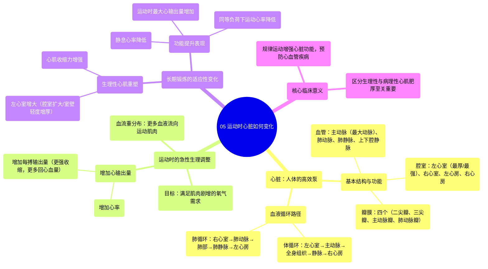

# 05 How the Heart Changes with Exercise

  <video controls preload="metadata" playsinline>
    <source src="https://helly.s3.bitiful.net/心血管学科/%E4%B8%93%E8%BE%91%2019%EF%BC%9A%E5%BF%83%E5%86%85%E7%A7%91%E7%BB%88%E6%9E%81%E8%BE%9E%E5%85%B8%E5%9F%BA%E7%A1%80%E7%A7%91%E5%AD%A6%E7%AF%87/05%20How%20the%20Heart%20Changes%20with%20Exercise.mp4" type="video/mp4">
    
您的浏览器不支持播放，请升级。

  </video>

::: tip ⚡️ 核心考点 (30s速读)
*   **核心考点**：运动时，心脏通过增加心输出量（心率×每搏输出量）来满足肌肉组织急剧增加的氧气需求。长期规律锻炼，心脏会发生结构性适应，如左心室心肌肥厚（生理性），泵血能力增强。
*   **临床意义**：理解心脏的运动适应性是运动生理学和心脏康复的基础。规律运动能增强心脏功能，降低心血管疾病风险；而病理性心肌肥厚（如高血压所致）则增加心衰风险，需加以区分。
:::

## 🧠 深度精讲

*   **心脏的基本功能与结构**：心脏是一个肌肉泵，主要功能是将含氧血泵送至全身组织（特别是运动中的肌肉），并回收脱氧血至肺部进行气体交换。其最强大的腔室是**左心室**，负责将血液泵入**主动脉**（人体最大的动脉），再经各级动脉分支输送至全身。
*   **运动时的急性调整**：从静息到剧烈运动，肌肉需氧量剧增。为满足需求，心脏做出以下即时调整：
    1.  **增加心率**：单位时间内心跳次数增加。
    2.  **增加每搏输出量**：左心室每次收缩泵出的血量增加。这主要通过增强心肌收缩力和优化静脉回心血量实现。
    3.  **增加心输出量**：心输出量 = 心率 × 每搏输出量。运动时心输出量可显著增加（如从静息时的约5 L/min增至剧烈运动时的20-25 L/min或更高）。
    4.  **血流重分布**：通过血管舒缩，将更多血液（心输出量的比例）从内脏器官重新分配至运动的骨骼肌。
*   **长期锻炼的适应性变化**：规律运动（尤其是有氧运动）可诱导心脏发生有益的生理性重塑：
    1.  **心脏增大**：主要表现为**左心室腔室扩大**和/或**室壁轻度增厚**（生理性心肌肥厚），这增强了心脏的泵血能力和效率。
    2.  **每搏输出量增加**：结构改变使心脏在每次跳动时能泵出更多血液，因此在相同心率下，心输出量更大，或在完成相同工作量时心率更低（运动心率下降）。
    3.  **静息心率降低**：心脏泵血效率提高，无需频繁跳动即可满足身体需求，这是心脏功能增强的标志之一。
*   **血液循环路径回顾（结合运动）**：运动肌肉消耗氧气并产生二氧化碳 → 脱氧血经**毛细血管** → **微静脉** → **静脉**（如股静脉）→ **右心房** → **右心室** → 泵入**肺动脉**至肺部进行气体交换（排出CO₂，摄取O₂）→ 含氧血经**肺静脉** → **左心房** → **左心室** → 泵入**主动脉**，开始新一轮循环。运动极大地加速和放大了这一过程。

## 📚 双语术语表 (Terminology)
| 英文术语 | 中文翻译 | 定义/解释 |
| :--- | :--- | :--- |
| Heart | 心脏 | 位于胸腔内的肌性器官，作为循环系统的动力泵。 |
| Left Ventricle | 左心室 | 心脏最厚、最有力的腔室，负责将含氧血泵入主动脉，供应全身。 |
| Aorta | 主动脉 | 人体内最粗大的动脉血管，起始于左心室，是体循环动脉系统的总干。 |
| Artery | 动脉 | 将血液从心脏运送到身体各部位的血管，管壁较厚，弹性好。 |
| Capillary | 毛细血管 | 连接微动脉和微静脉的极细微血管网，是血液与组织细胞进行物质交换（如O₂、CO₂）的主要场所。 |
| Venule | 微静脉 | 收集毛细血管血液并汇合形成静脉的细小血管。 |
| Vein | 静脉 | 将血液从身体各部位运回心脏的血管，管壁较薄，弹性较小，多数有静脉瓣防止血液倒流。 |
| Cardiac Output | 心输出量 | 每分钟一侧心室泵出的血液总量，等于心率与每搏输出量的乘积，是衡量心脏泵血功能的核心指标。 |
| Stroke Volume | 每搏输出量 | 一次心搏中，一侧心室射出的血液量。 |
| Heart Rate | 心率 | 每分钟心脏跳动的次数。 |
| Physiological Hypertrophy | 生理性心肌肥厚 | 长期规律运动引起的心脏（尤其是左心室）壁适度增厚和/或腔室扩大，属于有益的功能性适应。 |

## 🗺️ 知识图谱

