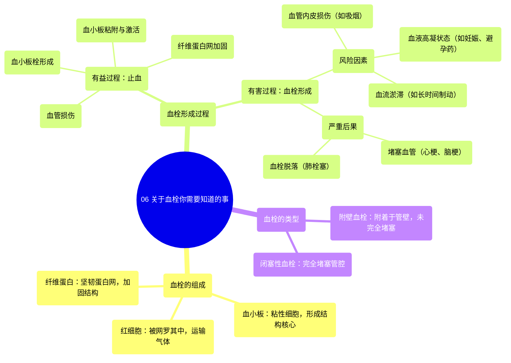

# 06 What You NEED to Know About Blood Clots

  <video controls preload="metadata" playsinline>
    <source src="https://helly.s3.bitiful.net/心血管学科/%E4%B8%93%E8%BE%91%2019%EF%BC%9A%E5%BF%83%E5%86%85%E7%A7%91%E7%BB%88%E6%9E%81%E8%BE%9E%E5%85%B8%E5%9F%BA%E7%A1%80%E7%A7%91%E5%AD%A6%E7%AF%87/06%20What%20You%20NEED%20to%20Know%20About%20Blood%20Clots.mp4" type="video/mp4">
    
您的浏览器不支持播放，请升级。

  </video>

::: tip ⚡️ 核心考点 (30s速读)
*   **核心考点**：血栓是血小板、红细胞和纤维蛋白组成的固体团块。其形成过程分为有益的“止血”和有害的“血栓形成”。
*   **临床意义**：血栓可堵塞血管，导致心肌梗死、脑卒中等严重后果。长时间制动、吸烟、妊娠等是常见风险因素。
:::

## 🧠 深度精讲

*   **血栓的组成**：一个完整的血栓（血栓）由三种主要成分构成：
    *   **血小板**：粘性细胞，是血栓结构的核心，负责初始的粘附和聚集。
    *   **红细胞**：被网罗在血栓结构中，主要功能是运输气体。
    *   **纤维蛋白**：一种坚韧的蛋白质，由凝血酶作用于纤维蛋白原转化而来，形成坚固的网状结构，加固血栓。

*   **有益的血栓形成：止血**
    *   **定义**：身体为阻止出血而发生的自然过程。
    *   **过程**：
        1.  **血管损伤**：血管壁破裂，血液流出。
        2.  **血小板粘附与激活**：流动的血小板接触到损伤处，粘附于血管壁并被激活。
        3.  **血小板栓形成**：激活的血小板释放化学信号，吸引更多血小板和红细胞聚集，形成松软的“血小板栓”，初步堵塞破口。
        4.  **纤维蛋白网加固**：血液中的凝血酶在血小板表面被激活，将可溶性的纤维蛋白原转化为不溶性的纤维蛋白。纤维蛋白交织成网，牢牢网住血小板和红细胞，形成坚固的“纤维蛋白网凝块”，完成止血。

*   **有害的血栓形成：血栓形成**
    *   **定义**：在未发生出血的完整血管内形成血栓。
    *   **风险因素**：
        *   **血管内皮损伤**：如吸烟、高血压。
        *   **血液高凝状态**：如妊娠、服用某些避孕药、遗传性疾病。
        *   **血流淤滞**：**长时间制动**（如术后卧床、长途飞行、轮椅生活），因压迫血管导致血流缓慢，极易引发血小板和红细胞聚集形成血栓。
    *   **后果**：血栓可能堵塞血管，阻断下游组织的血液供应，引发组织缺血坏死（如心梗、脑梗）。血栓也可能脱落，随血流移动形成“栓子”，堵塞远端血管（如肺栓塞）。

*   **血栓的类型（基于形态）**
    *   **附壁血栓**：附着于心脏或大血管壁，但不完全堵塞管腔的血栓。
    *   **闭塞性血栓**：完全堵塞血管腔的血栓。

## 📚 双语术语表 (Terminology)
| 英文术语 | 中文翻译 | 定义/解释 |
| :--- | :--- | :--- |
| Thrombus | 血栓 | 在心血管系统内，由血液成分形成的固体团块。 |
| Platelet (Thrombocyte) | 血小板 | 血液中的无核细胞碎片，在止血和血栓形成中起关键粘附、聚集作用。 |
| Fibrin | 纤维蛋白 | 由纤维蛋白原经凝血酶作用转化而来的不溶性蛋白质，形成加固血栓的网状结构。 |
| Fibrinogen | 纤维蛋白原 | 血液中可溶性的蛋白质，是纤维蛋白的前体。 |
| Hemostasis | 止血 | 机体为阻止血管损伤后出血而启动的一系列生理过程。 |
| Thrombosis | 血栓形成 | 在活体的心脏或血管腔内，血液发生凝固或血液中某些有形成分凝集形成固体质块的过程。 |
| Mural Thrombus | 附壁血栓 | 附着于心腔或血管壁，未完全阻塞管腔的血栓。 |
| Occlusive Thrombus | 闭塞性血栓 | 完全阻塞血管腔的血栓。 |

## 🗺️ 知识图谱

