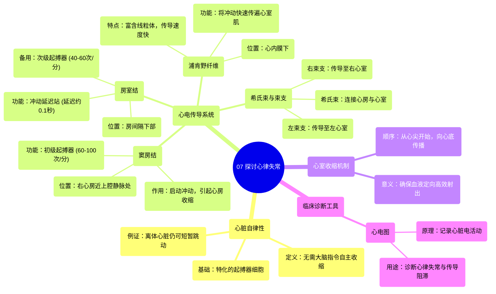

# 07 Let's Talk About Irregular Heartbeats

  <video controls preload="metadata" playsinline>
    <source src="https://helly.s3.bitiful.net/心血管学科/%E4%B8%93%E8%BE%91%2019%EF%BC%9A%E5%BF%83%E5%86%85%E7%A7%91%E7%BB%88%E6%9E%81%E8%BE%9E%E5%85%B8%E5%9F%BA%E7%A1%80%E7%A7%91%E5%AD%A6%E7%AF%87/07%20Let%27s%20Talk%20About%20Irregular%20Heartbeats.mp4" type="video/mp4">
    
您的浏览器不支持播放，请升级。

  </video>

::: tip ⚡️ 核心考点 (30s速读)
*   **核心考点**：心脏的“自律性”与“心电传导系统”是理解其规律跳动的基础。窦房结是天然起搏器，房室结是“安全备份”，浦肯野纤维确保心室协调收缩。
*   **临床意义**：传导系统任一环节（如窦房结、房室结、束支）的病变都会导致心律失常。心电图是诊断这些异常的关键工具。
:::

## 🧠 深度精讲
*   **心脏的自律性**：心脏最独特的能力之一是“自律性”，即无需大脑指令即可自主、有节律地收缩。这依赖于心脏内部特化的“起搏器细胞”。即使将心脏从体内取出，它仍能自主跳动数分钟，直到缺氧停止。
*   **心电传导系统的结构与功能**：心脏的规律收缩依赖于一个精密的“心电传导系统”。这个系统像电路一样，确保电信号有序传播，引发协调的肌肉收缩。
    1.  **窦房结**：位于右心房与上腔静脉交界处，是心脏的“总司令”和天然起搏器。它自发产生电冲动（约60-100次/分钟），首先引起心房收缩。
    2.  **房室结**：位于房间隔下部，是关键的“延迟站”。它将来自窦房结的冲动延迟约0.1秒，确保心房有足够时间将血液完全排入心室后，心室再收缩。如果窦房结失效，房室结可作为备用起搏器（40-60次/分钟），维持心跳。
    3.  **希氏束与束支**：冲动通过房室结后，进入希氏束（以发现者Wilhelm His Jr.命名）。希氏束穿过纤维环，在室间隔内分为“左束支”和“右束支”，分别将电信号传向左、右心室。
    4.  **浦肯野纤维**：束支的终末分支，是位于心内膜下、富含线粒体的特化传导纤维网络。它们将电信号快速传递至整个心室的心肌细胞。
*   **心室收缩的顺序与意义**：电信号通过浦肯野纤维网，首先引起心尖部（心脏最下端的尖端）心肌收缩，然后向上（心底方向）传播。这种“从下至上”的收缩方式，像挤牙膏一样，能最有效地将血液定向射入主动脉和肺动脉，极大提高了泵血效率。如果心室各处同时收缩，血液会乱流，效率极低。
*   **心电图的应用**：心电图是记录心脏电活动随时间变化的图形。通过分析心电图波形的形态、间期和节律，医生可以判断心电传导系统是否正常，精准定位心律失常（如传导阻滞、早搏等）的发生部位，是心血管疾病诊断不可或缺的工具。

## 📚 双语术语表 (Terminology)
| 英文术语 | 中文翻译 | 定义/解释 |
| :--- | :--- | :--- |
| Self-excitation / Automaticity | 自律性 | 心脏无需外部神经刺激即可自发产生节律性电冲动的特性。 |
| Pacemaker cells | 起搏器细胞 | 心脏内特化的、能够自发产生动作电位并启动心跳的细胞。 |
| Sinoatrial node (SA node) | 窦房结 | 位于右心房上部，是正常心脏的初级起搏点，决定心率。 |
| Atrioventricular node (AV node) | 房室结 | 位于房间隔下部，能延迟电冲动传导，确保心房心室顺序收缩；也是次级起搏点。 |
| Bundle of His | 希氏束 | 连接房室结与心室束支的传导纤维束。 |
| Bundle branches (Left/Right) | 束支（左/右） | 希氏束在室间隔内的分支，分别将冲动传向左、右心室。 |
| Purkinje fibers | 浦肯野纤维 | 位于心内膜下的终末传导纤维网络，负责将电冲动快速传递至整个心室肌。 |
| Endocardium | 心内膜 | 心脏壁的最内层，与血液直接接触，浦肯野纤维分布于此层下。 |
| Myocardium | 心肌层 | 心脏壁的中层，由心肌细胞构成，负责心脏的收缩功能。 |
| Apex of the heart | 心尖 | 心脏的左下尖端，心室收缩通常由此开始。 |
| Electrocardiogram (ECG/EKG) | 心电图 | 记录心脏电活动变化的图形，用于诊断心脏节律和传导异常。 |

## 🗺️ 知识图谱

