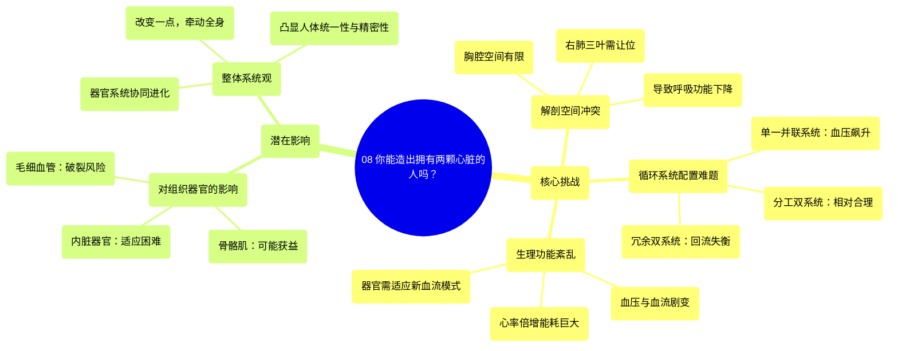

# 08 Can YOU Build a Human With TWO Hearts

  <video controls preload="metadata" playsinline>
    <source src="https://helly.s3.bitiful.net/心血管学科/%E4%B8%93%E8%BE%91%2019%EF%BC%9A%E5%BF%83%E5%86%85%E7%A7%91%E7%BB%88%E6%9E%81%E8%BE%9E%E5%85%B8%E5%9F%BA%E7%A1%80%E7%A7%91%E5%AD%A6%E7%AF%87/08%20Can%20YOU%20Build%20a%20Human%20With%20TWO%20Hearts.mp4" type="video/mp4">
    
您的浏览器不支持播放，请升级。

  </video>

::: tip ⚡️ 核心考点 (30s速读)
*   **核心考点**：探讨人体拥有两个心脏在解剖结构、循环系统、生理功能及器官适应性方面面临的巨大挑战。
*   **临床意义**：理解单心脏循环系统的精妙设计与高效性，以及多泵系统可能带来的血压失控、器官功能紊乱等严重后果，有助于深入认识心血管生理的复杂性和人体作为一个统一整体的重要性。
:::

## 🧠 深度精讲

*   **概念1：解剖位置与空间冲突**
    视频指出，安置第二个心脏最合理的位置是胸腔，以利用肋骨和胸骨的保护。然而，右侧胸腔空间有限，因为右肺有三个肺叶。若要容纳第二个心脏，可能需要牺牲一个肺叶，这将导致整体呼吸功能下降。身体可能通过增加红细胞计数来适应较低的氧气水平（类似于高原反应），但这又会增加血液粘稠度，进而推高血压。

*   **概念2：循环系统配置方案**
    视频讨论了三种可能的配置方案：
    1.  **单一并联系统**：两个心脏泵入同一套血管系统。这会导致血压急剧升高（“血压会冲破屋顶”），对脆弱的毛细血管（尤其是心脏附近的）造成巨大压力，可能导致其破裂出血。
    2.  **冗余双系统**：建立两套独立但路径完全相同的心血管系统，旨在实现冗余备份（一个心脏停跳，另一个可接管）。但问题在于静脉回流的平衡难以保证，因为静脉压很低，依赖肌肉收缩，日常活动可能导致一个系统的回流优于另一个，造成血流动力学失衡。
    3.  **分工双系统**：两个心脏分别负责不同的身体区域（例如，一个负责内脏器官和大脑，另一个负责肌肉、骨骼和皮肤）。这被认为是最合理的方案，因为它避免了单一系统下的血压剧增问题，并且可以根据供应区域的需求调整每个心脏的大小。

*   **概念3：生理挑战与器官适应**
    1.  **血压与血流**：在单一并联系统中，双泵同时工作会使血压飙升。即使在分工系统中，稳定的血流（而非搏动性血流）对全身器官也是一个巨大挑战。人体所有器官都已进化到适应单心脏产生的搏动性血流周期（收缩期和舒张期），突然改为稳定血流，需要每个器官和组织进行大规模的功能重塑，这是一项“巨大的任务”。
    2.  **心率与能耗**：如果两个心脏独立跳动，静息合并心率可能高达160-200次/分钟，这本身就“听起来让人精疲力尽”，会极大增加心脏自身的能耗。
    3.  **器官获益不均**：骨骼肌可能从更稳定的血流中获益最大，提升耐力和恢复能力。但对于大多数内脏器官，稳定的血流不一定能提升其效率，反而可能因为它们需要参与管理新的心脏而增加负担。

*   **概念4：整体系统观**
    视频最后强调了一个关键点：人体每一个器官系统都是与其他系统协同进化而来的。改变一个核心系统（如循环系统），并不意味着其他系统（如呼吸、泌尿、神经系统）会自动做出完美适配的反应。这凸显了人体作为一个高度整合、精密平衡的有机整体的复杂性。

## 📚 双语术语表 (Terminology)
| 英文术语 | 中文翻译 | 定义/解释 |
| :--- | :--- | :--- |
| Thoracic cavity | 胸腔 | 由胸廓围成的体腔，内含心脏、肺、大血管等重要器官。 |
| Vasculature | 血管系统 | 血管的整个网络，包括动脉、静脉和毛细血管。 |
| Binary circulatory system | 双循环系统 | 指拥有两套独立或部分独立的心脏和血管网络的设想系统。 |
| Redundancy | 冗余性 | 系统设计中的备份能力，指一个部件失效时，另一个可接管其功能。 |
| Capillaries | 毛细血管 | 体内最微小的血管，是血液与组织细胞进行物质交换的主要场所，管壁极薄。 |
| Venous return | 静脉回流 | 血液通过静脉系统流回心脏的过程。 |
| Cardiac cycle | 心脏周期 | 心脏一次完整的收缩（ systole ）和舒张（ diastole ）过程。 |
| Skeletal muscles | 骨骼肌 | 附着在骨骼上，受意识支配的肌肉，负责身体运动。 |

## 🗺️ 知识图谱

