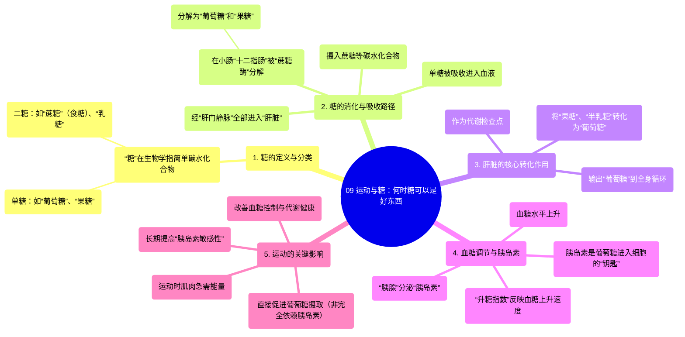

# 09 Exercise & Sugar When Sugar Can Be a Good Thing

  <video controls preload="metadata" playsinline>
    <source src="https://helly.s3.bitiful.net/心血管学科/%E4%B8%93%E8%BE%91%2019%EF%BC%9A%E5%BF%83%E5%86%85%E7%A7%91%E7%BB%88%E6%9E%81%E8%BE%9E%E5%85%B8%E5%9F%BA%E7%A1%80%E7%A7%91%E5%AD%A6%E7%AF%87/09%20Exercise%20%26%20Sugar%20When%20Sugar%20Can%20Be%20a%20Good%20Thing.mp4" type="video/mp4">
    
您的浏览器不支持播放，请升级。

  </video>

::: tip ⚡️ 核心考点 (30s速读)
*   **核心考点**：运动能显著改善身体对糖（主要是葡萄糖）的加工、利用和储存能力。糖（如蔗糖）在体内必须被分解为单糖（葡萄糖、果糖）才能吸收，并由肝脏统一转化为葡萄糖供身体利用。胰岛素是调节血糖进入细胞的关键激素。
*   **临床意义**：理解糖的代谢路径有助于解释为何过量摄入精制糖（高升糖指数）会导致血糖剧烈波动，而运动可以增强胰岛素敏感性，帮助更有效地管理血糖水平，这对于预防和管理2型糖尿病、代谢综合征等至关重要。
:::

## 🧠 深度精讲

*   **糖的分类与消化吸收**：视频中澄清了“糖”在生物学上主要指“简单碳水化合物”，包括“单糖”（如葡萄糖、果糖）和“二糖”（如蔗糖、乳糖）。我们摄入的食糖（蔗糖）是一种二糖，身体无法直接吸收。它需要在“小肠”的“十二指肠”部位，由“蔗糖酶”分解为“葡萄糖”和“果糖”这两种单糖，然后才能穿过肠壁被吸收进入血液。

*   **肝脏的核心作用——代谢检查点**：被吸收的“单糖”通过“肝门静脉”首先全部进入“肝脏”。肝脏扮演着关键“检查点”的角色：它会捕获所有的“果糖”和“半乳糖”（来自乳糖），并将它们转化为“葡萄糖”。这意味着，无论摄入何种碳水化合物，其代谢的“最终产物”都是“葡萄糖”。这解释了为什么临床只监测“血糖”（即血液中的葡萄糖水平）。

*   **血糖调节与胰岛素**：“葡萄糖”进入血液后，导致“血糖水平”上升。上升的速度由食物的“升糖指数”衡量，高升糖指数食物（如精制淀粉、含糖饮料）会引起血糖快速飙升。升高的血糖会刺激“胰腺”释放“胰岛素”。“胰岛素”是允许葡萄糖从血液进入全身大多数细胞（如肌肉、脂肪细胞）的必需“钥匙”。没有胰岛素（如1型糖尿病），葡萄糖就无法进入细胞，导致高血糖。

*   **运动的关键影响**：视频的核心论点之一是运动如何改变这一过程。运动时，肌肉需要大量能量，这会通过多种机制（如增加肌肉细胞膜上的葡萄糖转运蛋白）极大地促进葡萄糖的摄取和利用，**即使在不依赖大量胰岛素的情况下也能进行**。长期运动还能提高“胰岛素敏感性”，意味着身体需要更少的胰岛素就能有效降低血糖，这是运动改善代谢健康的核心机制之一。

## 📚 双语术语表 (Terminology)
| 英文术语 | 中文翻译 | 定义/解释 |
| :--- | :--- | :--- |
| Monosaccharide | 单糖 | 最简单的碳水化合物形式，由单个糖分子构成，如葡萄糖、果糖。 |
| Disaccharide | 二糖 | 由两个单糖分子连接而成，如蔗糖（葡萄糖+果糖）、乳糖（葡萄糖+半乳糖）。 |
| Sucrose | 蔗糖 | 常见的食糖，是一种二糖。 |
| Glucose | 葡萄糖 | 人体最主要的能量来源，是血糖监测的指标，所有膳食碳水化合物代谢的最终核心产物。 |
| Fructose | 果糖 | 一种单糖，天然存在于水果和蜂蜜中，在肝脏中代谢并转化为葡萄糖。 |
| Liver / Hepatic | 肝脏 / 肝的 | 人体最大的代谢器官，负责将果糖等单糖转化为葡萄糖，是糖代谢的重要枢纽。 |
| Insulin | 胰岛素 | 由胰腺分泌的激素，其主要功能是促进葡萄糖从血液进入细胞，降低血糖水平。 |
| Glycemic Index (GI) | 升糖指数 | 衡量含碳水化合物食物引起血糖升高速度和程度的指标。 |
| Skeletal Muscle | 骨骼肌 | 附着在骨骼上的肌肉，是运动时消耗葡萄糖的主要场所。 |

## 🗺️ 知识图谱

