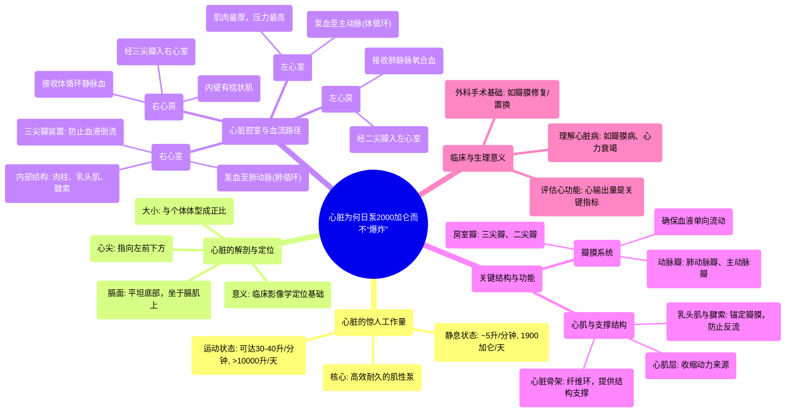

# 10 Why Your Heart Doesn't EXPLODE Pumping 2000 Gallons a Day

  <video controls preload="metadata" playsinline>
    <source src="https://helly.s3.bitiful.net/心血管学科/%E4%B8%93%E8%BE%91%2019%EF%BC%9A%E5%BF%83%E5%86%85%E7%A7%91%E7%BB%88%E6%9E%81%E8%BE%9E%E5%85%B8%E5%9F%BA%E7%A1%80%E7%A7%91%E5%AD%A6%E7%AF%87/10%20Why%20Your%20Heart%20Doesn%27t%20EXPLODE%20Pumping%202000%20Gallons%20a%20Day.mp4" type="video/mp4">
    
您的浏览器不支持播放，请升级。

  </video>

::: tip ⚡️ 核心考点 (30s速读)
*   **核心考点**：心脏是一个高效、耐久的肌性泵，其大小与个体体型相关，每天泵血量巨大（静息时约1900加仑/天，运动时可超10000升/天）。其结构（如瓣膜、腱索、心肌）精密协作，确保血液单向流动并承受巨大压力而不“爆炸”。
*   **临床意义**：理解心脏的解剖定位（如膈面、心尖朝向）和内部结构（如瓣膜、乳头肌、腱索）是诊断心脏疾病（如瓣膜关闭不全、心肌病）和进行心脏手术的基础。心脏的泵血能力是评估心血管健康的关键指标。
:::

## 🧠 深度精讲
*   **心脏的惊人工作量**：视频开篇以震撼的数据揭示了心脏的非凡耐力。即使在睡眠时，心脏每分钟也泵出约5升血液，相当于其自身重量的30倍。以此推算，每日泵血量超过7200升（约1900加仑）。在运动状态下，如马拉松运动员，心输出量可激增至每分钟30-40升，日泵血量轻松超过一万升。这凸显了心脏作为终身无休“泵”的卓越效率。
*   **心脏的解剖定位与大小**：教授通过实物心脏演示了如何在体内定位心脏。关键点是**膈面**——心脏底部平坦的表面，它直接坐落在膈肌的中心腱上。**心尖**则指向左前下方。心脏的大小并非固定为“拳头大小”，而是大致与个体体型成正比（例如，身材高大者心脏通常更大）。理解这种定位对解读医学影像（如X光、CT）至关重要。
*   **心房结构与功能**：视频展示了心脏的后视图，重点观察**右心房**和**左心房**。两者之间由**房间隔**分隔。心房内壁大部分光滑，因其在胚胎期融合了静脉结构。**右心房**内可见**梳状肌**，这些肌性隆起形似梳子齿，得名于此。心房的主要功能是接收回心血液（右心房接收体循环静脉血，左心房接收肺静脉氧合血），并通过轻微收缩将血液送入心室。
*   **心室与瓣膜装置**：视频通过解剖窗口展示了**右心室**的内部结构。核心在于**三尖瓣**的精密装置：**瓣膜尖**（瓣叶）通过纤细而坚韧的**腱索**连接到心室壁的**乳头肌**上。这个结构如同“酒吧门”及其“门闩和铰链”，防止心室收缩时血液倒流回心房。心室壁内还有纵横交错的**肉柱**，这些肌束增加了收缩力。这套装置确保了血液单向、高效地向前流动，是心脏泵血功能的核心机械结构。

## 📚 双语术语表 (Terminology)
| 英文术语 | 中文翻译 | 定义/解释 |
| :--- | :--- | :--- |
| Heart | 心脏 | 肌性器官，作为循环系统的泵，推动血液流经全身。 |
| Pumping / Cardiac Output | 泵血 / 心输出量 | 心脏每分钟泵出的血液总量。静息时约5升/分钟。 |
| Diaphragmatic Surface | 膈面 | 心脏底部（心底）与膈肌接触的平坦表面。用于解剖定位。 |
| Apex | 心尖 | 心脏的左下尖端，指向左前下方。 |
| Atrium (pl. Atria) | 心房 | 心脏上部的腔室，负责接收回心血液。分左心房和右心房。 |
| Intraatrial Septum | 房间隔 | 分隔左心房和右心房的肌性隔膜。 |
| Pectinate Muscle | 梳状肌 | 位于右心房壁内的肌性隆起，排列形似梳子齿。 |
| Ventricle | 心室 | 心脏下部的腔室，肌肉发达，负责将血液泵出心脏。分左心室和右心室。 |
| Tricuspid Valve | 三尖瓣 | 位于右心房和右心室之间的瓣膜，有三个瓣叶，防止血液从心室倒流回心房。 |
| Papillary Muscle | 乳头肌 | 心室壁上的锥形肌性突起，通过腱索连接房室瓣的瓣叶。 |
| Chordae Tendineae | 腱索 | 连接乳头肌和房室瓣（如三尖瓣、二尖瓣）瓣叶的坚韧纤维索，防止瓣膜外翻。 |
| Trabeculae Carneae | 肉柱 | 心室壁内表面纵横交错的肌性小梁，增加收缩力。 |

## 🗺️ 知识图谱

