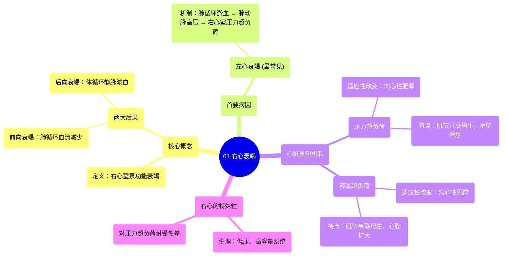

# 01 Right Sided Heart Failure

  <video controls preload="metadata" playsinline>
    <source src="https://helly.s3.bitiful.net/心血管学科/%E4%B8%93%E8%BE%91%2020%EF%BC%9A%E5%BF%83%E5%86%85%E7%A7%91%E7%BB%88%E6%9E%81%E8%BE%9E%E5%85%B8%E7%96%BE%E7%97%85%E6%9C%BA%E5%88%B6%E7%AF%87%20%28PathologyMechanisms%29/01%20Right%20Sided%20Heart%20Failure.mp4" type="video/mp4">
    
您的浏览器不支持播放，请升级。

  </video>

::: tip ⚡️ 核心考点 (30s速读)
*   **核心考点**：右心衰竭的核心是右心室泵血功能下降，导致血液无法有效泵入肺循环进行氧合，同时血液在体循环静脉系统内淤积。
*   **临床意义**：左心衰竭是导致右心衰竭的最主要原因。理解右心对压力超负荷（导致向心性肥厚）和容量超负荷（导致离心性肥厚）的不同适应性改变，是掌握其病理生理的关键。
:::

## 🧠 深度精讲

*   **功能解剖与循环**：心脏分为左、右两侧，分别管理体循环和肺循环两个独立的系统。右心负责接收来自全身的脱氧血，并将其泵入肺部进行氧合。
*   **右心衰竭的定义与后果**：当右心泵功能受损时，会产生两个主要后果：1) **前向衰竭**：血液无法充分到达肺部，导致氧合不足；2) **后向衰竭**：血液在静脉系统（体循环）中淤积，导致静脉充血。
*   **首要病因：左心衰竭**：这是导致右心衰竭最常见的原因。左心衰竭时，血液在肺循环淤积，导致肺动脉压力升高。右心室在收缩时需要克服这个异常增高的阻力（压力超负荷），长期以往导致右心功能受损。
*   **心脏的重塑机制**：心脏为适应不同的负荷会发生结构改变，即心肌肥厚。
    *   **压力超负荷**（如肺动脉高压）：心脏通过**向心性肥厚**来适应。心肌纤维（肌节）以**并联**方式增生，导致心室壁**增厚**，但心腔大小变化不大。这是左心室应对高血压的典型方式。
    *   **容量超负荷**（如瓣膜反流）：心脏通过**离心性肥厚**来适应。心肌纤维以**串联**方式增生，导致心室腔**扩大**，但室壁相对变薄。右心室作为一个低压容量系统，更常以此方式应对慢性容量增加。
*   **右心衰竭的特殊性**：右心室壁薄，天生是一个**低压、高容量**的泵。它对**压力超负荷**的耐受性远不如左心室。当因左心衰竭等原因面临持续压力超负荷时，右心室试图通过向心性肥厚来代偿，但这种能力有限，最终容易导致失代偿，发生右心衰竭。

## 📚 双语术语表 (Terminology)
| 英文术语 | 中文翻译 | 定义/解释 |
| :--- | :--- | :--- |
| Right-sided heart failure | 右心衰竭 | 右心室泵血功能下降，导致体循环静脉淤血和肺循环血流减少的临床综合征。 |
| Systemic circulation | 体循环 | 血液从左心室泵出，经动脉输送至全身组织，再经静脉返回右心房的循环路径。 |
| Pulmonary circulation | 肺循环 | 血液从右心室泵出，进入肺部进行气体交换后返回左心房的循环路径。 |
| Forward effect / failure | 前向效应 / 衰竭 | 指心脏泵血功能下降，导致向前射出的血量不足。在右心衰竭中表现为进入肺循环的血流减少。 |
| Venous congestion | 静脉淤血 | 由于心脏后向压力增高，导致血液在静脉系统内淤积的状态。右心衰竭时表现为颈静脉怒张、肝淤血、下肢水肿等。 |
| Pressure overload | 压力超负荷 | 心脏（尤其是心室）在收缩射血时需要克服的阻力异常增高。 |
| Volume overload | 容量超负荷 | 心脏在舒张期承受的血容量异常增多。 |
| Concentric hypertrophy | 向心性肥厚 | 心肌细胞肌节并联性增生，导致心室壁增厚而心腔容积不变或缩小，是对压力超负荷的主要适应性改变。 |
| Eccentric hypertrophy | 离心性肥厚 | 心肌细胞肌节串联性增生，导致心室腔扩大而室壁相对变薄，是对容量超负荷的主要适应性改变。 |
| Sarcomere | 肌节 | 心肌细胞的基本收缩单位。 |

## 🗺️ 知识图谱

