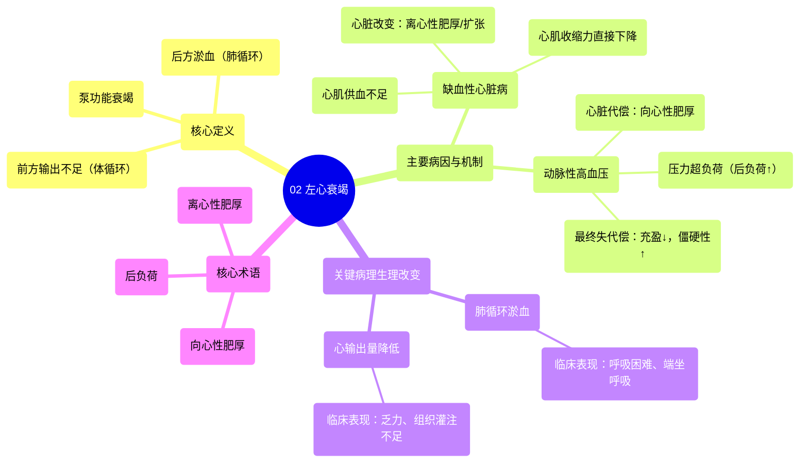

# 02 Left Sided Heart Failure

  <video controls preload="metadata" playsinline>
    <source src="https://helly.s3.bitiful.net/心血管学科/%E4%B8%93%E8%BE%91%2020%EF%BC%9A%E5%BF%83%E5%86%85%E7%A7%91%E7%BB%88%E6%9E%81%E8%BE%9E%E5%85%B8%E7%96%BE%E7%97%85%E6%9C%BA%E5%88%B6%E7%AF%87%20%28PathologyMechanisms%29/02%20Left%20Sided%20Heart%20Failure.mp4" type="video/mp4">
    
您的浏览器不支持播放，请升级。

  </video>

::: tip ⚡️ 核心考点 (30s速读)
*   **核心考点**：左心衰竭的核心是左心室泵血功能受损，导致血液在肺循环淤积（肺淤血）和/或向体循环泵血不足（心输出量降低）。
*   **临床意义**：理解左心衰竭的关键在于掌握其两大病因（压力超负荷与心肌缺血）如何通过不同机制（向心性肥厚与离心性肥厚）最终导致泵功能衰竭，并引发特征性的“肺淤血”症状（如呼吸困难、端坐呼吸）。
:::

## 🧠 深度精讲

*   **概念1：左心的结构与功能**
    心脏左侧（左心房、左心室）负责接收来自肺部的含氧血，并通过强有力的收缩将其泵入主动脉，供应全身组织。左心室壁肌肉厚度是右心室的3-4倍，以适应体循环的高阻力。

*   **概念2：心力衰竭的定义**
    心力衰竭是指心脏作为一个“泵”的功能受损，无法有效工作。其核心问题有二：1) **后方淤血**：无法有效接收回心血液，导致血液在后方循环系统（对左心而言是肺循环）淤积；2) **前方输出不足**：无法将足够的血液泵入前方循环系统（对左心而言是体循环），以满足身体代谢需求。

*   **概念3：左心衰竭的病因与机制**
    1.  **动脉性高血压（压力超负荷）**：
        *   **机制**：体循环动脉阻力持续增高（如动脉粥样硬化导致血管狭窄），左心室射血时面临巨大阻力（后负荷增加）。
        *   **心脏代偿**：为克服阻力，左心室心肌发生 **“向心性肥厚”** ，即通过平行增加肌节使室壁增厚，但心腔容积减小。
        *   **失代偿**：长期肥厚导致心肌僵硬、舒张功能下降、心腔充盈减少，最终泵血能力下降，引发左心衰竭。
    2.  **缺血性心脏病（冠状动脉疾病）**：
        *   **机制**：冠状动脉狭窄或阻塞导致心肌供血不足，心肌细胞缺血、坏死，收缩力直接下降。
        *   **心脏改变**：受损的心室壁变薄、扩张，发生 **“离心性肥厚”** （心腔扩大，室壁可能代偿性增厚但相对变薄），导致泵血效率低下。
        *   **结果**：心脏无法有效泵血，同样导致肺循环淤血和心输出量降低。

## 📚 双语术语表 (Terminology)
| 英文术语 | 中文翻译 | 定义/解释 |
| :--- | :--- | :--- |
| Left-sided heart failure | 左心衰竭 | 左心室泵血功能受损，导致肺循环淤血和/或体循环灌注不足的临床综合征。 |
| Systemic circulation | 体循环 | 血液从左心室泵出，经主动脉输送至全身组织，再返回右心房的循环路径。 |
| Pulmonary circulation | 肺循环 | 血液从右心室泵出，经肺动脉到达肺部进行气体交换，再返回左心房的循环路径。 |
| Afterload | 后负荷 | 心室收缩射血时需要克服的阻力，对左心室而言主要指主动脉血压和全身血管阻力。 |
| Concentric hypertrophy | 向心性肥厚 | 心肌细胞增粗，导致心室壁增厚而心腔容积相对减小或不变，常见于压力超负荷（如高血压）。 |
| Eccentric hypertrophy | 离心性肥厚 | 心肌细胞拉长，导致心腔扩大，室壁可能代偿性增厚但相对变薄，常见于容量超负荷或心肌损伤。 |
| Sarcomere | 肌节 | 心肌收缩的基本结构和功能单位。 |
| Arterial hypertension | 动脉性高血压 | 体循环动脉血压持续升高的慢性疾病状态，是左心衰竭的主要病因之一。 |
| Ischemic heart disease | 缺血性心脏病 | 因冠状动脉狭窄或阻塞导致心肌血液供应不足的心脏疾病，常导致心力衰竭。 |
| Coronary artery disease | 冠状动脉疾病 | 冠状动脉发生粥样硬化引起管腔狭窄或闭塞，导致心肌缺血、缺氧的疾病。 |

## 🗺️ 知识图谱

