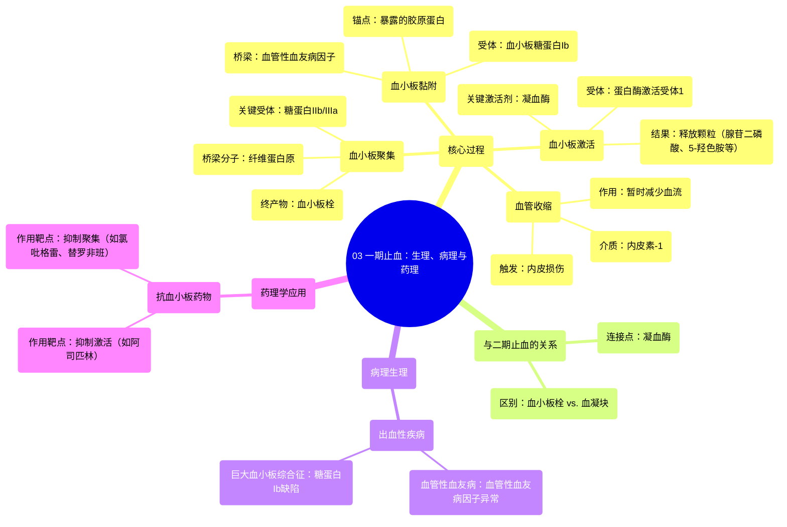

# 03 Primary Hemostasis _ Physiology, Pathophysiology, and Pharmacology

  <video controls preload="metadata" playsinline>
    <source src="https://helly.s3.bitiful.net/心血管学科/%E4%B8%93%E8%BE%91%2020%EF%BC%9A%E5%BF%83%E5%86%85%E7%A7%91%E7%BB%88%E6%9E%81%E8%BE%9E%E5%85%B8%E7%96%BE%E7%97%85%E6%9C%BA%E5%88%B6%E7%AF%87%20%28PathologyMechanisms%29/03%20Primary%20Hemostasis%20_%20Physiology%2C%20Pathophysiology%2C%20and%20Pharmacology.mp4" type="video/mp4">
    
您的浏览器不支持播放，请升级。

  </video>

::: tip ⚡️ 核心考点 (30s速读)
*   **核心考点**：一期止血是血管损伤后立即发生的止血过程，核心是形成**血小板栓**（而非血凝块）。其关键步骤包括：血管收缩、血小板黏附、血小板激活和血小板聚集。
*   **临床意义**：此过程中的任一环节缺陷（如血管性血友病因子缺乏、血小板受体异常）都会导致出血倾向。同时，针对不同环节的药物（如阿司匹林、氯吡格雷）可用于预防血栓形成。
:::

## 🧠 深度精讲

*   **概念1：一期止血的四个阶段**
    1.  **血管收缩**：血管损伤后，受损的内皮细胞释放**内皮素-1**，引起局部血管痉挛，暂时减少血流，为后续止血步骤争取时间。
    2.  **血小板黏附**：血管内皮下的**胶原蛋白**暴露，内皮细胞释放的**血管性血友病因子**与胶原结合。循环中的血小板通过其表面的**糖蛋白Ib受体**识别并结合血管性血友病因子，从而黏附在损伤部位。
    3.  **血小板激活**：黏附的血小板被激活，此过程主要由**凝血酶**（来自二期止血的凝血级联）通过结合血小板上的**蛋白酶激活受体1**触发。激活导致血小板释放其颗粒内容物，包括**腺苷二磷酸**、**5-羟色胺**和更多的血管性血友病因子。
    4.  **血小板聚集**：释放的腺苷二磷酸等物质进一步激活并募集更多的血小板，血小板之间通过**纤维蛋白原**桥连（主要经由血小板表面的**糖蛋白IIb/IIIa受体**），最终形成稳固的**血小板栓**，暂时封堵血管破口。

*   **概念2：与二期止血的联系与区别**
    *   **联系**：一期止血形成的血小板栓是“临时封堵”。同时启动的**二期止血**（凝血级联）生成**纤维蛋白**，加固血小板栓，形成坚固的**血凝块**。凝血酶是连接两个过程的关键分子，既催化纤维蛋白生成，又激活血小板。
    *   **区别**：一期止血核心是**血小板**行为，形成**血小板栓**；二期止血核心是**血浆凝血因子**的酶促反应，形成**纤维蛋白网**。

*   **概念3：病理生理与药理学联系**
    *   **病理**：视频提及，糖蛋白Ib受体缺陷会导致**巨大血小板综合征**，血管性血友病因子缺乏或功能异常会导致**血管性血友病**，均表现为一期止血障碍，引起出血。
    *   **药理**：药物可针对性干预：
        *   **抑制血小板激活**：如**阿司匹林**（不可逆抑制环氧合酶，减少血栓烷A2生成）。
        *   **抑制血小板聚集**：如**氯吡格雷**（拮抗腺苷二磷酸受体P2Y12），或**替罗非班**（阻断糖蛋白IIb/IIIa受体）。

## 📚 双语术语表 (Terminology)
| 英文术语 | 中文翻译 | 定义/解释 |
| :--- | :--- | :--- |
| Primary Hemostasis | 一期止血 | 血管损伤后，由血小板主导的、快速形成血小板栓的初始止血过程。 |
| Secondary Hemostasis | 二期止血 | 紧随一期止血后，由凝血因子级联反应生成纤维蛋白，加固血小板栓形成稳定血凝块的过程。 |
| Vasoconstriction | 血管收缩 | 损伤血管通过平滑肌收缩使管腔变窄，减少局部血流。 |
| Endothelin-1 | 内皮素-1 | 由受损内皮细胞释放的强效血管收缩肽。 |
| Platelet Adhesion | 血小板黏附 | 血小板通过受体识别并附着于血管损伤处暴露的基质（如胶原-血管性血友病因子复合物）。 |
| Collagen | 胶原蛋白 | 血管基底膜的主要成分，带负电荷，损伤时暴露，是血小板黏附的关键锚定点。 |
| von Willebrand Factor | 血管性血友病因子 | 由内皮细胞和血小板合成的一种大分子糖蛋白，作为桥梁连接血小板（通过GP Ib受体）与损伤处的胶原蛋白。 |
| Glycoprotein Ib | 糖蛋白Ib | 血小板膜上的受体复合物，主要功能是结合血管性血友病因子，介导血小板黏附。 |
| Platelet Activation | 血小板激活 | 黏附的血小板被激活，发生形态改变并释放颗粒内容物，为聚集做准备。 |
| Thrombin | 凝血酶 | 凝血级联反应的关键酶，能将纤维蛋白原转化为纤维蛋白，同时也是强大的血小板激活剂。 |
| PAR1 | 蛋白酶激活受体1 | 血小板表面的一种G蛋白偶联受体，凝血酶可将其切割并激活，触发血小板释放反应。 |
| ADP | 腺苷二磷酸 | 血小板致密颗粒释放的重要物质，能进一步激活周围血小板，促进聚集。 |
| Serotonin | 5-羟色胺 | 血小板释放的血管活性胺，能促进局部血管收缩。 |
| Platelet Aggregation | 血小板聚集 | 激活的血小板通过纤维蛋白原桥连彼此（主要经由GP IIb/IIIa受体），聚集成团。 |
| Platelet Plug | 血小板栓 | 一期止血的终产物，由聚集的血小板形成的临时性堵塞物。 |

## 🗺️ 知识图谱

