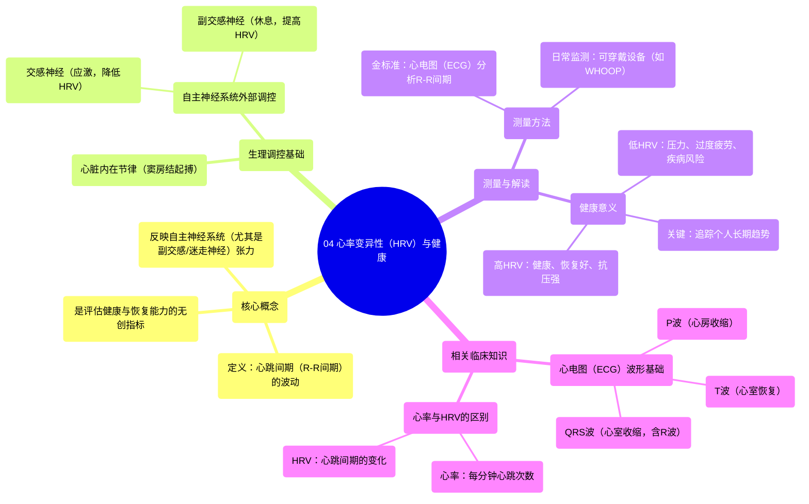

# 04 Heart Rate Variability (HRV) and Health

  <video controls preload="metadata" playsinline>
    <source src="https://helly.s3.bitiful.net/心血管学科/%E4%B8%93%E8%BE%91%2020%EF%BC%9A%E5%BF%83%E5%86%85%E7%A7%91%E7%BB%88%E6%9E%81%E8%BE%9E%E5%85%B8%E7%96%BE%E7%97%85%E6%9C%BA%E5%88%B6%E7%AF%87%20%28PathologyMechanisms%29/04%20Heart%20Rate%20Variability%20%28HRV%29%20and%20Health.mp4" type="video/mp4">
    
您的浏览器不支持播放，请升级。

  </video>

::: tip ⚡️ 核心考点 (30s速读)
*   **核心考点**：心率变异性（HRV）是指连续心跳之间的时间间隔的微小变化，它反映了自主神经系统（尤其是副交感神经）对心脏节律的调控能力。
*   **临床意义**：HRV是评估整体健康状况、压力水平、恢复能力和心血管风险的重要无创指标。较高的HRV通常与更好的心血管健康、更强的压力适应能力和更佳的身体恢复状态相关。
:::

## 🧠 深度精讲

*   **概念1：什么是心率变异性（HRV）？**
    心率变异性并非指心率（每分钟心跳次数）本身，而是指**相邻两次心跳之间的时间间隔（R-R间期）的波动情况**。即使你的心率是稳定的每分钟60次，每次心跳之间的间隔也并非完全一致，可能存在几十毫秒的差异。这种微小的、自然的波动就是HRV。它反映了心脏对外界环境和内部需求的动态适应能力。

*   **概念2：HRV的生理学基础——谁在控制心跳？**
    心跳受双重调控：
    1.  **心脏内在节律**：心脏自身有“起搏细胞”，位于**窦房结（SA node）**，能自发产生电冲动，引起心脏收缩。这是心跳的基础节律。
    2.  **自主神经系统（ANS）的外部调控**：这是影响HRV的关键。
        *   **交感神经系统（“战斗或逃跑”系统）**：在压力、运动或紧张时激活，释放肾上腺素等，使心率加快、心跳间隔变**规律**（倾向于降低HRV）。
        *   **副交感神经系统（“休息与消化”系统）**：主要通过**迷走神经**在休息、放松时活跃，起到“刹车”作用，使心率减慢，并增加心跳间隔的**不规则性**（即提高HRV）。
    **HRV的高低，很大程度上反映了副交感神经（迷走神经）张力的强弱**。高HRV意味着身体能灵活地在应激后迅速恢复平静，是健康和有韧性的标志。

*   **概念3：如何测量HRV？（结合心电图ECG理解）**
    最准确的测量方法是通过心电图（ECG/EKG）。在心电图上：
    *   一次心跳的典型波形包括P波（心房除极）、QRS波群（心室除极，其中R波最高尖）和T波（心室复极）。
    *   **R-R间期**：即相邻两个R波顶峰之间的时间间隔。通过长时间记录（如5分钟或24小时）并分析一系列R-R间期的变异（如计算其标准差），即可得出HRV。
    *   现代可穿戴设备（如WHOOP）通过光学传感器（PPG）监测脉搏波，间接估算R-R间期来计算HRV，为日常监测提供了便利。

*   **概念4：HRV的健康意义解读**
    *   **HRV较高**：通常意味着**良好的健康状况**。表明身体恢复良好，抗压能力强，心血管系统灵活高效。常见于经常锻炼、睡眠充足、压力管理良好的人群。
    *   **HRV较低**：可能提示**身体正承受较大压力**（如过度训练、睡眠不足、疾病感染、慢性压力或焦虑），或与某些健康状况（如心力衰竭、糖尿病、抑郁症）相关。长期低HRV是未来心血管事件的风险预测因子之一。
    *   **重要提示**：HRV有很强的个体差异性，**追踪自身HRV的长期趋势比关注单次绝对值更重要**。突然的、持续的下降往往是身体需要休息和恢复的警报。

## 📚 双语术语表 (Terminology)

| 英文术语 | 中文翻译 | 定义/解释 |
| :--- | :--- | :--- |
| Heart Rate Variability (HRV) | 心率变异性 | 连续心跳间期（R-R间期）的波动变化，反映自主神经对心脏的调节能力。 |
| SA Node (Sinoatrial Node) | 窦房结 | 位于右心房的天然心脏起搏点，自发产生电冲动，引发心跳。 |
| Autonomic Nervous System (ANS) | 自主神经系统 | 控制内脏功能（如心率、消化）的神经系统，包括交感神经和副交感神经。 |
| Sympathetic Nervous System | 交感神经系统 | ANS的一部分，负责“战斗或逃跑”反应，激活时增加心率和收缩力。 |
| Parasympathetic Nervous System | 副交感神经系统 | ANS的一部分，负责“休息与消化”状态，主要通过迷走神经减慢心率。 |
| Vagus Nerve | 迷走神经 | 最主要的副交感神经，对降低心率、提高HRV起关键作用。 |
| Electrocardiogram (ECG/EKG) | 心电图 | 记录心脏电活动的检查，是测量HRV的金标准。 |
| R-R Interval | R-R间期 | 心电图上相邻两个R波之间的时间间隔，是计算HRV的基础。 |
| P Wave | P波 | 心电图上代表心房除极（收缩）的波形。 |
| QRS Complex | QRS波群 | 心电图上代表心室除极（收缩）的快速波形，其中R波最为显著。 |
| T Wave | T波 | 心电图上代表心室复极（恢复）的波形。 |

## 🗺️ 知识图谱

