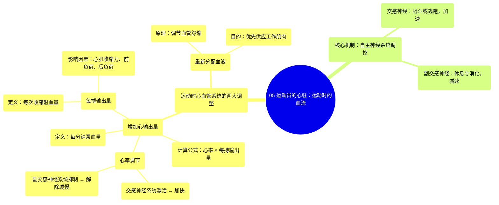

# 05 An Athletes Heart Blood Flow During Exercise

  <video controls preload="metadata" playsinline>
    <source src="https://helly.s3.bitiful.net/心血管学科/%E4%B8%93%E8%BE%91%2020%EF%BC%9A%E5%BF%83%E5%86%85%E7%A7%91%E7%BB%88%E6%9E%81%E8%BE%9E%E5%85%B8%E7%96%BE%E7%97%85%E6%9C%BA%E5%88%B6%E7%AF%87%20%28PathologyMechanisms%29/05%20An%20Athletes%20Heart%20Blood%20Flow%20During%20Exercise.mp4" type="video/mp4">
    
您的浏览器不支持播放，请升级。

  </video>

::: tip ⚡️ 核心考点 (30s速读)
*   **核心考点**：运动时，心血管系统通过**增加心输出量**和**重新分配血液**来满足肌肉对氧气和营养的激增需求。
*   **临床意义**：理解这一机制是评估心脏储备功能、制定运动处方和解释运动相关心血管反应（如心率、血压变化）的基础。
:::

## 🧠 深度精讲

*   **概念1：心输出量**
    *   **定义**：指心脏每分钟泵出的血液总量，是衡量心脏泵血功能的核心指标。
    *   **计算公式**：**心输出量 = 心率 × 每搏输出量**。
    *   **举例**：视频中以静息状态下未经训练的男性为例：心率72次/分，每搏输出量70毫升，则心输出量为5升/分钟。
    *   **运动时的变化**：运动时，心输出量会显著增加，主要通过增加心率和每搏输出量来实现。

*   **概念2：心率调节**
    *   **自主节律性**：心脏本身具有自发跳动的能力。
    *   **自主神经系统调节**：心率受自主神经系统的精确调控。
        *   **交感神经系统**（战斗或逃跑系统）：被激活时（如运动、紧张），释放神经递质，**加快心率**。
        *   **副交感神经系统**（休息与消化系统）：主要通过迷走神经活动，在静息时占主导，**减慢心率**。
    *   **运动时的应用**：运动作为一种应激源，会激活交感神经系统，抑制副交感神经活动，从而导致心率加快。

*   **概念3：每搏输出量**
    *   **定义**：指心脏每一次收缩（心跳）时，单侧心室射出的血液量。
    *   **影响因素**：主要包括心肌收缩力、心脏前负荷（回心血量）和后负荷（动脉血压）等。视频中通过绘制心脏左侧（左心房、左心室、主动脉）的示意图，直观展示了血液流动和心肌收缩的过程。

*   **概念4：血液重新分配**
    *   **原理**：运动时，身体会通过调节血管（血管系统）的舒缩状态，将更多的血液从相对不活跃的器官（如消化系统）分流到正在工作的骨骼肌，以确保肌肉获得充足的氧气和营养供应。
    *   **意义**：这是心血管系统高效满足局部需求的重要策略。

## 📚 双语术语表 (Terminology)
| 英文术语 | 中文翻译 | 定义/解释 |
| :--- | :--- | :--- |
| Cardiac Output (CO) | 心输出量 | 心脏每分钟泵出的血液总量。 |
| Heart Rate (HR) | 心率 | 心脏每分钟跳动的次数。 |
| Stroke Volume (SV) | 每搏输出量 | 心脏每次收缩时，单侧心室射出的血液量。 |
| Autonomic Nervous System (ANS) | 自主神经系统 | 调节内脏功能（如心率、消化）的神经系统，不受意识控制。 |
| Sympathetic Nervous System | 交感神经系统 | 自主神经系统的一部分，负责“战斗或逃跑”反应，能加快心率、升高血压等。 |
| Parasympathetic Nervous System | 副交感神经系统 | 自主神经系统的一部分，负责“休息与消化”状态，能减慢心率、促进消化等。 |
| Myocardium | 心肌 | 构成心脏壁的肌肉组织。 |
| Vasculature | 血管系统 | 全身血管的总称，包括动脉、静脉和毛细血管。 |
| Redistribution of Blood | 血液重新分配 | 根据身体不同部位的需求变化，调整血液流向的过程。 |

## 🗺️ 知识图谱

