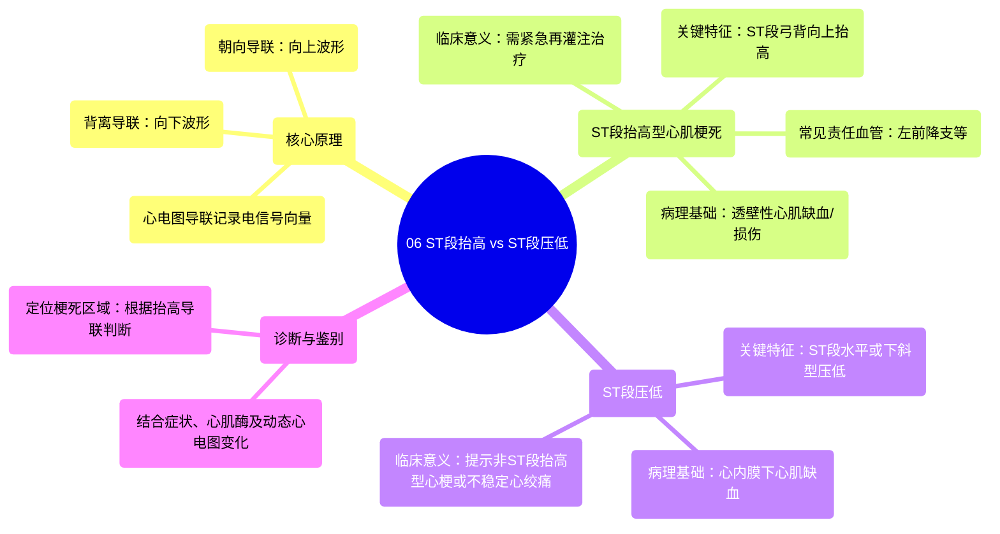

# 06 ST Elevation vs ST Depression

  <video controls preload="metadata" playsinline>
    <source src="https://helly.s3.bitiful.net/心血管学科/%E4%B8%93%E8%BE%91%2020%EF%BC%9A%E5%BF%83%E5%86%85%E7%A7%91%E7%BB%88%E6%9E%81%E8%BE%9E%E5%85%B8%E7%96%BE%E7%97%85%E6%9C%BA%E5%88%B6%E7%AF%87%20%28PathologyMechanisms%29/06%20ST%20Elevation%20vs%20ST%20Depression.mp4" type="video/mp4">
    
您的浏览器不支持播放，请升级。

  </video>

::: tip ⚡️ 核心考点 (30s速读)
*   **核心考点**：ST段抬高与压低是心电图诊断心肌梗死的关键特征，其形态取决于梗死心肌相对于探查导联的深度和电活动方向。
*   **临床意义**：ST段抬高型心肌梗死通常提示冠状动脉完全闭塞，需紧急再灌注治疗（如溶栓或介入）；ST段压低则可能提示心内膜下缺血或非ST段抬高型心肌梗死，治疗策略不同。
:::

## 🧠 深度精讲

*   **概念1：心电图基础与导联原理**
    心电图通过贴在胸部和四肢的电极（12导联）从不同角度“观察”心脏的电活动。每个导联记录的是电信号朝向导联（产生向上波形）或背离导联（产生向下波形）的向量总和。正常心电图的波形（P波、QRS波群、T波）对应着一次心动周期中心房和心室有序的去极化与复极化过程。

*   **概念2：ST段改变的病理生理机制**
    心肌梗死时，冠状动脉阻塞导致心肌缺血、损伤甚至坏死。这会造成心肌细胞膜电位不稳定，产生“损伤电流”。
    *   **ST段抬高**：通常发生在**透壁性心肌缺血/损伤**时。坏死区域的心肌细胞无法正常去极化与复极化，导致在除极后（ST段期间）持续存在指向损伤区的电位差，在面向损伤区的导联上表现为ST段弓背向上抬高。
    *   **ST段压低**：通常发生在**心内膜下心肌缺血**时。心内膜下心肌承受压力最大，最容易缺血。缺血导致复极过程异常，产生背离心外膜的电流向量，因此在面向心外膜的导联上表现为ST段水平型或下斜型压低。

*   **概念3：从正常到异常的推理（结合视频）**
    视频中以导联II为例，解释了正常心室去极化（QRS波群形成）时，电信号方向与波形的关系（朝向=向上，背离=向下）。当心肌发生梗死时，这块区域变成了电活动的“死区”或“异常区”。如果梗死是透壁的（从心内膜到心外膜），它会显著改变整个心脏的除极向量，在面向它的导联产生持续的ST段抬高信号。如果缺血仅限于心内膜下，则主要影响复极过程，表现为ST段压低。

## 📚 双语术语表 (Terminology)
| 英文术语 | 中文翻译 | 定义/解释 |
| :--- | :--- | :--- |
| ST Elevation | ST段抬高 | 心电图ST段异常高于基线，常提示急性透壁性心肌缺血。 |
| ST Depression | ST段压低 | 心电图ST段异常低于基线，常提示心内膜下心肌缺血。 |
| Myocardial Infarction (MI) | 心肌梗死 | 因冠状动脉血流中断导致的心肌坏死。 |
| ECG / EKG | 心电图 | 记录心脏电活动的检查。 |
| Lead | 导联 | 心电图电极的特定组合，提供心脏电活动的一个特定视角。 |
| Precordial Leads | 胸前导联 | 放置在胸前的电极（V1-V6），主要观察心脏前壁及侧壁。 |
| Limb Leads | 肢体导联 | 放置在四肢的电极（I, II, III, aVR, aVL, aVF），观察心脏下壁及侧壁。 |
| Depolarization | 去极化 | 心肌细胞由静息状态转为兴奋状态的过程，产生收缩。 |
| Repolarization | 复极化 | 心肌细胞恢复静息电位的过程，为下一次兴奋做准备。 |
| Transmural Ischemia | 透壁性缺血 | 缺血累及心室壁全层。 |
| Subendocardial Ischemia | 心内膜下缺血 | 缺血仅累及心室壁内侧部分。 |

## 🗺️ 知识图谱

