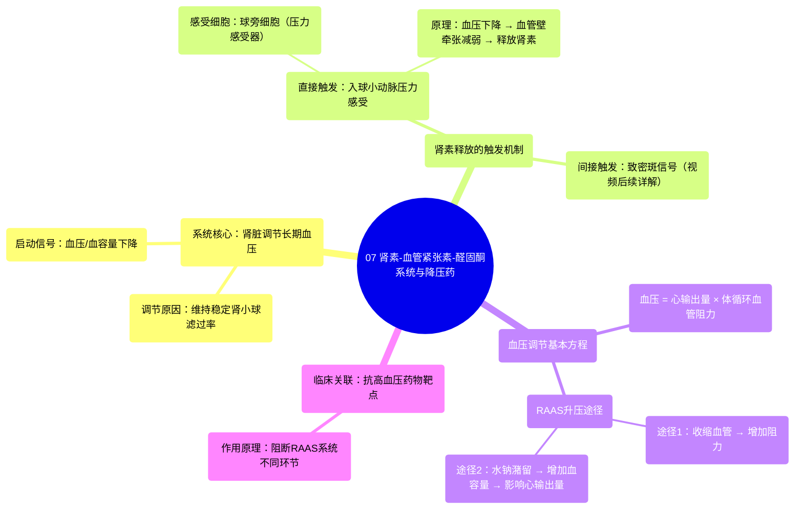

# 07 Renin Angiotensin Aldosterone System & Blood Pressure Drugs

  <video controls preload="metadata" playsinline>
    <source src="https://helly.s3.bitiful.net/心血管学科/%E4%B8%93%E8%BE%91%2020%EF%BC%9A%E5%BF%83%E5%86%85%E7%A7%91%E7%BB%88%E6%9E%81%E8%BE%9E%E5%85%B8%E7%96%BE%E7%97%85%E6%9C%BA%E5%88%B6%E7%AF%87%20%28PathologyMechanisms%29/07%20Renin%20Angiotensin%20Aldosterone%20System%20%26%20Blood%20Pressure%20Drugs.mp4" type="video/mp4">
    
您的浏览器不支持播放，请升级。

  </video>

::: tip ⚡️ 核心考点 (30s速读)
*   **核心考点**：肾素-血管紧张素-醛固酮系统是肾脏调节长期血压的核心机制。血压或血容量下降时，肾脏通过释放肾素启动该系统，最终导致血管收缩和水钠潴留，从而升高血压。
*   **临床意义**：理解RAAS是掌握一系列抗高血压药物（如ACEI、ARB、肾素抑制剂）作用机制的基础，这些药物通过阻断该系统的不同环节来降低血压。
:::

## 🧠 深度精讲

*   **肾脏为何是长期血压的“总指挥”？**
    肾脏的核心功能是持续过滤血液，生成“滤液”。为了稳定地完成这项工作（约120毫升/分钟），肾脏必须维持稳定的肾小球滤过压。当血压或血容量下降时，滤过率会随之降低。因此，肾脏进化出了感知和调节血压的能力，以确保自身功能正常，这使其成为调节长期血压的理想器官。

*   **肾素释放的“触发器”是什么？**
    肾素释放的直接触发信号主要来自肾脏内部：
    1.  **入球小动脉压力感受**：在肾小球的入球小动脉管壁上，存在一种特殊的**球旁细胞**（也称颗粒细胞、肾素分泌细胞）。它们是压力感受器，能直接感知入球小动脉内的血压（血管壁牵张程度）。当血压下降时，牵张减弱，这些细胞就会直接释放肾素。
    2.  **致密斑的化学信号**：视频后续部分会详细讲解。简单来说，肾小管中一个叫“致密斑”的区域能监测流经的滤液中钠离子的浓度。当血容量减少导致滤过的钠离子减少时，致密斑会向邻近的球旁细胞发出信号，刺激其释放肾素。

*   **血压调节的基本方程**
    血压 = 心输出量 × 体循环血管阻力。RAAS系统主要通过以下两种方式影响这个方程来升高血压：
    1.  **增加体循环血管阻力**：通过生成血管紧张素II引起全身小动脉收缩。
    2.  **增加血容量（从而影响心输出量）**：通过醛固酮促进肾脏对水和钠的重吸收，增加循环血量。

## 📚 双语术语表 (Terminology)
| 英文术语 | 中文翻译 | 定义/解释 |
| :--- | :--- | :--- |
| Renin-Angiotensin-Aldosterone System (RAAS) | 肾素-血管紧张素-醛固酮系统 | 由肾脏启动的、调节血压和体液平衡的关键激素系统。 |
| Nephron | 肾单位 | 肾脏的基本结构和功能单位，负责血液过滤和尿液生成。 |
| Afferent Arteriole | 入球小动脉 | 将血液带入肾小球的小动脉，其管壁上有肾素分泌细胞。 |
| Efferent Arteriole | 出球小动脉 | 将血液带离肾小球的小动脉。 |
| Glomerulus | 肾小球 | 肾单位内的一团毛细血管网，是血液滤过发生的场所。 |
| Filtrate | 滤液 | 血液经肾小球滤过后进入肾小囊的液体，是尿液的前身。 |
| Juxtaglomerular Cells (Granular Cells) | 球旁细胞（颗粒细胞） | 位于入球小动脉壁上的特化细胞，能感知血压并分泌肾素。 |
| Baroreceptor | 压力感受器 | 能感知压力（如血压）变化的感受器。 |
| Systemic Vascular Resistance (SVR) | 体循环血管阻力 | 血液在体循环动脉系统中流动所遇到的阻力，是决定血压的关键因素之一。 |
| Cardiac Output | 心输出量 | 每分钟一侧心室泵出的血液总量，是决定血压的关键因素之一。 |

## 🗺️ 知识图谱

