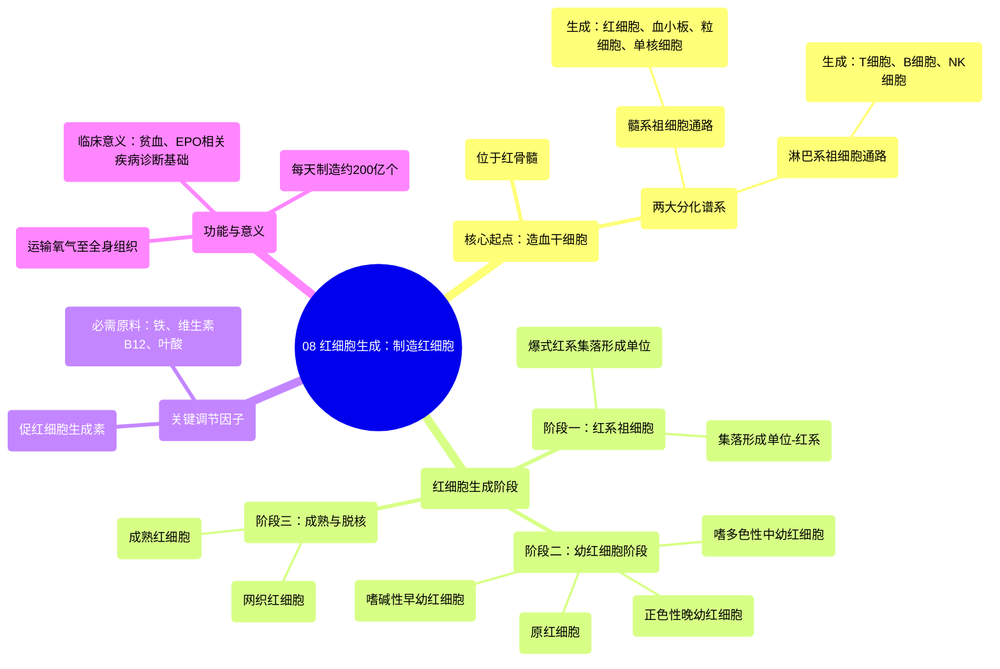

# 08 Erythropoiesis Making Red Blood Cells

  <video controls preload="metadata" playsinline>
    <source src="https://helly.s3.bitiful.net/心血管学科/%E4%B8%93%E8%BE%91%2020%EF%BC%9A%E5%BF%83%E5%86%85%E7%A7%91%E7%BB%88%E6%9E%81%E8%BE%9E%E5%85%B8%E7%96%BE%E7%97%85%E6%9C%BA%E5%88%B6%E7%AF%87%20%28PathologyMechanisms%29/08%20Erythropoiesis%20Making%20Red%20Blood%20Cells.mp4" type="video/mp4">
    
您的浏览器不支持播放，请升级。

  </video>

::: tip ⚡️ 核心考点 (30s速读)
*   **核心考点**：红细胞生成是一个多阶段、受精密调控的过程，起始于骨髓中的造血干细胞，经过髓系祖细胞、红系祖细胞（BFUE、CFUE）、幼红细胞阶段（原红、嗜碱、多染、正染），最终脱核成为网织红细胞，成熟为红细胞。
*   **临床意义**：理解此过程是诊断贫血、红细胞增多症等血液疾病的基础。关键调节因子（如促红细胞生成素EPO）的异常与多种疾病相关。
:::

## 🧠 深度精讲

*   **概念1：红细胞生成概述**
    红细胞生成是人体制造红细胞的过程。成年人每天约制造200亿个红细胞（每秒约200万个），以确保组织有充足的氧气供应。这个过程主要发生在红骨髓中。

*   **概念2：造血干细胞与分化谱系**
    所有血细胞都起源于**造血干细胞**。它有两个主要分化方向：
    1.  **髓系祖细胞通路**：生成红细胞、血小板、粒细胞（中性、嗜酸、嗜碱性粒细胞）和单核细胞。
    2.  **淋巴系祖细胞通路**：生成淋巴细胞（T细胞、B细胞、NK细胞），负责适应性免疫和部分固有免疫。

*   **概念3：红细胞生成的具体阶段**
    红细胞生成遵循一条明确的细胞分化路径：
    1.  **阶段一：红系祖细胞**
        *   **爆式红系集落形成单位**：红系定向分化的最早可识别细胞，在体外培养时形成“爆裂”状集落。
        *   **集落形成单位-红系**：由BFUE分化而来，形成更小、更规整的集落。
    2.  **阶段二：幼红细胞阶段（红细胞前体）**
        细胞开始大量合成血红蛋白，并逐渐变小、细胞核浓缩直至排出。按顺序包括：
        *   **原红细胞**：体积大，富含RNA。
        *   **嗜碱性早幼红细胞**：胞质嗜碱性（染成蓝色），开始合成血红蛋白。
        *   **嗜多色性中幼红细胞**：胞质同时呈现嗜碱性（蓝色）和因血红蛋白积累产生的嗜酸性（粉红色）。
        *   **正色性晚幼红细胞**：胞质几乎充满血红蛋白，呈均一的粉红色（“正确颜色”）。
    3.  **阶段三：成熟与脱核**
        *   正色性晚幼红细胞将细胞核排出，成为**网织红细胞**（胞质内残留少量RNA）。
        *   网织红细胞进入血液循环，约1-2天后完全成熟为无核的**成熟红细胞**，专职运输氧气。

*   **概念4：关键调节因子**
    *   **促红细胞生成素**：由肾脏产生，是调节红细胞生成最重要的激素。在组织缺氧时分泌增加，主要作用于CFUE及其后续阶段，促进红细胞增殖、分化和存活。
    *   **其他因子**：铁、维生素B12、叶酸等是合成血红蛋白和DNA所必需的原料，其缺乏会导致贫血。

## 📚 双语术语表 (Terminology)
| 英文术语 | 中文翻译 | 定义/解释 |
| :--- | :--- | :--- |
| Erythropoiesis | 红细胞生成 | 制造红细胞的过程。 |
| Hematopoietic Stem Cell (HSC) | 造血干细胞 | 存在于骨髓中，能分化为所有类型血细胞的原始细胞。 |
| Myeloid Progenitor | 髓系祖细胞 | 造血干细胞分化出的前体细胞，可生成红细胞、血小板、粒细胞和单核细胞。 |
| Lymphoid Progenitor | 淋巴系祖细胞 | 造血干细胞分化出的前体细胞，可生成T细胞、B细胞和NK细胞。 |
| Burst Forming Unit-Erythroid (BFUE) | 爆式红系集落形成单位 | 红系分化的早期祖细胞，体外培养形成爆裂样集落。 |
| Colony Forming Unit-Erythroid (CFUE) | 集落形成单位-红系 | 由BFUE分化而来，对EPO敏感，是红系定向分化的关键祖细胞。 |
| Proerythroblast | 原红细胞 | 幼红细胞阶段的第一种细胞，体积较大。 |
| Basophilic Erythroblast | 嗜碱性早幼红细胞 | 胞质呈强嗜碱性（蓝色），开始合成血红蛋白。 |
| Polychromatic Erythroblast | 嗜多色性中幼红细胞 | 胞质同时呈现蓝色（RNA）和粉红色（血红蛋白）。 |
| Orthochromatic Erythroblast | 正色性晚幼红细胞 | 胞质充满血红蛋白呈粉红色，即将排出细胞核。 |
| Reticulocyte | 网织红细胞 | 脱核后进入血液的未完全成熟红细胞，含少量RNA。 |
| Erythrocyte | 红细胞 | 成熟的、无核的、双凹圆盘状的血细胞，负责运输氧气。 |
| Erythropoietin (EPO) | 促红细胞生成素 | 主要由肾脏产生的激素，是红细胞生成的主要调节因子。 |

## 🗺️ 知识图谱

