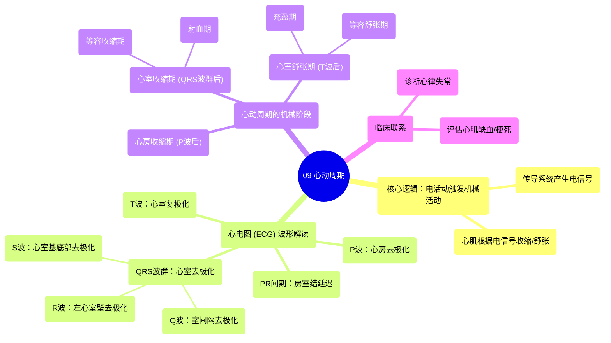

# 09 Cardiac Cycle

  <video controls preload="metadata" playsinline>
    <source src="https://helly.s3.bitiful.net/心血管学科/%E4%B8%93%E8%BE%91%2020%EF%BC%9A%E5%BF%83%E5%86%85%E7%A7%91%E7%BB%88%E6%9E%81%E8%BE%9E%E5%85%B8%E7%96%BE%E7%97%85%E6%9C%BA%E5%88%B6%E7%AF%87%20%28PathologyMechanisms%29/09%20Cardiac%20Cycle.mp4" type="video/mp4">
    
您的浏览器不支持播放，请升级。

  </video>

::: tip ⚡️ 核心考点 (30s速读)
*   **核心考点**：心动周期是心脏一次完整的收缩与舒张过程，其机械活动（泵血）由电活动（传导系统）精确触发和协调。
*   **临床意义**：理解心动周期是解读心电图（ECG）的基础，心电图上的波形（P波、QRS波群、T波）直接反映了心脏不同阶段的电活动，从而间接推断其机械功能状态，对诊断心律失常、心肌缺血等至关重要。
:::

## 🧠 深度精讲

*   **概念1：心动周期的定义与核心逻辑**
    心动周期是指心脏从一次收缩开始到下一次收缩开始前所经历的整个过程。其核心逻辑是 **“电活动在前，机械活动在后”**。心脏的传导系统（如窦房结、房室结）自发产生并传导电信号（去极化与复极化），这些电信号触发心肌细胞的收缩与舒张，从而完成泵血功能。理解这个先后顺序是掌握整个章节的关键。

*   **概念2：心电图（ECG）与心脏电活动的对应关系**
    心电图是记录心脏电活动的工具。在标准导联II的视角下：
    *   **“P波”**：代表**心房去极化**（电兴奋），方向朝向电极，产生向上的波。这触发了心房的收缩。
    *   **“PR间期”**：代表电信号通过房室结的延迟，在心电图上表现为一段平直线。这个延迟至关重要，它确保心房收缩完毕、血液充分流入心室后，心室才开始收缩。
    *   **“QRS波群”**：代表**心室去极化**。
        *   **“Q波”**：短小的向下波，代表**室间隔**的去极化（背离电极）。
        *   **“R波”**：高大的向上波，代表**左心室壁**（心肌最厚部分）的去极化（朝向电极），其幅度最大。
        *   **“S波”**：短小的向下波，代表心室基底部的去极化（背离电极）。
    *   **“T波”**：代表**心室复极化**（电恢复、重置）。由于复极化的方向与去极化相反（主要由外向内），在导联II上产生一个向上的波。

*   **概念3：从电活动到机械活动的衔接**
    心动周期的机械活动（泵血期和充盈期）紧随电活动之后：
    1.  **心房收缩期**：P波之后，心房肌收缩，将血液进一步挤入心室（心室舒张末期充盈）。
    2.  **心室收缩期**：QRS波群之后，心室肌强力收缩。这包括**等容收缩期**（心室压力上升但容积不变，所有瓣膜关闭）和**射血期**（主动脉瓣/肺动脉瓣开放，血液泵出）。
    3.  **心室舒张期**：T波之后，心室肌舒张。这包括**等容舒张期**（心室压力下降但容积不变，所有瓣膜关闭）和**充盈期**（房室瓣开放，血液从心房流入心室）。
    整个过程的协调性，确保了血液高效、单向地流动。

## 📚 双语术语表 (Terminology)
| 英文术语 | 中文翻译 | 定义/解释 |
| :--- | :--- | :--- |
| Cardiac Cycle | 心动周期 | 心脏一次完整的收缩与舒张过程，包括电活动和随之而来的机械活动。 |
| Depolarization | 去极化 | 心肌细胞膜电位由静息状态变为正电位的过程，是电兴奋的标志，触发收缩。 |
| Repolarization | 复极化 | 心肌细胞膜电位恢复为静息负电位的过程，为下一次兴奋做准备。 |
| SA Node (Sinoatrial Node) | 窦房结 | 位于右心房的正常心脏起搏点，自发产生去极化冲动，启动心跳。 |
| AV Node (Atrioventricular Node) | 房室结 | 位于心房与心室交界处，传导电信号并产生生理性延迟，确保心房收缩先于心室。 |
| ECG / Electrocardiogram | 心电图 | 记录心脏电活动随时间变化的图形。 |
| P Wave | P波 | 心电图上第一个向上的波，代表心房去极化。 |
| QRS Complex | QRS波群 | 心电图上紧随P波后的快速波群，代表心室去极化。 |
| T Wave | T波 | 心电图上QRS波群后的一个波，通常与主波方向一致，代表心室复极化。 |
| Septum | 室间隔 | 分隔左、右心室的心脏肌肉壁。Q波代表其去极化。 |
| Purkinje Fibers | 浦肯野纤维 | 心室内传导系统的终末分支，快速将电信号传递至整个心室肌。 |

## 🗺️ 知识图谱

