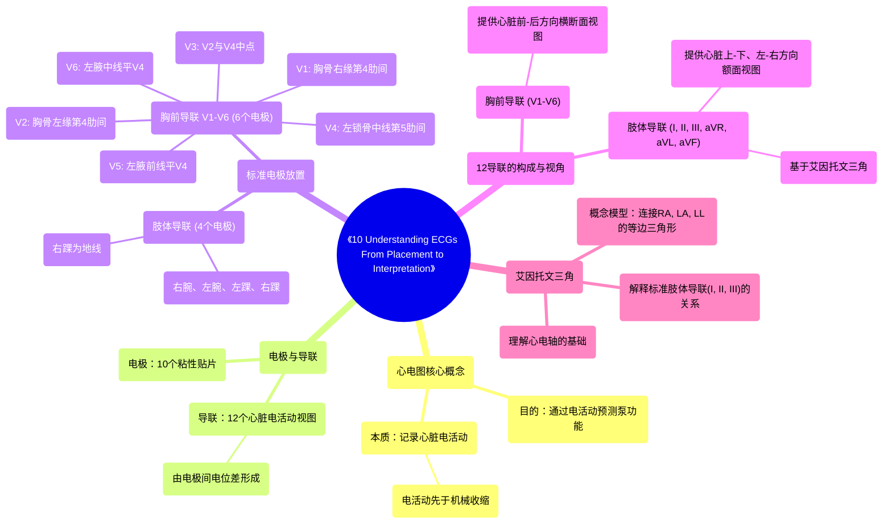

# 10 Understanding ECGs From Placement to Interpretation

  <video controls preload="metadata" playsinline>
    <source src="https://helly.s3.bitiful.net/心血管学科/%E4%B8%93%E8%BE%91%2020%EF%BC%9A%E5%BF%83%E5%86%85%E7%A7%91%E7%BB%88%E6%9E%81%E8%BE%9E%E5%85%B8%E7%96%BE%E7%97%85%E6%9C%BA%E5%88%B6%E7%AF%87%20%28PathologyMechanisms%29/10%20Understanding%20ECGs%20From%20Placement%20to%20Interpretation.mp4" type="video/mp4">
    
您的浏览器不支持播放，请升级。

  </video>

::: tip ⚡️ 核心考点 (30s速读)
*   **核心考点**：掌握12导联心电图的电极标准放置位置，理解肢体导联与胸前导联共同构成心脏电活动的三维视图。
*   **临床意义**：正确的电极放置是心电图判读的基础。电极位置错误会导致图形失真，可能造成误诊。理解导联的“视角”有助于定位心脏的异常电活动。
:::

## 🧠 深度精讲

*   **心电图本质**：心电图（ECG/EKG）是记录心脏电活动的图形。关键点在于，**电活动先于机械收缩发生**。因此，分析心电图可以预测心脏的泵血功能是否可能受损。
*   **电极与导联**：
    *   **电极**：是贴在皮肤上的粘性贴片（共10个）。
    *   **导联**：是设备记录到的、代表特定“视角”下心脏电活动的图形（共12个）。导联由电极之间的“对话”（电位差）形成。
*   **电极标准放置**：
    *   **肢体导联（4个电极）**：分别置于右腕（RA）、左腕（LA）、左踝（LL）、右踝（RL）。右踝电极通常作为“地线”，不直接产生视图。
    *   **胸前导联（6个电极）**：
        *   V1：胸骨右缘，第4肋间。
        *   V2：胸骨左缘，第4肋间。
        *   V4：左锁骨中线，第5肋间。
        *   V3：位于V2与V4连线的中点。
        *   V5：左腋前线，与V4同一水平（第5肋间）。
        *   V6：左腋中线，与V4同一水平（第5肋间）。
*   **12导联的构成**：
    *   **6个胸前导联（V1-V6）**：提供心脏**前-后**方向的横断面视图。
    *   **6个肢体导联**：
        *   **3个标准导联（I, II, III）**：由两个肢体电极之间的“对话”直接形成（如I导联=LA-RA）。
        *   **3个加压单极肢体导联（aVR, aVL, aVF）**：通过计算一个肢体电极与其他两个肢体电极的平均电位差形成。
    *   所有肢体导联共同提供了心脏**上-下、左-右**方向的额面视图。
*   **艾因托文三角**：这是一个概念模型，将右肩（RA）、左肩（LA）、左髋（LL）三点连接成一个等边三角形。它形象地展示了三个标准肢体导联（I, II, III）的“视角”关系，是理解额面心电轴的基础。

## 📚 双语术语表 (Terminology)
| 英文术语 | 中文翻译 | 定义/解释 |
| :--- | :--- | :--- |
| ECG / EKG | 心电图 | 记录心脏电活动的图形。EKG是德语拼写，在美国常用。 |
| Electrode | 电极 | 贴在皮肤上用于探测电信号的粘性贴片。 |
| Lead | 导联 | 心电图机上记录到的、代表特定角度下心脏电活动的图形。 |
| 12-lead ECG | 12导联心电图 | 标准心电图检查，通过10个电极获得12个不同视角的心脏电活动图形。 |
| Limb Leads | 肢体导联 | 放置在四肢（腕、踝）的电极及其产生的导联（I, II, III, aVR, aVL, aVF），提供额面视图。 |
| Precordial / Chest Leads | 胸前导联 | 放置在胸壁的电极（V1-V6），提供横断面（水平面）视图。 |
| Einthoven‘s Triangle | 艾因托文三角 | 一个概念性等边三角形，其顶点代表右肩、左肩、左髋，用于解释标准肢体导联的关系。 |
| Electrical Activity | 电活动 | 心脏内产生并传导的电流，是心肌收缩的触发信号。 |
| Mechanical Event | 机械事件 | 指心脏肌肉的收缩和舒张，即泵血动作。 |

## 🗺️ 知识图谱

