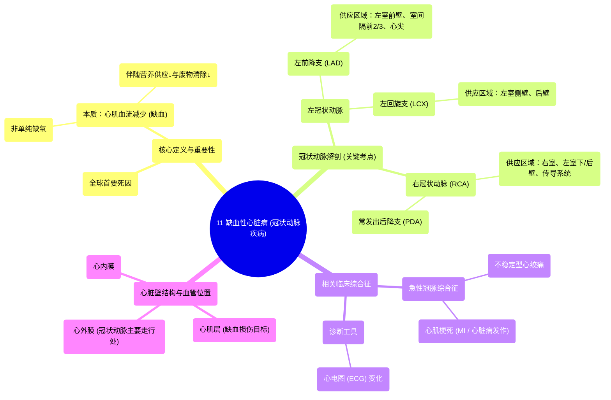

# 11 Ischemic Heart Disease (Coronary Artery Disease)

  <video controls preload="metadata" playsinline>
    <source src="https://helly.s3.bitiful.net/心血管学科/%E4%B8%93%E8%BE%91%2020%EF%BC%9A%E5%BF%83%E5%86%85%E7%A7%91%E7%BB%88%E6%9E%81%E8%BE%9E%E5%85%B8%E7%96%BE%E7%97%85%E6%9C%BA%E5%88%B6%E7%AF%87%20%28PathologyMechanisms%29/11%20Ischemic%20Heart%20Disease%20%28Coronary%20Artery%20Disease%29.mp4" type="video/mp4">
    
您的浏览器不支持播放，请升级。

  </video>

::: tip ⚡️ 核心考点 (30s速读)
*   **核心考点**：缺血性心脏病（IHD）是全球首要死因，其本质是流向心肌的血液减少，导致氧气、营养物质供应不足及废物清除障碍。
*   **临床意义**：理解冠状动脉（左前降支、左回旋支、右冠状动脉、后降支）的解剖分布，是定位急性冠脉综合征（如心绞痛、心肌梗死）病变区域和解读心电图变化的基础。
:::

## 🧠 深度精讲

*   **缺血性心脏病的定义**：缺血性心脏病，又称冠状动脉疾病，是指由于冠状动脉血流减少，导致心肌供氧、供能不足及代谢废物清除障碍的一类疾病。它不仅仅是“缺氧”（缺氧血症），而是综合性的血流灌注不足问题。
*   **流行病学与重要性**：缺血性心脏病是全球范围内的头号致死疾病。例如，超过35岁的美国人中，有超过30%最终将死于该病。因此，掌握其病理生理学至关重要。
*   **冠状动脉解剖（重点）**：心脏自身的血液供应依赖于冠状动脉系统，它们主要走行于心外膜表面。
    1.  **左冠状动脉**：起源于主动脉根部，很快分为两大主要分支：
        *   **左前降支**：沿心脏前室间沟下行，供应左心室前壁、室间隔前2/3及心尖部。是心肌梗死最常见的“罪犯血管”。
        *   **左回旋支**：沿左房室沟走行，供应左心室侧壁和后壁。
    2.  **右冠状动脉**：起源于主动脉根部，沿右房室沟走行，绕过心脏右缘至后部，通常发出**后降支**，供应右心室、左心室下壁/后壁及室间隔后1/3。
*   **心壁结构与血管位置**：心壁由内向外分为心内膜、心肌层和心外膜。冠状动脉的**心外膜段**（起始部分）是动脉粥样硬化斑块最常形成和导致管腔狭窄的部位，这是引发缺血性心脏病的解剖基础。

## 📚 双语术语表 (Terminology)
| 英文术语 | 中文翻译 | 定义/解释 |
| :--- | :--- | :--- |
| Ischemic Heart Disease (IHD) | 缺血性心脏病 | 因冠状动脉血流减少导致心肌缺血、缺氧的疾病总称。 |
| Coronary Artery Disease (CAD) | 冠状动脉疾病 | 特指冠状动脉因粥样硬化等原因发生狭窄或阻塞的疾病，是IHD最常见的原因。 |
| Acute Coronary Syndrome (ACS) | 急性冠状动脉综合征 | 由冠状动脉粥样硬化斑块破裂、血栓形成引起的一组急性临床综合征，包括不稳定型心绞痛和心肌梗死。 |
| Myocardial Infarction (MI) | 心肌梗死 | 冠状动脉急性、持续性缺血缺氧所引起的心肌坏死，俗称“心脏病发作”。 |
| Angina | 心绞痛 | 心肌暂时性缺血引起的以胸痛为主要表现的临床综合征。 |
| Electrocardiogram (ECG) | 心电图 | 记录心脏电活动的检查，是诊断心肌缺血和梗死的关键工具。 |
| Left Anterior Descending (LAD) Artery | 左前降支动脉 | 左冠状动脉的主要分支，供应左心室前壁等重要区域。 |
| Left Circumflex (LCX) Artery | 左回旋支动脉 | 左冠状动脉的分支，供应左心室侧壁和后壁。 |
| Right Coronary Artery (RCA) | 右冠状动脉 | 供应右心室、左心室下壁/后壁及窦房结、房室结的动脉。 |
| Posterior Descending Artery (PDA) | 后降支动脉 | 多由右冠状动脉发出，供应左心室下壁后部及室间隔后部。 |
| Epicardium | 心外膜 | 心脏壁的最外层，冠状动脉主要走行于此层表面。 |
| Myocardium | 心肌层 | 心脏壁的中间层，由心肌细胞构成，负责心脏的收缩功能。 |
| Endocardium | 心内膜 | 心脏壁的最内层，衬于心脏腔室内表面。 |

## 🗺️ 知识图谱

