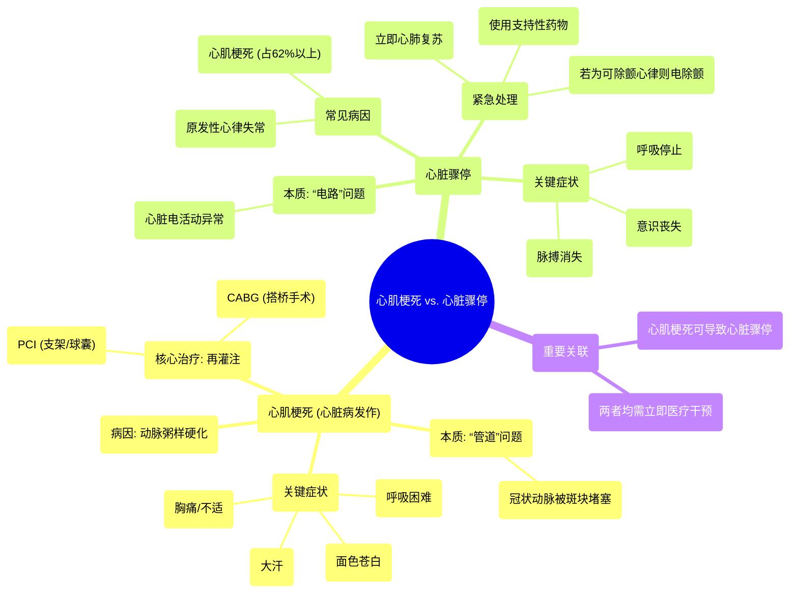

# 12 Heart attack vs Cardiac arrest in 2 mins(1)

  <video controls preload="metadata" playsinline>
    <source src="https://helly.s3.bitiful.net/心血管学科/%E4%B8%93%E8%BE%91%2020%EF%BC%9A%E5%BF%83%E5%86%85%E7%A7%91%E7%BB%88%E6%9E%81%E8%BE%9E%E5%85%B8%E7%96%BE%E7%97%85%E6%9C%BA%E5%88%B6%E7%AF%87%20%28PathologyMechanisms%29/12%20Heart%20attack%20vs%20Cardiac%20arrest%20in%202%20mins%281%29.mp4" type="video/mp4">
    
您的浏览器不支持播放，请升级。

  </video>

::: tip ⚡️ 核心考点 (30s速读)
*   **核心考点**：心肌梗死是“管道问题”（冠状动脉堵塞），心脏骤停是“电路问题”（心脏电活动异常）。
*   **临床意义**：两者均危及生命，但病理生理、症状和紧急处理方式不同。识别差异对正确施救至关重要。
:::

## 🧠 深度精讲

*   **概念1：心肌梗死**
    *   **定义**：医学上称为心肌梗死，指为心脏肌肉供血的冠状动脉被斑块堵塞，导致心肌血流中断。若血流不恢复，心肌会因缺血而坏死。
    *   **病因**：主要病因为动脉粥样硬化，即脂质、纤维组织等形成的斑块在冠状动脉内积聚，造成管腔狭窄或闭塞。
    *   **症状**：典型症状包括胸部压迫性疼痛或不适、呼吸困难、面色苍白、大汗淋漓。症状严重程度可从轻微到致命。
    *   **治疗**：关键在于**立即再灌注**，即尽快重新开通堵塞的血管。主要方法包括经皮冠状动脉介入治疗（如球囊扩张、支架植入）或冠状动脉旁路移植术（搭桥手术）。

*   **概念2：心脏骤停**
    *   **定义**：指心脏泵血功能突然、意外地停止，心脏停止有效搏动，导致全身血液循环中断。
    *   **病因**：核心是心脏**电活动异常**，如室性心动过速、心室颤动、无脉性电活动或心脏停搏（心电图为直线）。值得注意的是，超过60%的心脏骤停是由心肌梗死诱发恶性心律失常所致。
    *   **症状**：主要表现为意识突然丧失、呼吸停止、大动脉（如颈动脉、股动脉）搏动消失。
    *   **治疗**：需要**立即进行心肺复苏**以维持基本血液循环。如果心电监测显示为可除颤心律（如室颤、无脉性室速），应立即进行电除颤。同时可使用药物支持心脏电活动与功能。

## 📚 双语术语表 (Terminology)
| 英文术语 | 中文翻译 | 定义/解释 |
| :--- | :--- | :--- |
| Heart Attack / Myocardial Infarction (MI) | 心肌梗死 / 心脏病发作 | 冠状动脉阻塞导致心肌缺血、坏死。 |
| Cardiac Arrest | 心脏骤停 | 心脏泵血功能突然停止，导致循环中断。 |
| Atherosclerosis | 动脉粥样硬化 | 动脉壁内脂质和纤维物质积聚形成斑块，是心梗的主要病因。 |
| Plaque | 斑块 | 在动脉血管壁内形成的脂肪、胆固醇等沉积物。 |
| Reperfusion | 再灌注 | 恢复缺血组织的血流，是心梗治疗的核心目标。 |
| Percutaneous Coronary Intervention (PCI) | 经皮冠状动脉介入治疗 | 通过血管穿刺，用球囊或支架开通堵塞冠状动脉的微创手术。 |
| Coronary Artery Bypass Graft (CABG) | 冠状动脉旁路移植术 | 俗称“搭桥手术”，取自身血管在堵塞的冠状动脉两端建立新通道。 |
| Ventricular Tachycardia (VT) | 室性心动过速 | 起源于心室的一种快速性心律失常，可导致心脏骤停。 |
| Ventricular Fibrillation (VF) | 心室颤动 | 心室肌发生快速、无序的颤动，心脏完全失去泵血功能，需立即除颤。 |
| Asystole | 心脏停搏 | 心电图上呈一条直线，表示心脏电活动完全停止。 |
| Cardiopulmonary Resuscitation (CPR) | 心肺复苏 | 通过胸外按压和人工呼吸维持基本循环和氧合的急救技术。 |
| Defibrillation | 除颤 | 使用除颤器对心脏释放电流，以终止某些恶性心律失常（如室颤）的治疗方法。 |

## 🗺️ 知识图谱

