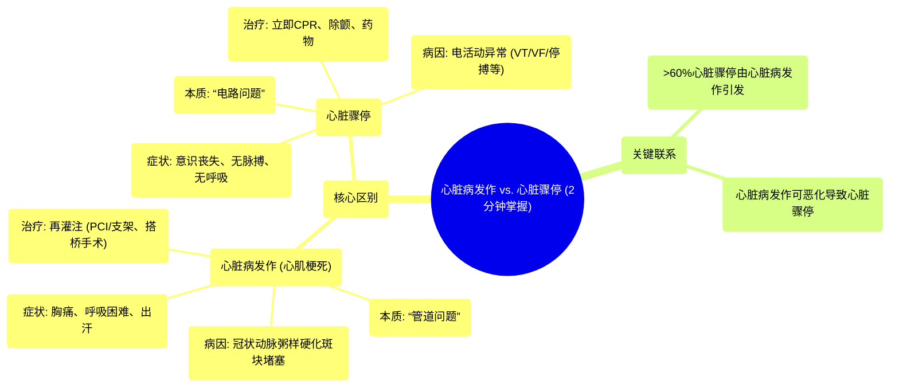

# 13 Heart attack vs Cardiac arrest in 2 mins

  <video controls preload="metadata" playsinline>
    <source src="https://helly.s3.bitiful.net/心血管学科/%E4%B8%93%E8%BE%91%2020%EF%BC%9A%E5%BF%83%E5%86%85%E7%A7%91%E7%BB%88%E6%9E%81%E8%BE%9E%E5%85%B8%E7%96%BE%E7%97%85%E6%9C%BA%E5%88%B6%E7%AF%87%20%28PathologyMechanisms%29/13%20Heart%20attack%20vs%20Cardiac%20arrest%20in%202%20mins.mp4" type="video/mp4">
    
您的浏览器不支持播放，请升级。

  </video>

::: tip ⚡️ 核心考点 (30s速读)
*   **核心考点**：心脏病发作（心肌梗死）是“管道问题”（血管堵塞），心脏骤停是“电路问题”（电活动异常）。前者是血流中断，后者是泵血停止。
*   **临床意义**：识别差异至关重要。心脏病发作需尽快疏通血管（再灌注治疗），心脏骤停需立即心肺复苏（CPR）和除颤。心脏病发作可能恶化为心脏骤停。
:::

## 🧠 深度精讲

*   **概念1：心脏病发作 (心肌梗死)**
    *   **本质**：这是一个“管道问题”。供应心脏肌肉（心肌）血液的冠状动脉被粥样硬化斑块堵塞，导致心肌缺血、缺氧，若血流不恢复，心肌会开始坏死。
    *   **病因**：主要病因为动脉粥样硬化，即脂质、胆固醇等物质在血管壁沉积形成斑块，导致血管狭窄或闭塞。
    *   **症状**：典型症状包括胸部压迫性疼痛或不适（可放射至左臂、下颌、背部）、呼吸困难、面色苍白、出冷汗（大汗）等。症状可从轻微到严重。
    *   **治疗**：目标是尽快恢复心肌血流，称为“再灌注治疗”。主要方法包括：
        1.  **经皮冠状动脉介入治疗**：通过导管用球囊扩张狭窄处，并通常植入支架保持血管通畅。
        2.  **冠状动脉旁路移植术**：俗称“搭桥手术”，为堵塞的血管建立新的血液通道。

*   **概念2：心脏骤停**
    *   **本质**：这是一个“电路问题”。心脏的电活动发生严重紊乱或停止，导致心脏突然停止有效搏动，无法向全身泵血。
    *   **病因**：通常由恶性心律失常引起，如室性心动过速、心室颤动、无脉性电活动或心脏停搏（心电图呈直线）。值得注意的是，**超过60%的心脏骤停是由心脏病发作（心肌梗死）诱发**的。
    *   **症状**：表现为突发意识丧失、呼之不应、呼吸停止或濒死叹息样呼吸、大动脉（如颈动脉、股动脉）搏动消失。
    *   **治疗**：需要立即进行急救，争分夺秒。
        1.  **心肺复苏**：立即开始高质量的胸外按压和人工呼吸，为大脑和心脏等重要器官提供最低限度的血流。
        2.  **除颤**：如果患者的心律是“可电击心律”（如室颤、无脉性室速），应尽快使用自动体外除颤器或手动除颤器进行电击，以终止恶性心律，让心脏恢复正常节律。
        3.  **高级生命支持**：包括使用肾上腺素等药物支持心脏电活动与收缩功能。

*   **核心关系总结**：可以将心脏想象成一个房子。**心脏病发作**好比房子的**水管（冠状动脉）堵了**，导致房间（心肌）缺血。**心脏骤停**好比房子的**电路系统（心脏电传导系统）完全故障**，导致整个房子停电，水泵（心脏）停止工作。水管严重堵塞（严重心梗）最终也可能导致电路系统崩溃，引发停电（心脏骤停）。

## 📚 双语术语表 (Terminology)
| 英文术语 | 中文翻译 | 定义/解释 |
| :--- | :--- | :--- |
| Heart Attack / Myocardial Infarction (MI) | 心脏病发作 / 心肌梗死 | 冠状动脉阻塞导致心肌血流中断，心肌缺血坏死。 |
| Cardiac Arrest | 心脏骤停 | 心脏电活动异常导致心脏突然停止有效搏动。 |
| Atherosclerosis | 动脉粥样硬化 | 动脉壁内脂质、胆固醇等沉积形成斑块，使血管变硬、变窄。 |
| Plaque | (粥样硬化)斑块 | 在动脉血管壁内形成的由脂肪、胆固醇、钙等物质组成的沉积物。 |
| Percutaneous Coronary Intervention (PCI) | 经皮冠状动脉介入治疗 | 通过皮肤穿刺血管，用导管对狭窄或闭塞的冠状动脉进行扩张和支架植入的微创手术。 |
| Coronary Artery Bypass Graft (CABG) | 冠状动脉旁路移植术 | 俗称“搭桥手术”，取患者自身血管，在堵塞的冠状动脉两端建立新的血流通道。 |
| Ventricular Tachycardia (VT) | 室性心动过速 | 起源于心室的一种快速性心律失常。 |
| Ventricular Fibrillation (VF) | 心室颤动 | 心室肌发生快速、无序、不协调的颤动，心脏完全失去泵血功能。 |
| Asystole | 心脏停搏 | 心脏无任何电活动和机械收缩，心电图呈一条直线。 |
| Pulseless Electrical Activity (PEA) | 无脉性电活动 | 心电图显示有组织的心电活动，但无法触及有效脉搏，心脏无有效泵血。 |
| Cardiopulmonary Resuscitation (CPR) | 心肺复苏 | 通过胸外按压和人工呼吸，为心脏骤停患者建立人工循环和呼吸的急救技术。 |
| Defibrillation | 除颤 | 使用除颤器对心脏释放电流，以终止某些恶性心律失常（如室颤）的治疗方法。 |
| Reperfusion | 再灌注 | 使缺血组织重新获得血流供应的过程，是心肌梗死治疗的核心目标。 |

## 🗺️ 知识图谱

