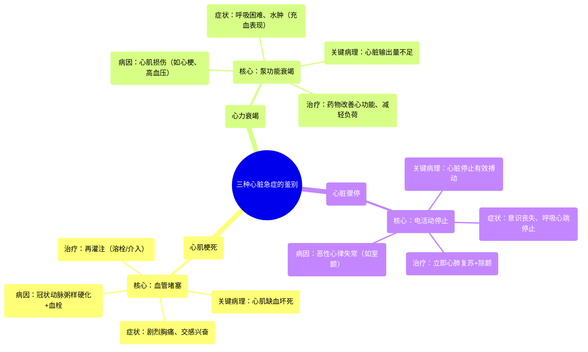

# 14 Heart attack vs Heart failure vs Cardiac arrest

  <video controls preload="metadata" playsinline>
    <source src="https://helly.s3.bitiful.net/心血管学科/%E4%B8%93%E8%BE%91%2020%EF%BC%9A%E5%BF%83%E5%86%85%E7%A7%91%E7%BB%88%E6%9E%81%E8%BE%9E%E5%85%B8%E7%96%BE%E7%97%85%E6%9C%BA%E5%88%B6%E7%AF%87%20%28PathologyMechanisms%29/14%20Heart%20attack%20vs%20Heart%20failure%20vs%20Cardiac%20arrest.mp4" type="video/mp4">
    
您的浏览器不支持播放，请升级。

  </video>

::: tip ⚡️ 核心考点 (30s速读)
*   **核心考点**：心肌梗死、心力衰竭、心脏骤停是三种截然不同的心血管急症，核心区别在于**病理生理机制**：心肌梗死是**心肌缺血坏死**，心力衰竭是**心脏泵血功能下降**，心脏骤停是**心脏电活动停止**。
*   **临床意义**：三者可相互关联（如心肌梗死可导致心力衰竭，心力衰竭可诱发心脏骤停），但**病因、症状和紧急处理方式完全不同**，准确识别对抢救至关重要。
:::

## 🧠 深度精讲

*   **心肌梗死**
    *   **定义**：医学上称为“心肌梗死”，指为心脏供血的**冠状动脉**发生急性、持续性堵塞，导致其供血区域的心肌因**缺血、缺氧而坏死**。
    *   **病因**：最常见于**冠状动脉粥样硬化**基础上的斑块破裂，继发血栓形成，完全堵塞血管。
    *   **关键病理**：属于**缺血性心脏病**的最严重形式。其前驱或较轻阶段称为**心绞痛**（冠状动脉狭窄导致心肌一过性缺血，但未坏死）。
    *   **症状**：典型表现为突发、剧烈、持续的**胸痛或压迫感**，可放射至左肩、背部、下颌或手臂。常伴有大汗、恶心、呕吐、呼吸困难及濒死感（交感神经兴奋表现）。

*   **心力衰竭**
    *   **定义**：指心脏的**泵血功能**受损，无法满足身体代谢需要的综合征。它不是一种独立疾病，而是多种心脏疾病的终末阶段。
    *   **病因**：任何导致心脏结构或功能受损的疾病均可引起，如心肌梗死、高血压、心肌病、心脏瓣膜病等。
    *   **关键病理**：心脏像一个“泵”，当这个泵的效率下降，就无法将足够的血液泵出以满足全身需求。可分为左心衰（肺循环淤血，导致呼吸困难、咳粉红色泡沫痰）、右心衰（体循环淤血，导致下肢水肿、肝大、颈静脉怒张）或全心衰。
    *   **症状**：主要表现为“充血”症状，如活动后**气短、乏力、夜间阵发性呼吸困难、端坐呼吸**以及身体低垂部位（如脚踝）**水肿**。

*   **心脏骤停**
    *   **定义**：指心脏**突然停止有效搏动**，泵血功能瞬间丧失，导致全身血液循环中断。患者会立即意识丧失、呼吸停止。
    *   **病因**：最常见的原因是**恶性心律失常**，如心室颤动或无脉性室性心动过速。心肌梗死、心力衰竭、电解质紊乱、触电等都可能触发心脏骤停。
    *   **关键病理**：核心是心脏的**电活动异常**，导致心肌无法协调收缩。与心肌梗死（血管问题）和心力衰竭（泵功能问题）的机制根本不同。
    *   **症状与处理**：突发意识丧失、抽搐、呼吸停止或叹息样呼吸、大动脉搏动消失。**必须立即进行心肺复苏和使用自动体外除颤器**，争分夺秒是抢救成功的关键。

## 📚 双语术语表 (Terminology)
| 英文术语 | 中文翻译 | 定义/解释 |
| :--- | :--- | :--- |
| Heart Attack / Myocardial Infarction (MI) | 心肌梗死 / 心脏病发作 | 冠状动脉阻塞导致心肌缺血性坏死。 |
| Heart Failure (HF) | 心力衰竭 | 心脏泵血功能下降，无法满足机体需求。 |
| Cardiac Arrest | 心脏骤停 | 心脏突然停止有效搏动，血液循环中断。 |
| Coronary Artery Disease (CAD) | 冠状动脉疾病 | 冠状动脉粥样硬化导致血管狭窄或阻塞的疾病。 |
| Ischemic Heart Disease (IHD) | 缺血性心脏病 | 因冠状动脉血流减少导致心肌缺血的疾病总称。 |
| Atherosclerosis | 动脉粥样硬化 | 动脉壁内脂质、纤维组织等沉积形成斑块的病理过程。 |
| Angina | 心绞痛 | 冠状动脉狭窄导致心肌一过性缺血引起的胸痛。 |
| Left Anterior Descending (LAD) | 左前降支 | 冠状动脉的一个重要分支，是心肌梗死的常见部位。 |

## 🗺️ 知识图谱

