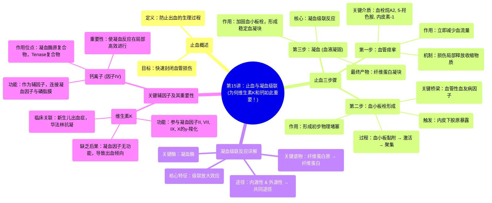

# 15 Hemostasis and the Clotting Cascade (Why Vitamin K & Calcium are important!)

  <video controls preload="metadata" playsinline>
    <source src="https://helly.s3.bitiful.net/心血管学科/%E4%B8%93%E8%BE%91%2020%EF%BC%9A%E5%BF%83%E5%86%85%E7%A7%91%E7%BB%88%E6%9E%81%E8%BE%9E%E5%85%B8%E7%96%BE%E7%97%85%E6%9C%BA%E5%88%B6%E7%AF%87%20%28PathologyMechanisms%29/15%20Hemostasis%20and%20the%20Clotting%20Cascade%20%28Why%20Vitamin%20K%20%26%20Calcium%20are%20important%21%29.mp4" type="video/mp4">
    
您的浏览器不支持播放，请升级。

  </video>

::: tip ⚡️ 核心考点 (30s速读)
*   **核心考点**：止血是机体防止出血的生理过程，包含三个关键步骤：血管痉挛、血小板栓形成和凝血级联反应。凝血级联反应是学生学习的难点，涉及多种凝血因子（I-XIII）的级联激活，最终形成稳定的纤维蛋白凝块。
*   **临床意义**：理解止血过程是掌握出血性疾病（如血友病、血管性血友病）和血栓性疾病（如深静脉血栓）病理生理的基础。维生素K和钙离子是多个凝血因子（如II, VII, IX, X）激活所必需的辅因子，缺乏会导致凝血功能障碍。
:::

## 🧠 深度精讲

*   **概念1：止血概述**
    止血是机体在血管损伤后，通过一系列复杂反应迅速封闭伤口、防止血液流失的生理过程。它不是一个单一事件，而是一个有序、多步骤的精密调控程序。

*   **概念2：止血三步骤**
    1.  **血管痉挛**：血管损伤后，受损的内皮细胞和周围组织立即释放化学物质（如血栓烷A2、5-羟色胺、内皮素-1），引起受损血管平滑肌反射性收缩（血管痉挛），从而在第一时间减少血流量和血液流失。
    2.  **血小板栓形成**：血管内皮损伤暴露出内皮下带负电荷的胶原蛋白。循环中的血小板（血栓细胞）通过**血管性血友病因子**作为“桥梁”黏附到胶原上。黏附的血小板被激活，释放内容物（如ADP、血栓烷A2），吸引和激活更多血小板聚集，形成松软的**血小板栓**，初步封堵伤口。
    3.  **凝血（血液凝固）**：这是止血的巩固阶段。通过**凝血级联反应**，血浆中一系列无活性的酶原（凝血因子）被顺序激活，最终将可溶性的纤维蛋白原（因子I）转化为不溶性的**纤维蛋白**。纤维蛋白交织成网，将血小板、血细胞等牢牢网罗其中，形成坚固的**血凝块**。

*   **概念3：凝血级联反应与关键辅因子**
    *   **过程**：这是一个“瀑布式”放大反应。传统上分为**内源性途径**（由血管内皮下胶原暴露等启动）和**外源性途径**（由组织损伤释放组织因子启动），两者最终汇合于**共同途径**，激活凝血酶原（因子II）生成**凝血酶**，凝血酶再催化纤维蛋白原转化为纤维蛋白。
    *   **维生素K的作用**：肝脏合成凝血因子II、VII、IX、X以及抗凝蛋白（如蛋白C、S）时，需要维生素K参与其**γ-羧化**过程。只有经过γ-羧化的这些因子才能与钙离子结合，进而与血小板磷脂膜结合，发挥凝血功能。缺乏维生素K（如新生儿、长期使用广谱抗生素、华法林抗凝治疗）会导致这些因子功能不全，引起出血倾向。
    *   **钙离子的作用**：钙离子（因子IV）是凝血过程中多个步骤必需的辅因子。它主要在凝血因子与磷脂膜表面结合形成“**凝血酶原复合物**”和“**Tenase复合物**”中起桥梁作用，是级联反应在局部高效进行的关键。

## 📚 双语术语表 (Terminology)
| 英文术语 | 中文翻译 | 定义/解释 |
| :--- | :--- | :--- |
| Hemostasis | 止血 | 机体防止血液从受损血管流失的生理过程。 |
| Vascular Spasm | 血管痉挛 | 血管损伤后立即发生的反射性收缩，以减少出血。 |
| Platelet Plug | 血小板栓 | 由激活的血小板聚集形成的初步堵塞物。 |
| Clotting Cascade | 凝血级联反应 | 一系列凝血因子顺序激活，最终导致血凝块形成的酶促反应。 |
| Coagulation Factors | 凝血因子 | 参与血液凝固过程的一组蛋白质（通常用罗马数字I-XIII表示）。 |
| Von Willebrand Factor (vWF) | 血管性血友病因子 | 一种由内皮细胞和血小板释放的蛋白质，作为血小板黏附于内皮下胶原的桥梁。 |
| Thromboxane A2 (TXA2) | 血栓烷A2 | 一种由血小板等释放的类花生酸，能促进血管收缩和血小板聚集。 |
| Fibrin | 纤维蛋白 | 由纤维蛋白原经凝血酶切割后形成的不溶性蛋白质，是血凝块的网状骨架。 |
| Prothrombin | 凝血酶原 | 凝血因子II，在凝血酶原复合物作用下转化为凝血酶。 |
| Thrombin | 凝血酶 | 凝血级联反应中的关键酶，能将纤维蛋白原转化为纤维蛋白，并激活血小板和多种凝血因子。 |

## 🗺️ 知识图谱

