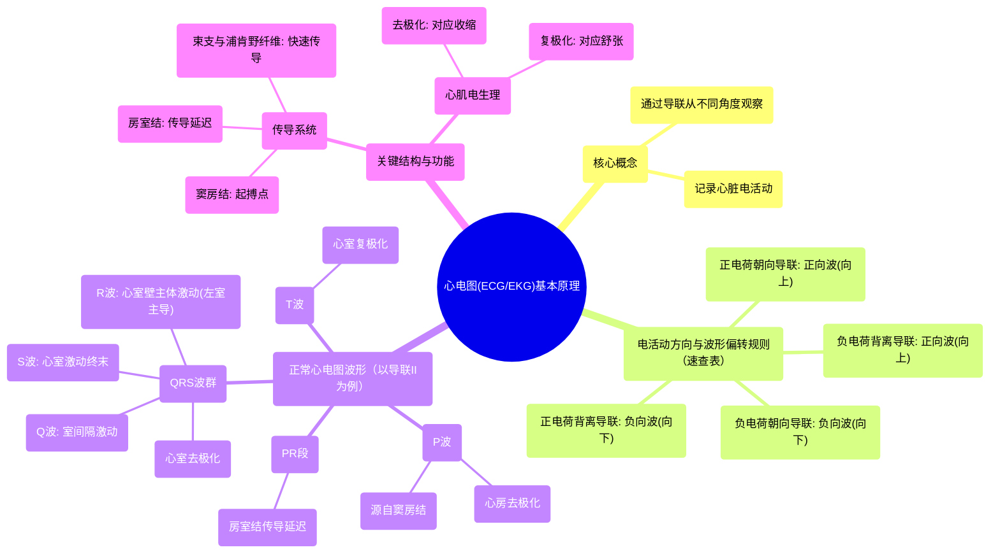

# 16 ECGs (EKGs) Made Easy!

  <video controls preload="metadata" playsinline>
    <source src="https://helly.s3.bitiful.net/心血管学科/%E4%B8%93%E8%BE%91%2020%EF%BC%9A%E5%BF%83%E5%86%85%E7%A7%91%E7%BB%88%E6%9E%81%E8%BE%9E%E5%85%B8%E7%96%BE%E7%97%85%E6%9C%BA%E5%88%B6%E7%AF%87%20%28PathologyMechanisms%29/16%20ECGs%20%28EKGs%29%20Made%20Easy%21.mp4" type="video/mp4">
    
您的浏览器不支持播放，请升级。

  </video>

::: tip ⚡️ 核心考点 (30s速读)
*   **核心考点**：心电图（ECG/EKG）通过记录心脏电活动来评估心脏功能。理解电活动方向与心电图波形偏转（正向/负向）的关系是解读心电图的基础。
*   **临床意义**：心电图是诊断心律失常、心肌缺血、心肌梗死等心脏疾病的基石。通过分析P波、QRS波群、T波等波形，可以判断心脏电传导是否正常，以及心肌是否存在损伤。
:::

## 🧠 深度精讲
*   **心电图基本原理**：心电图通过在胸部和四肢放置电极，从不同角度（称为“导联”）记录心脏的电活动。心脏的电活动本质上是正、负电荷的移动。根据“速查表”原则：**正电荷朝向某导联移动，该导联记录到正向波（向上）；正电荷背离某导联移动，则记录到负向波（向下）。负电荷的移动方向与波形偏转的关系则相反。**
*   **正常心电图的波形解读（以导联II为例）**：
    1.  **P波**：代表心房的去极化（电激动）。电活动从**窦房结**发出，经心房肌传向**房室结**。由于正电荷朝向导联II移动，因此产生一个向上的小波。
    2.  **PR段**：代表电激动在**房室结**内的传导延迟，形成一段短暂的等电位线（基线）。
    3.  **QRS波群**：代表心室的去极化。
        *   **Q波**：初始的负向波，代表室间隔最早的去极化，其向量背离导联II。
        *   **R波**：高大的正向波，代表左、右心室壁主体部分的去极化。由于**左心室壁更厚**，其电活动占主导，总体向量朝向导联II，形成向上的大尖波。
        *   **S波**：R波后的负向波，代表心室去极化的终末部分，向量背离导联II。
    4.  **ST段与T波**：代表心室的复极化（电复位）。心肌细胞恢复静息电位（负电荷）的过程。T波通常与QRS波群的主波方向一致（在导联II为正向），因为复极化的电向量方向与去极化相反。

## 📚 双语术语表 (Terminology)
| 英文术语 | 中文翻译 | 定义/解释 |
| :--- | :--- | :--- |
| ECG / EKG (Electrocardiogram) | 心电图 | 记录心脏电活动的图形。 |
| Lead | 导联 | 放置在身体特定位置的电极组合，提供观察心脏电活动的特定角度。 |
| Deflection | 偏转 | 心电图上波形相对于基线的向上（正向）或向下（负向）移动。 |
| Sinoatrial (SA) Node | 窦房结 | 心脏的正常起搏点，位于右心房，自发产生电冲动。 |
| Atrioventricular (AV) Node | 房室结 | 位于心房与心室交界处，能延迟电冲动传导，确保心房收缩完毕后再心室收缩。 |
| Bundle Branches | 束支 | 希氏束的分支（左、右束支），将电冲动快速传向心室。 |
| Purkinje Fibers | 浦肯野纤维 | 分布于心室内膜下的特殊传导纤维，将电冲动快速传递至整个心室肌。 |
| Depolarization | 去极化 | 心肌细胞由静息状态（外正内负）变为兴奋状态（外负内正）的电活动过程，对应心肌收缩。 |
| Repolarization | 复极化 | 心肌细胞由兴奋状态恢复为静息状态的电活动过程，对应心肌舒张。 |
| P Wave | P波 | 代表心房肌的去极化。 |
| QRS Complex | QRS波群 | 代表心室肌的去极化。 |
| T Wave | T波 | 代表心室肌的复极化。 |

## 🗺️ 知识图谱

