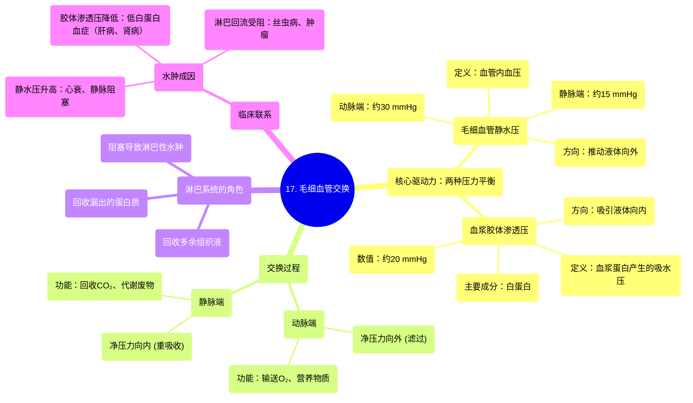

# 17 Capillary Exchange

  <video controls preload="metadata" playsinline>
    <source src="https://helly.s3.bitiful.net/心血管学科/%E4%B8%93%E8%BE%91%2020%EF%BC%9A%E5%BF%83%E5%86%85%E7%A7%91%E7%BB%88%E6%9E%81%E8%BE%9E%E5%85%B8%E7%96%BE%E7%97%85%E6%9C%BA%E5%88%B6%E7%AF%87%20%28PathologyMechanisms%29/17%20Capillary%20Exchange.mp4" type="video/mp4">
    
您的浏览器不支持播放，请升级。

  </video>

::: tip ⚡️ 核心考点 (30s速读)
*   **核心考点**：毛细血管交换的核心是**静水压**与**胶体渗透压**的平衡。在动脉端，静水压占优，物质滤出；在静脉端，胶体渗透压占优，物质重吸收。净滤过量进入组织间隙，由淋巴系统回收。
*   **临床意义**：理解此平衡是解释**水肿**（组织液过多）和**脱水**（组织液过少）等病理生理现象的基础。例如，血浆蛋白（如白蛋白）减少会导致胶体渗透压下降，引起水肿。
:::

## 🧠 深度精讲

*   **概念1：毛细血管交换的动力——两种压力**
    毛细血管内物质交换并非被动扩散，而是由两种方向相反的物理压力驱动：
    1.  **毛细血管静水压**：即毛细血管内的**血压**。它由心脏收缩产生，推动血液向前流动，同时也推动血浆中的水分和小分子溶质（如氧气、葡萄糖、电解质）**向外**穿过毛细血管壁，进入组织间隙。在动脉端，此压力约为 **30 mmHg**。
    2.  **血浆胶体渗透压**：主要由血浆中的**蛋白质**（尤其是白蛋白）产生。由于这些蛋白质分子较大，无法自由穿过毛细血管壁，在血管内形成了较高的胶体浓度，从而产生**向内**的“吸水”力量。此压力约为 **20 mmHg**。

*   **概念2：交换的动态过程——从动脉端到静脉端**
    沿着毛细血管床，这两种压力的净效应决定了液体的流动方向：
    *   **在动脉端**：静水压 (30 mmHg) > 胶体渗透压 (20 mmHg)。**净压力向外**，约为10 mmHg。因此，液体和营养物质**滤出**毛细血管，滋养组织细胞。
    *   **在静脉端**：由于血液在流动过程中克服阻力，血压（静水压）下降至约 **15 mmHg**，而胶体渗透压保持相对稳定（仍为~20 mmHg）。此时，胶体渗透压 (20 mmHg) > 静水压 (15 mmHg)。**净压力向内**，约为5 mmHg。因此，组织细胞代谢产生的废物（如二氧化碳、尿素）和部分组织液**被重吸收**回毛细血管。

*   **概念3：淋巴系统的关键作用**
    并非所有从动脉端滤出的液体都能在静脉端被重吸收。每天约有 **2-4升** 的液体和少量蛋白质会滞留在组织间隙，形成**组织液**。**淋巴系统**就像身体的“排水系统”，负责收集这些多余的液体和蛋白质，最终将其送回血液循环。如果淋巴系统阻塞（如丝虫病、肿瘤压迫），就会导致组织液积聚，形成**淋巴性水肿**。

## 📚 双语术语表 (Terminology)
| 英文术语 | 中文翻译 | 定义/解释 |
| :--- | :--- | :--- |
| Capillary Exchange | 毛细血管交换 | 血液与组织细胞之间通过毛细血管壁进行的物质（如氧气、营养物质、代谢废物）和液体交换。 |
| Hydrostatic Pressure | 静水压 / 流体静压 | 在心血管系统中，指血液对血管壁产生的侧向压力，即血压。是推动液体**滤出**毛细血管的主要力量。 |
| Oncotic Pressure / Colloid Osmotic Pressure | 胶体渗透压 | 主要由血浆蛋白质（特别是白蛋白）产生的渗透压。由于蛋白质不能自由通过毛细血管壁，从而形成**向内**的“吸水”力量。 |
| Edema | 水肿 | 组织间隙或体腔内异常积聚过多液体。毛细血管滤出增加或重吸收/淋巴回流减少均可导致。 |
| Arterial End | 动脉端 | 毛细血管床中靠近微动脉的一端，此处静水压最高。 |
| Venous End | 静脉端 | 毛细血管床中靠近微静脉的一端，此处静水压最低。 |
| Filtration | 滤过 | 在毛细血管动脉端，液体和溶质在净外向压力作用下从血管进入组织间隙的过程。 |
| Reabsorption | 重吸收 | 在毛细血管静脉端，液体和废物在净内向压力作用下从组织间隙返回血管的过程。 |

## 🗺️ 知识图谱

