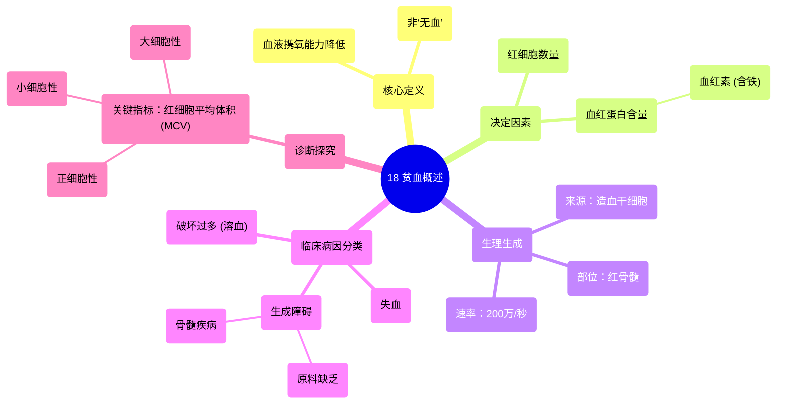

# 18 Anaemia - An overview

  <video controls preload="metadata" playsinline>
    <source src="https://helly.s3.bitiful.net/心血管学科/%E4%B8%93%E8%BE%91%2020%EF%BC%9A%E5%BF%83%E5%86%85%E7%A7%91%E7%BB%88%E6%9E%81%E8%BE%9E%E5%85%B8%E7%96%BE%E7%97%85%E6%9C%BA%E5%88%B6%E7%AF%87%20%28PathologyMechanisms%29/18%20Anaemia%20-%20An%20overview.mp4" type="video/mp4">
    
您的浏览器不支持播放，请升级。

  </video>

::: tip ⚡️ 核心考点 (30s速读)
*   **核心考点**：贫血的本质是血液携氧能力下降，可由红细胞数量减少或红细胞内血红蛋白含量降低导致。
*   **临床意义**：贫血是多种疾病的共同表现，其病因可分为失血、生成障碍和破坏过多三大类，通过红细胞大小（MCV）等指标可进行初步鉴别。
:::

## 🧠 深度精讲

*   **贫血的定义**：贫血并非字面意义上的“没有血液”，而是指**血液携氧能力降低**。这主要由两个因素决定：**红细胞数量**和每个红细胞内的**血红蛋白含量**。血红蛋白是红细胞内携带氧气的关键蛋白质，其核心是含铁的**血红素**。因此，无论是红细胞总数减少，还是单个红细胞内血红蛋白不足，都会导致贫血。

*   **红细胞的生理与数量**：
    *   **生成部位**：红细胞在骨骼的**红骨髓**中由**造血干细胞**分化、成熟而来。这些干细胞具有多向分化潜能，能生成所有血细胞谱系。
    *   **惊人的数量**：人体内约有**20万亿个红细胞**，占全身细胞总数的约60%。正常成人每微升血液中约有500万个红细胞，每个红细胞内约含2.5亿个血红蛋白分子，具有强大的携氧能力。

*   **贫血的病因分类**：视频将贫血的病因归纳为三大类，这是临床诊断的重要思路：
    1.  **失血**：急慢性出血导致红细胞直接丢失。
    2.  **生成障碍**：骨髓造血功能出现问题，导致红细胞产量不足。可能由于造血原料（如铁、维生素B12、叶酸）缺乏，或骨髓本身疾病（如再生障碍性贫血、白血病浸润）导致。
    3.  **破坏过多**：红细胞在血管内或脾脏中被过早破坏，即**溶血性贫血**。

*   **贫血的临床探究思路**：初步评估贫血时，**红细胞平均体积（MCV）** 是一个关键指标，用于判断红细胞的大小：
    *   **小细胞性贫血**：MCV减小，常见于缺铁性贫血。
    *   **正细胞性贫血**：MCV正常，可见于急性失血、溶血或某些慢性病。
    *   **大细胞性贫血**：MCV增大，常见于维生素B12或叶酸缺乏。

## 📚 双语术语表 (Terminology)
| 英文术语 | 中文翻译 | 定义/解释 |
| :--- | :--- | :--- |
| Anemia | 贫血 | 血液携氧能力降低的状态。 |
| Red Blood Cell (RBC) | 红细胞 | 血液中负责运输氧气和二氧化碳的细胞。 |
| Hemoglobin (HB) | 血红蛋白 | 红细胞内富含铁的蛋白质，是氧气的载体。 |
| Heme | 血红素 | 血红蛋白的辅基，是一个含铁的卟啉环结构，直接结合氧分子。 |
| Hematopoietic Stem Cell | 造血干细胞 | 存在于骨髓中的多能干细胞，能分化为所有类型的血细胞。 |
| Bone Marrow | 骨髓 | 骨骼内的软组织，是血细胞生成的主要场所。 |
| Red Marrow | 红骨髓 | 具有活跃造血功能的骨髓。 |
| Microcytic Anemia | 小细胞性贫血 | 红细胞平均体积（MCV）小于正常的贫血。 |
| Normocytic Anemia | 正细胞性贫血 | 红细胞平均体积（MCV）在正常范围内的贫血。 |
| Macrocytic Anemia | 大细胞性贫血 | 红细胞平均体积（MCV）大于正常的贫血。 |

## 🗺️ 知识图谱

