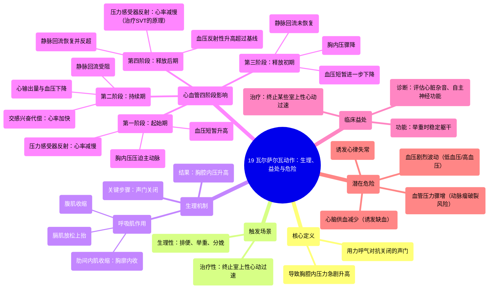

# 19 Valsalva Maneuver Physiology, Benefits, Dangers

  <video controls preload="metadata" playsinline>
    <source src="https://helly.s3.bitiful.net/心血管学科/%E4%B8%93%E8%BE%91%2020%EF%BC%9A%E5%BF%83%E5%86%85%E7%A7%91%E7%BB%88%E6%9E%81%E8%BE%9E%E5%85%B8%E7%96%BE%E7%97%85%E6%9C%BA%E5%88%B6%E7%AF%87%20%28PathologyMechanisms%29/19%20Valsalva%20Maneuver%20Physiology%2C%20Benefits%2C%20Dangers.mp4" type="video/mp4">
    
您的浏览器不支持播放，请升级。

  </video>

::: tip ⚡️ 核心考点 (30s速读)
*   **核心考点**：瓦尔萨尔瓦动作是用力呼气时关闭声门，导致胸腔内压力急剧升高的生理过程。其核心生理效应是通过压力变化影响静脉回流、心输出量和血压，进而触发自主神经反射（压力感受器反射），最终导致心率变化。
*   **临床意义**：该动作可用于终止某些类型的室上性心动过速（SVT），是一种无创的物理治疗方法。但同时，它也可能导致血压剧烈波动、减少心脑供血，对心血管疾病患者（如主动脉瘤、冠心病）有潜在危险。
:::

## 🧠 深度精讲

*   **概念1：瓦尔萨尔瓦动作的定义与触发**
    瓦尔萨尔瓦动作是指**用力呼气时对抗关闭的声门**。这导致呼气气流被阻断，胸腔内压力急剧升高。它并非一个刻意学习的“技巧”，而是在日常生活中自然触发的生理现象，例如：**用力排便、举重（尤其是接近最大重量时）、分娩时用力**。在医学上，它也被有意识地用于**尝试终止室上性心动过速**。

*   **概念2：动作执行的生理机制**
    1.  **用力呼气准备**：收缩肋间内肌使胸廓下降内收，放松膈肌使其上抬，并可能收缩腹肌。这些动作共同**减小胸腔容积**。
    2.  **关键步骤——关闭声门**：在用力呼气的同时，**关闭声门（喉咙处的阀门）**，阻止空气呼出。这是区分普通用力呼气和瓦尔萨尔瓦动作的关键。
    3.  **压力变化**：由于胸腔容积减小而气体无法排出，导致**胸腔内压力（Intrathoracic Pressure）急剧升高**。

*   **概念3：对心血管系统的四阶段影响（核心生理）**
    瓦尔萨尔瓦动作对循环系统的影响可分为四个经典阶段：
    1.  **第一阶段（起始期）**：胸腔内压升高，直接压迫主动脉，导致**主动脉血压短暂升高**。压力感受器感知到血压升高，通过**迷走神经（副交感神经）反射性引起心率减慢**。
    2.  **第二阶段（持续期）**：持续的高胸内压严重压迫腔静脉等大静脉，阻碍了**静脉血液回流到心脏**。这导致心脏充盈血量减少，进而使**心输出量和动脉血压下降**。此时，身体会代偿性地**激活交感神经系统，使心率加快**，试图维持血压。
    3.  **第三阶段（释放初期）**：动作停止，声门打开，胸腔内压骤然下降。对静脉的压迫解除，但血液尚未充分回流至心脏，**血压会有一个短暂的进一步下降**。
    4.  **第四阶段（释放后期/“overshoot”期）**：静脉回流恢复并超过正常水平，心脏充盈量增加，心输出量恢复。同时，第二阶段激活的交感兴奋和血容量反弹共同作用，导致**血压反射性升高超过基线，并伴随心率反射性减慢（压力感受器再次响应）**。**正是第四期的心率减慢效应，被用于治疗室上性心动过速**。

*   **概念4：益处与危险**
    *   **益处**：
        *   **治疗用途**：通过第四阶段的迷走神经刺激，可能终止**房室结折返性心动过速（AVNRT）** 等室上性心动过速。
        *   **诊断用途**：用于检查心脏杂音（如肥厚型梗阻性心肌病的杂音会增强）或评估自主神经功能。
        *   **功能性用途**：在举重时提供躯干稳定性，保护脊柱。
    *   **危险**：
        *   **血压剧烈波动**：可能导致一过性严重低血压（脑灌注不足，引起头晕、黑矇甚至晕厥）或高血压。
        *   **减少心脑供血**：第二阶段心输出量下降，可能诱发心肌缺血或脑缺血，对冠心病、脑血管病患者风险高。
        *   **血管压力骤增**：可能导致主动脉夹层、动脉瘤破裂或视网膜出血的风险增加。
        *   **心律失常**：可能诱发其他类型的心律失常。

## 📚 双语术语表 (Terminology)
| 英文术语 | 中文翻译 | 定义/解释 |
| :--- | :--- | :--- |
| Valsalva maneuver | 瓦尔萨尔瓦动作 | 用力呼气时对抗关闭的声门，导致胸内压升高的动作。 |
| Glottis | 声门 | 喉部两侧声带之间的开口，其关闭是完成该动作的关键。 |
| Intrathoracic pressure | 胸腔内压力 | 胸腔内部的压力。瓦尔萨尔瓦动作使其急剧升高。 |
| Venous return | 静脉回流 | 血液从全身静脉返回右心房的过程。该动作会阻碍此过程。 |
| Aortic pressure | 主动脉压力 | 主动脉内的血压。该动作初期使其升高，随后因静脉回流减少而下降。 |
| Baroreceptor | 压力感受器 | 位于颈动脉窦和主动脉弓，感知血压变化的感受器。 |
| Vagus nerve | 迷走神经 | 第10对脑神经，是副交感神经系统的主要神经，可减慢心率。 |
| Parasympathetic nervous system | 副交感神经系统 | “休息和消化”系统，兴奋时减慢心率、降低血压。 |
| Sympathetic nervous system | 交感神经系统 | “战或逃”系统，兴奋时加快心率、升高血压。 |
| Supraventricular tachycardia (SVT) | 室上性心动过速 | 起源于心房或房室结的快速性心律失常，部分类型可通过瓦尔萨尔瓦动作终止。 |
| Phase 1/2/3/4 | 第一/二/三/四阶段 | 描述瓦尔萨尔瓦动作期间血压和心率变化的四个经典时期。 |

## 🗺️ 知识图谱

