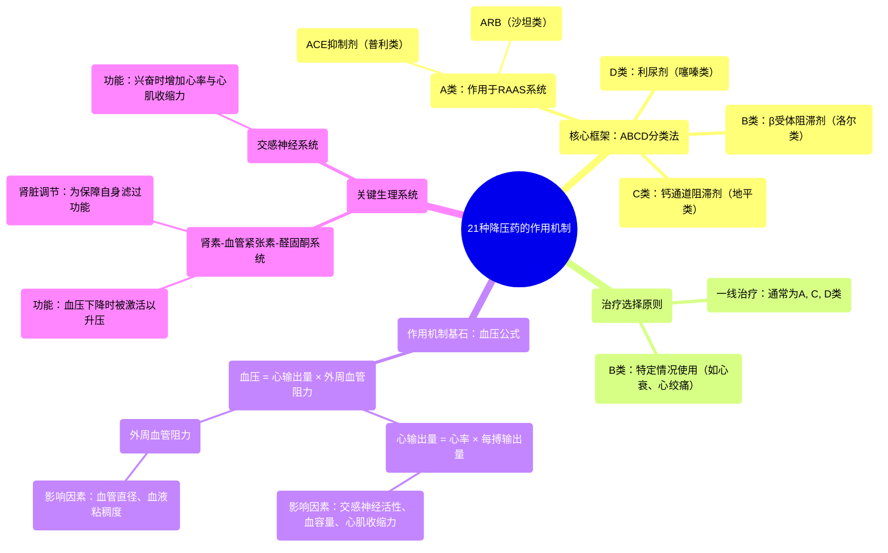

# 21 Blood Pressure Drugs Mechanism of Action

  <video controls preload="metadata" playsinline>
    <source src="https://helly.s3.bitiful.net/心血管学科/%E4%B8%93%E8%BE%91%2020%EF%BC%9A%E5%BF%83%E5%86%85%E7%A7%91%E7%BB%88%E6%9E%81%E8%BE%9E%E5%85%B8%E7%96%BE%E7%97%85%E6%9C%BA%E5%88%B6%E7%AF%87%20%28PathologyMechanisms%29/21%20Blood%20Pressure%20Drugs%20Mechanism%20of%20Action.mp4" type="video/mp4">
    
您的浏览器不支持播放，请升级。

  </video>

::: tip ⚡️ 核心考点 (30s速读)
*   **核心考点**：降压药主要分为ABCD四类：A（ACEI/ARB）、B（β受体阻滞剂）、C（CCB）、D（利尿剂）。一线治疗通常选择A、C、D类，因其在大型临床试验中显示出更优的心脑血管保护作用。
*   **临床意义**：理解降压药的作用机制，关键在于掌握血压公式（血压=心输出量×外周血管阻力）及肾素-血管紧张素-醛固酮系统（RAAS）。这有助于解释不同药物如何通过影响心率、心肌收缩力、血容量或血管阻力来降低血压。
:::

## 🧠 深度精讲

*   **降压药的ABCD分类法**：这是记忆降压药类别最简便的方法。A类作用于肾素-血管紧张素-醛固酮系统（RAAS），包括血管紧张素转化酶抑制剂（ACEI，普利类）和血管紧张素II受体拮抗剂（ARB，沙坦类）。B类是β受体阻滞剂（洛尔类）。C类是钙通道阻滞剂（CCB，地平类）。D类是利尿剂，主要指噻嗪及噻嗪样利尿剂。
*   **一线治疗选择**：基于大型临床试验证据，对于无并发症的原发性高血压，通常首选A、C、D类药物作为初始治疗。β受体阻滞剂（B类）因其在预防老年患者卒中及降低全因死亡率方面效果相对较弱，通常不作为一线首选，但在合并心绞痛、心力衰竭或既往心肌梗死等特定情况时仍有重要地位。
*   **作用机制基础：血压公式**：血压（BP）= 心输出量（CO）× 体循环血管阻力（SVR）。心输出量（CO）= 心率（HR）× 每搏输出量（SV）。因此，任何能降低心率、每搏输出量或外周血管阻力的药物，都能降低血压。
*   **A类药物（ACEI/ARB）的核心通路：RAAS**：当血压下降时，肾脏启动RAAS进行调节。该系统最终产生血管紧张素II，具有强烈的缩血管作用和促进醛固酮分泌（导致水钠潴留、血容量增加）的作用。ACEI抑制血管紧张素II的生成，ARB则阻断其受体，从而扩张血管、减少血容量，降低血压。肾脏依赖充足的血流量来滤过血液、清除废物，因此它通过RAAS精密调控血压以保证自身灌注。
*   **各类药物如何影响血压公式**：
    *   **β受体阻滞剂（B类）**：主要通过阻断心脏的β1受体，降低心率和心肌收缩力，从而减少心输出量来降压。
    *   **钙通道阻滞剂（C类）**：主要通过阻断血管平滑肌细胞的钙通道，引起血管扩张，降低外周血管阻力来降压。部分药物（如非二氢吡啶类）也可降低心率。
    *   **利尿剂（D类）**：主要通过促进肾脏排钠、排水，减少血容量，从而降低心输出量来降压。

## 📚 双语术语表 (Terminology)
| 英文术语 | 中文翻译 | 定义/解释 |
| :--- | :--- | :--- |
| Blood Pressure Drugs / Antihypertensive Medications | 降压药 / 抗高血压药 | 用于治疗高血压的药物。 |
| ABCD of BP | 血压药物的ABCD分类法 | 记忆降压药类别的简便方法：A(ACEI/ARB), B(Beta-blockers), C(CCB), D(Diuretics)。 |
| ACE Inhibitors (PRILs) | 血管紧张素转化酶抑制剂（普利类） | 抑制血管紧张素II生成，扩张血管，减少血容量。 |
| ARBs (Sartans) | 血管紧张素II受体拮抗剂（沙坦类） | 阻断血管紧张素II受体，作用与ACEI类似。 |
| Beta Blockers (LOLs) | β受体阻滞剂（洛尔类） | 主要阻断β受体，降低心率和心肌收缩力。 |
| Calcium Channel Blockers (Dihydropyridines/Pines) | 钙通道阻滞剂（二氢吡啶类/地平类） | 阻断血管钙通道，扩张血管，降低外周阻力。 |
| Diuretics (Thiazide) | 利尿剂（噻嗪类） | 促进肾脏排钠排水，减少血容量。 |
| First-line Therapy | 一线治疗 | 指南推荐的首选初始治疗方案。 |
| Renin-Angiotensin-Aldosterone System (RAAS) | 肾素-血管紧张素-醛固酮系统（RAAS） | 调节血压、血容量和电解质平衡的关键激素系统。 |
| Blood Pressure Equation | 血压公式 | BP = CO × SVR。理解降压药作用机制的基石。 |
| Cardiac Output (CO) | 心输出量 | 心脏每分钟泵出的血量，CO = HR × SV。 |
| Systemic Vascular Resistance (SVR) | 体循环血管阻力 | 血液在全身动脉中流动所遇到的阻力。 |
| Stroke Volume (SV) | 每搏输出量 | 心脏每次收缩泵出的血量。 |
| Sympathetic Nervous System | 交感神经系统 | 激活时可使心率加快、心肌收缩力增强、血管收缩。 |

## 🗺️ 知识图谱

