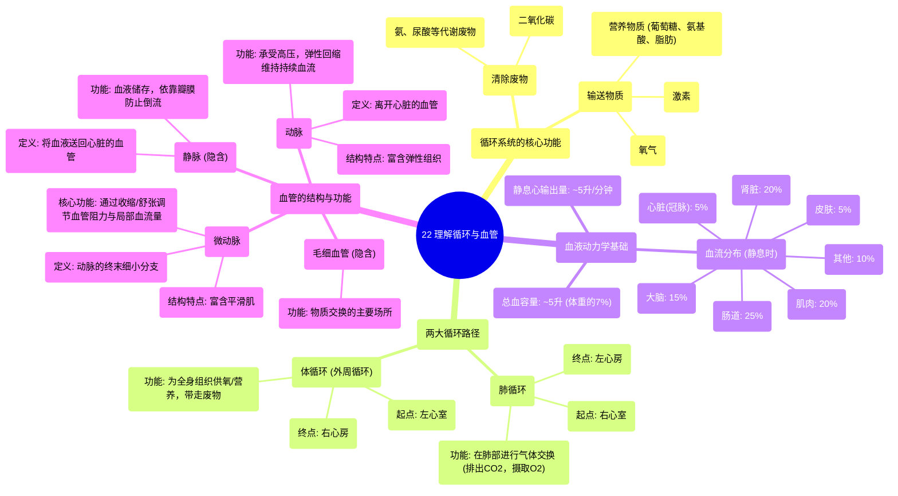

# 22 Understanding Circulation and Blood Vessels

  <video controls preload="metadata" playsinline>
    <source src="https://helly.s3.bitiful.net/心血管学科/%E4%B8%93%E8%BE%91%2020%EF%BC%9A%E5%BF%83%E5%86%85%E7%A7%91%E7%BB%88%E6%9E%81%E8%BE%9E%E5%85%B8%E7%96%BE%E7%97%85%E6%9C%BA%E5%88%B6%E7%AF%87%20%28PathologyMechanisms%29/22%20Understanding%20Circulation%20and%20Blood%20Vessels.mp4" type="video/mp4">
    
您的浏览器不支持播放，请升级。

  </video>

::: tip ⚡️ 核心考点 (30s速读)
*   **核心考点**：循环系统通过体循环和肺循环两个独立系统，负责输送氧气、营养物质、激素，并清除二氧化碳等代谢废物。血液通过具有不同结构和功能的血管网络（动脉、微动脉、毛细血管、微静脉、静脉）进行运输。
*   **临床意义**：理解血管的结构（如动脉的弹性、微动脉的平滑肌）是理解血压调节、局部血流分配（如运动时肌肉血流增加）以及相关疾病（如动脉硬化、高血压）的基础。
:::

## 🧠 深度精讲

*   **循环系统的功能**：循环系统（心血管系统）的核心功能是“输送”与“清除”。它负责将生命活动必需的物质（如氧气、葡萄糖、氨基酸、脂肪、激素）输送到全身各组织，同时将组织代谢产生的废物（如二氧化碳、氨、尿酸）带走，以维持内环境稳定。
*   **两大循环**：
    1.  **体循环（Systemic Circulation / 外周循环）**：起始于左心室。富含氧气和营养的血液从左心室泵出，经主动脉及其分支动脉输送到全身各组织（除肺以外）。在组织毛细血管处完成物质交换后，血液变为含二氧化碳较多的静脉血，最终经上下腔静脉流回右心房。
    2.  **肺循环（Pulmonary Circulation）**：起始于右心室。含二氧化碳较多的静脉血从右心室泵出，经肺动脉到达肺部。在肺毛细血管处，血液释放二氧化碳并吸收氧气，重新变为含氧丰富的动脉血，然后经肺静脉流回左心房，完成气体交换。
*   **心输出量与血流分布**：静息状态下，成人心脏每分钟泵出的血量（心输出量）约为5升，与全身总血容量相当。这5升血液并非平均分配，而是根据器官的代谢需求和功能进行分配。例如，约15%供应大脑，20-25%供应肾脏和肠道，20%供应肌肉（静息时），5%供应心脏本身（通过冠状动脉）。
*   **血管的结构与功能**：血液流经的血管是一个连续且结构功能各异的序列。
    1.  **动脉（Artery）**：所有**离开心脏**的血管都称为动脉（无论输送的是动脉血还是静脉血）。其管壁富含**弹性组织**，使其能够承受心脏收缩时产生的高压并扩张，在心脏舒张时弹性回缩，推动血液继续向前流动，起到“压力缓冲器”和“辅助泵”的作用。
    2.  **微动脉（Arteriole）**：动脉反复分支后形成的最小的动脉分支。其管壁含有丰富的**平滑肌**。平滑肌的收缩与舒张可以显著改变微动脉的管径，从而**精确调节流向特定组织毛细血管的血流量和阻力**，是调控血压和局部血流分配的关键部位。
    3.  **毛细血管（Capillary）**：血管网络中最细小的部分（视频中虽未详述，但隐含在微动脉之后），管壁仅由单层内皮细胞构成，是血液与组织细胞之间进行**物质交换（氧气、营养物质、废物）** 的主要场所。
    4.  **微静脉与静脉（Venule & Vein）**：血液经毛细血管汇集后，先进入微静脉，再汇合成静脉。静脉负责将血液**输送回心脏**。其管壁较薄，弹性较小，但管腔较大，且多数静脉内有**瓣膜**，以防止血液倒流。静脉系统是机体的**血液储存库**，在需要时可动员其中的血液。

## 📚 双语术语表 (Terminology)
| 英文术语 | 中文翻译 | 定义/解释 |
| :--- | :--- | :--- |
| Circulatory System | 循环系统（心血管系统） | 负责将血液泵送至全身，完成物质运输和交换的系统。 |
| Systemic Circulation | 体循环（大循环） | 血液从左心室流向全身组织（除肺外）再返回右心房的循环路径。 |
| Pulmonary Circulation | 肺循环（小循环） | 血液从右心室流向肺部进行气体交换再返回左心房的循环路径。 |
| Artery | 动脉 | 将血液从心脏输送到身体各部位的血管，管壁厚，弹性好。 |
| Arteriole | 微动脉（小动脉） | 动脉的终末细小分支，富含平滑肌，是调节外周阻力和局部血流的主要血管。 |
| Elastic Tissue | 弹性组织 | 存在于大动脉壁中，使其能够扩张和回弹，维持血流的连续性。 |
| Smooth Muscle | 平滑肌 | 存在于微动脉壁中，其收缩与舒张可调节血管直径，控制血流量。 |
| Cardiac Output | 心输出量 | 一侧心室每分钟泵出的血液总量，静息时成人约5升/分钟。 |
| Nutrient | 营养物质 | 维持生命活动所需的物质，如葡萄糖、氨基酸、脂肪酸等。 |
| Hormone | 激素 | 由内分泌腺或细胞分泌的化学信使，通过血液循环作用于靶器官。 |

## 🗺️ 知识图谱

