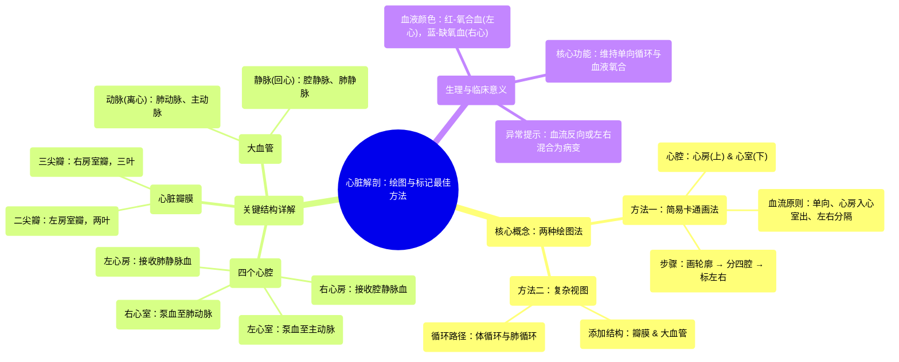

# 23 Best way to draw and label the heart! Heart Anatomy

  <video controls preload="metadata" playsinline>
    <source src="https://helly.s3.bitiful.net/心血管学科/%E4%B8%93%E8%BE%91%2020%EF%BC%9A%E5%BF%83%E5%86%85%E7%A7%91%E7%BB%88%E6%9E%81%E8%BE%9E%E5%85%B8%E7%96%BE%E7%97%85%E6%9C%BA%E5%88%B6%E7%AF%87%20%28PathologyMechanisms%29/23%20Best%20way%20to%20draw%20and%20label%20the%20heart%21%20Heart%20Anatomy.mp4" type="video/mp4">
    
您的浏览器不支持播放，请升级。

  </video>

::: tip ⚡️ 核心考点 (30s速读)
*   **核心考点**：掌握心脏的“卡通画法”与“复杂画法”两种绘图技巧，理解心脏四腔室、血流方向、瓣膜功能及大血管的名称与功能。
*   **临床意义**：理解单向血流和左右心分隔的生理意义，是诊断心脏瓣膜病（如二尖瓣反流）、先天性心脏病（如房间隔缺损）等异常的基础。
:::

## 🧠 深度精讲

本视频教授了两种绘制和标记心脏的方法，旨在通过视觉化手段，帮助学习者牢固掌握心脏解剖结构。

*   **方法一：简易“卡通”画法**
    1.  **绘制轮廓**：首先画出一个类似卡通形象的爱心轮廓。
    2.  **划分四腔**：将轮廓垂直和水平各切一刀，分成四个独立的部分，即心脏的四个**心腔**。
    3.  **命名心腔**：
        *   上方两个为**心房**（复数：Atria；单数：Atrium）。
        *   下方两个为**心室**（复数：Ventricles；单数：Ventricle）。
    4.  **确定左右**：绘图视角为**患者自身视角**。即图中左侧为患者的左心，右侧为患者的右心。因此，四个心腔分别为：**右心房**、**左心房**、**右心室**、**左心室**。
    5.  **理解血流**：
        *   血液流向：**心房 → 心室**。即右心房→右心室，左心房→左心室。
        *   血液进出：血液**进入心房**，**离开心室**。
        *   核心原则：血流是**单向**的，且左右心**相互独立**（血液不应倒流或左右混合）。违反此原则即提示心脏异常。

*   **方法二：复杂视图与血管连接**
    此方法在四腔室基础上，添加了瓣膜和连接心脏的大血管，构建完整循环路径。
    1.  **添加瓣膜**：
        *   **功能**：确保血液从心房到心室的单向流动。
        *   **右心**：位于右心房和右心室之间的瓣膜有三个瓣叶，称为**三尖瓣**。
        *   **左心**：位于左心房和左心室之间的瓣膜有两个瓣叶，称为**二尖瓣**或**二尖瓣**。
    2.  **连接大血管（体循环与肺循环）**：
        *   **颜色惯例**：为便于区分，常用**红色**表示富含氧气的动脉血（左心），**蓝色**表示缺氧的静脉血（右心）。这与血管本身是动脉或静脉无关。
        *   **定义**：**动脉**是**离开心脏**的血管；**静脉**是**进入心脏**的血管。
        *   **肺循环（右心 → 肺 → 左心）**：
            *   **右心**：缺氧血从身体经**上腔静脉**和**下腔静脉**回到**右心房** → 通过三尖瓣进入**右心室** → 从**肺动脉**泵出，前往肺部获取氧气。
            *   **左心**：富氧血从肺部经**肺静脉**（共4条）回到**左心房** → 通过二尖瓣进入**左心室**。
        *   **体循环（左心 → 身体 → 右心）**：
            *   **左心**：富氧血从左心室泵入**主动脉**，并由此分支分布到全身。
            *   **右心**：血液在全身释放氧气后变为缺氧血，通过腔静脉返回右心房，开始新一轮循环。

## 📚 双语术语表 (Terminology)
| 英文术语 | 中文翻译 | 定义/解释 |
| :--- | :--- | :--- |
| Atrium (pl. Atria) | 心房 | 心脏上部的两个腔室，接收回心血液。 |
| Ventricle | 心室 | 心脏下部的两个腔室，将血液泵出心脏。 |
| Tricuspid Valve | 三尖瓣 | 位于右心房和右心室之间，具有三个瓣叶，防止血液从心室倒流回心房。 |
| Mitral / Bicuspid Valve | 二尖瓣 / 二尖瓣 | 位于左心房和左心室之间，具有两个瓣叶，功能同上。 |
| Pulmonary Artery | 肺动脉 | 从右心室发出的动脉，将缺氧血输送至肺部。 |
| Pulmonary Vein | 肺静脉 | 将肺部氧合后的血液输送回左心房的静脉。 |
| Aorta | 主动脉 | 从左心室发出的最大动脉，将富氧血输送至全身。 |
| Superior / Inferior Vena Cava | 上腔静脉 / 下腔静脉 | 将身体上半身/下半身的缺氧血输送回右心房的大静脉。 |
| Oxygenated Blood | 动脉血 / 含氧血 | 富含氧气的血液，呈鲜红色，由左心泵出。 |
| Deoxygenated Blood | 静脉血 / 缺氧血 | 氧气含量较低的血液，呈暗红色（图中用蓝色示意），由右心泵向肺部。 |

## 🗺️ 知识图谱

