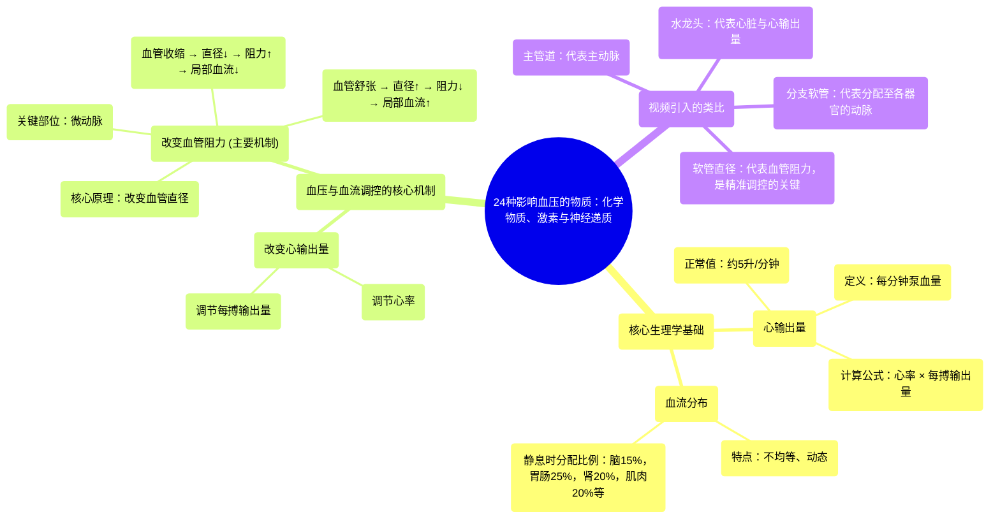

# 24 Substances That Alter Blood Pressure Chemicals, Hormones, and Neurotransmitters

  <video controls preload="metadata" playsinline>
    <source src="https://helly.s3.bitiful.net/心血管学科/%E4%B8%93%E8%BE%91%2020%EF%BC%9A%E5%BF%83%E5%86%85%E7%A7%91%E7%BB%88%E6%9E%81%E8%BE%9E%E5%85%B8%E7%96%BE%E7%97%85%E6%9C%BA%E5%88%B6%E7%AF%87%20%28PathologyMechanisms%29/24%20Substances%20That%20Alter%20Blood%20Pressure%20Chemicals%2C%20Hormones%2C%20and%20Neurotransmitters.mp4" type="video/mp4">
    
您的浏览器不支持播放，请升级。

  </video>

::: tip ⚡️ 核心考点 (30s速读)
*   **核心考点**：血压与血流调控的核心在于**心输出量**与**血管阻力**的平衡。心输出量由**心率**和**每搏输出量**决定，而血管阻力主要由**血管直径**调节。身体通过改变这两者，将有限的血液（约5升/分钟）按需分配到不同组织。
*   **临床意义**：理解这一机制是理解高血压、休克、心力衰竭等心血管疾病病理生理的基础。许多药物（如降压药、强心药）的作用靶点正是心率、心肌收缩力（影响每搏输出量）和血管直径。
:::

## 🧠 深度精讲

*   **心输出量 (Cardiac Output)**：这是指心脏每分钟泵出的血液总量，是决定血压和全身血流供应的关键因素。计算公式为：**心输出量 = 心率 × 每搏输出量**。视频中提到，一个普通成年人静息时的心输出量约为**5升/分钟**。这5升血液是全身所有组织血供的总来源。
*   **血流分布的不均等性**：心输出量并非平均分配给所有器官。视频列举了静息状态下的大致分配比例：大脑约15%，胃肠道约25%，肾脏约20%，肌肉约20%，心脏本身（冠状动脉）约5%，皮肤约5%。这种分配会根据器官的代谢需求实时动态调整（例如运动时肌肉血流量激增）。
*   **血管阻力与直径的关键作用**：这是视频用“水龙头与软管”类比重点阐述的核心原理。单纯增加心输出量（开大水龙头）会普遍升高血压，但无法精准地将更多血液导向特定组织。**改变血管（尤其是小动脉和微动脉）的直径是身体进行精准血流调控的主要方式**。血管收缩时直径变小，阻力增大，流向该区域的血流减少；血管舒张时直径变大，阻力减小，流向该区域的血流增加。这就像调节不同软管的粗细来控制流向不同植物的水量。

## 📚 双语术语表 (Terminology)
| 英文术语 | 中文翻译 | 定义/解释 |
| :--- | :--- | :--- |
| Cardiac Output | 心输出量 | 心脏每分钟泵出的血液总量，等于心率乘以每搏输出量。 |
| Heart Rate (HR) | 心率 | 心脏每分钟搏动（收缩）的次数。 |
| Stroke Volume (SV) | 每搏输出量 | 心脏每次收缩（每搏）从左心室射出的血液量。 |
| Blood Pressure (BP) | 血压 | 血液在血管内流动时作用于单位面积血管壁的侧压力。 |
| Arteriole | 微动脉 | 小动脉之后、毛细血管之前的微小血管，是调节血管阻力和局部血流的主要部位。 |
| Vascular Resistance | 血管阻力 | 血液在血管内流动所遇到的阻力，主要取决于血管直径（与半径的4次方成反比）。 |
| Laminar Flow | 层流 | 血液在血管中以分层、平稳的方式流动，中心流速最快，靠近管壁处最慢。 |
| Aorta | 主动脉 | 体循环的起始大动脉，将氧合血从左心室输送至全身。 |
| Distribution of Blood Flow | 血流分布 | 心输出量在不同器官和组织间的分配情况，随生理状态变化而动态调整。 |

## 🗺️ 知识图谱

