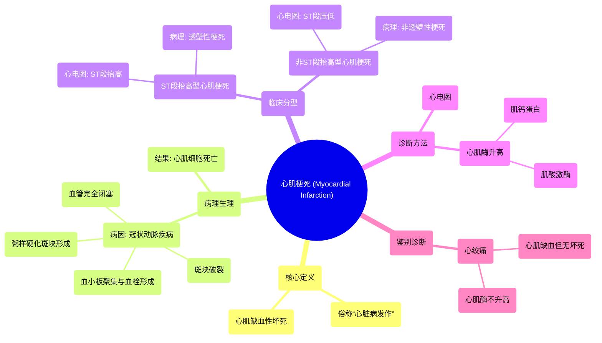

# 25 Myocardial Infarction in 2 mins!

  <video controls preload="metadata" playsinline>
    <source src="https://helly.s3.bitiful.net/心血管学科/%E4%B8%93%E8%BE%91%2020%EF%BC%9A%E5%BF%83%E5%86%85%E7%A7%91%E7%BB%88%E6%9E%81%E8%BE%9E%E5%85%B8%E7%96%BE%E7%97%85%E6%9C%BA%E5%88%B6%E7%AF%87%20%28PathologyMechanisms%29/25%20Myocardial%20Infarction%20in%202%20mins%21.mp4" type="video/mp4">
    
您的浏览器不支持播放，请升级。

  </video>

::: tip ⚡️ 核心考点 (30s速读)
*   **核心考点**：心肌梗死是冠状动脉粥样硬化斑块破裂，继发血栓形成，导致冠状动脉急性、持续性缺血缺氧所引起的心肌坏死。
*   **临床意义**：根据心电图ST段是否抬高，分为ST段抬高型心肌梗死（STEMI）和非ST段抬高型心肌梗死（NSTEMI），两者治疗方案不同。诊断依赖心电图和心肌酶（如肌钙蛋白）升高。
:::

## 🧠 深度精讲
*   **概念1：心肌梗死的定义与病理生理**
    心肌梗死（MI）即“心脏病发作”，其本质是心肌细胞的缺血性坏死。“Myo”指肌肉，“cardial”指心脏，“infarction”指组织死亡。其发生基础是冠状动脉疾病（CAD）或称缺血性心脏病。当冠状动脉内的纤维脂肪斑块（粥样硬化斑块）破裂，暴露出内部物质，会触发血小板聚集和血栓形成，导致血管完全闭塞，下游心肌因血流中断而死亡。

*   **概念2：心肌梗死的分类与诊断**
    心肌梗死主要分为两类：
    1.  **ST段抬高型心肌梗死（STEMI）**：心电图表现为ST段弓背向上抬高，提示心肌发生**透壁性**（全层）坏死。
    2.  **非ST段抬高型心肌梗死（NSTEMI）**：心电图表现为ST段压低，提示心肌发生**非透壁性**（部分厚度）坏死。
    无论哪种类型，心肌细胞坏死都会释放**心肌酶**（如肌钙蛋白、肌酸激酶）入血，因此**心电图**和**心肌酶**是诊断心肌梗死的两大关键工具。

*   **概念3：与心绞痛的区别**
    心绞痛是心肌缺血的临床表现，由冠状动脉狭窄导致心肌供血不足、心肌受刺激引起，但**没有心肌细胞坏死**，因此心肌酶不升高。而心肌梗死是血管**完全闭塞**，导致心肌细胞**不可逆的死亡**。

## 📚 双语术语表 (Terminology)
| 英文术语 | 中文翻译 | 定义/解释 |
| :--- | :--- | :--- |
| Myocardial Infarction (MI) | 心肌梗死 | 冠状动脉急性闭塞导致的心肌缺血性坏死，即“心脏病发作”。 |
| Coronary Artery Disease (CAD) | 冠状动脉疾病 | 冠状动脉因粥样硬化等原因发生狭窄或阻塞的疾病。 |
| Ischemic Heart Disease | 缺血性心脏病 | 由于冠状动脉血流减少导致心肌供氧不足的心脏疾病。 |
| Atherosclerotic Plaque | 粥样硬化斑块（纤维脂肪斑块） | 在动脉壁内层形成的由脂肪、胆固醇、钙等物质组成的沉积物。 |
| Thrombus | 血栓 | 在血管内形成的血凝块。 |
| STEMI | ST段抬高型心肌梗死 | 心电图显示ST段抬高，提示透壁性心肌梗死。 |
| NSTEMI | 非ST段抬高型心肌梗死 | 心电图无ST段抬高（常表现为压低），提示非透壁性心肌梗死。 |
| Angina | 心绞痛 | 心肌暂时性缺血引起的胸痛，无心肌坏死。 |
| Troponin | 肌钙蛋白 | 心肌损伤时特异性释放到血液中的蛋白质，是诊断心肌梗死的关键生物标志物。 |
| Creatine Kinase (CK) | 肌酸激酶 | 心肌损伤时释放的酶之一，也可用于辅助诊断。 |
| ECG / EKG | 心电图 | 记录心脏电活动的检查，是诊断心肌梗死分型的重要工具。 |
| ST Elevation | ST段抬高 | 心电图的一种表现，是STEMI的特征性改变。 |
| ST Depression | ST段压低 | 心电图的一种表现，常见于NSTEMI或不稳定型心绞痛。 |

## 🗺️ 知识图谱

