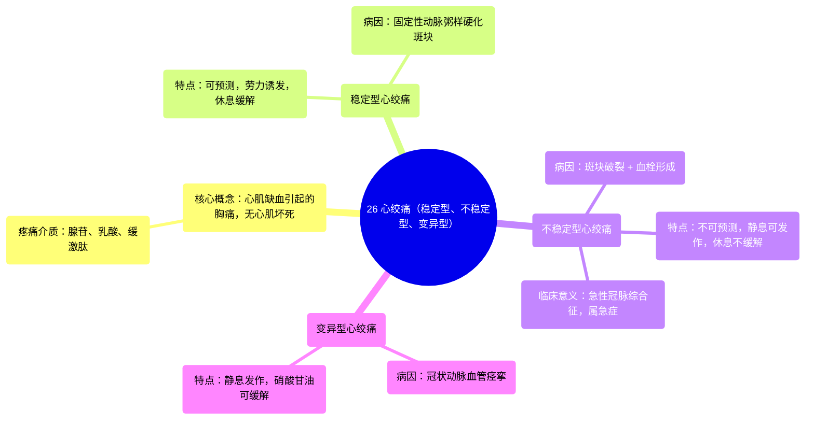

# 26 Angina pectoris (stable, unstable, variant) - in 2 mins!

  <video controls preload="metadata" playsinline>
    <source src="https://helly.s3.bitiful.net/心血管学科/%E4%B8%93%E8%BE%91%2020%EF%BC%9A%E5%BF%83%E5%86%85%E7%A7%91%E7%BB%88%E6%9E%81%E8%BE%9E%E5%85%B8%E7%96%BE%E7%97%85%E6%9C%BA%E5%88%B6%E7%AF%87%20%28PathologyMechanisms%29/26%20Angina%20pectoris%20%28stable%2C%20unstable%2C%20variant%29%20-%20in%202%20mins%21.mp4" type="video/mp4">
    
您的浏览器不支持播放，请升级。

  </video>

::: tip ⚡️ 核心考点 (30s速读)
*   **核心考点**：心绞痛是心肌缺血引起的胸痛，但无心肌细胞坏死。其三种主要类型（稳定型、不稳定型、变异型）的病因、疼痛特点和缓解方式截然不同，是鉴别诊断的关键。
*   **临床意义**：稳定型心绞痛提示固定狭窄，不稳定型心绞痛是急性冠脉综合征，提示斑块破裂和血栓形成，属于急症。变异型心绞痛由血管痉挛引起。快速识别类型对紧急处理和预后判断至关重要。
:::

## 🧠 深度精讲
*   **概念1：缺血性心脏病与心绞痛**：缺血性心脏病是因冠状动脉供血无法满足心肌需求而导致的一系列疾病总称。心绞痛是其中一种典型表现，其本质是心肌缺血引发的胸痛，但尚未导致心肌细胞死亡（即心肌梗死）。疼痛产生的机制是缺血心肌释放腺苷、乳酸、缓激肽等物质，刺激心脏周围神经纤维所致。
*   **概念2：稳定型心绞痛**：这是最常见类型。病因是冠状动脉内存在稳定的动脉粥样硬化斑块，造成血管固定狭窄。其特点是**疼痛可预测**：通常在体力活动、情绪激动等心肌耗氧量增加时发作，休息后可缓解。疼痛性质、部位和持续时间相对固定。
*   **概念3：不稳定型心绞痛**：这是**内科急症**，属于急性冠脉综合征。病因是在动脉粥样硬化斑块基础上，发生了斑块破裂、糜烂，并继发血栓形成，导致管腔严重狭窄或一过性闭塞。其特点是**疼痛不可预测**：可在静息或轻微活动时发作，疼痛更剧烈、持续时间更长，休息或含服硝酸甘油效果不佳或不完全缓解。
*   **概念4：变异型心绞痛**：此类型相对少见。病因主要是冠状动脉发生**一过性血管痉挛**，导致管腔严重狭窄或闭塞。痉挛常发生在已有动脉粥样硬化斑块的部位。其特点是静息时（尤其是夜间或凌晨）发作，疼痛剧烈，但**含服硝酸甘油可迅速缓解**（因其可扩张血管，解除痉挛）。

## 📚 双语术语表 (Terminology)
| 英文术语 | 中文翻译 | 定义/解释 |
| :--- | :--- | :--- |
| Ischemic heart disease | 缺血性心脏病 | 因冠状动脉血流减少导致心肌供氧不足而引起的一系列心脏疾病的总称。 |
| Myocardial ischemia | 心肌缺血 | 心脏肌肉（心肌）的血液供应和氧气供应不足的状态。 |
| Angina pectoris | 心绞痛 | 由心肌缺血引起的胸痛或不适，通常不伴有心肌细胞坏死。 |
| Stable angina | 稳定型心绞痛 | 由固定性冠状动脉狭窄引起，疼痛发作有规律、可预测，休息或服药后可缓解。 |
| Unstable angina | 不稳定型心绞痛 | 由斑块破裂和血栓形成引起，疼痛发作不规律、更严重，休息后不缓解，属于急性冠脉综合征。 |
| Variant angina (Prinzmetal angina) | 变异型心绞痛（普林兹梅塔尔心绞痛） | 由冠状动脉痉挛引起，常于静息时发作，硝酸甘油可有效缓解。 |
| Atherosclerotic plaque | 动脉粥样硬化斑块 | 在动脉血管壁内层积聚的脂肪、胆固醇、钙等物质形成的斑块。 |
| Thrombus | 血栓 | 在血管内形成的血凝块。 |
| Vasospasm | 血管痉挛 | 血管壁平滑肌不自主的强烈收缩，导致管腔狭窄。 |
| Nitroglycerine | 硝酸甘油 | 一种能快速扩张血管（尤其是静脉和冠状动脉）的药物，常用于缓解心绞痛急性发作。 |
| Adenosine / Lactate / Bradykinin | 腺苷 / 乳酸 / 缓激肽 | 心肌缺血时释放的代谢产物和炎症介质，能刺激神经末梢，引发疼痛感。 |

## 🗺️ 知识图谱

