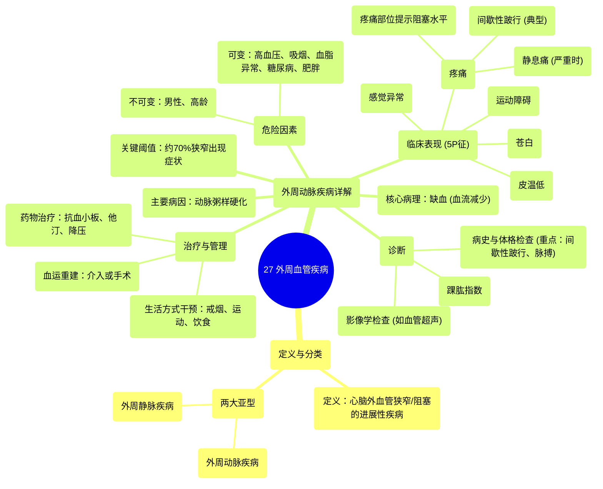

# 27 Peripheral Vascular Disease

  <video controls preload="metadata" playsinline>
    <source src="https://helly.s3.bitiful.net/心血管学科/%E4%B8%93%E8%BE%91%2020%EF%BC%9A%E5%BF%83%E5%86%85%E7%A7%91%E7%BB%88%E6%9E%81%E8%BE%9E%E5%85%B8%E7%96%BE%E7%97%85%E6%9C%BA%E5%88%B6%E7%AF%87%20%28PathologyMechanisms%29/27%20Peripheral%20Vascular%20Disease.mp4" type="video/mp4">
    
您的浏览器不支持播放，请升级。

  </video>

::: tip ⚡️ 核心考点 (30s速读)
*   **核心考点**：外周血管疾病分为外周动脉疾病和外周静脉疾病。外周动脉疾病主要由动脉粥样硬化引起，典型表现为下肢缺血，可通过“5P征”记忆其临床表现。
*   **临床意义**：识别“间歇性跛行”是诊断外周动脉疾病的关键线索，其特点是活动时下肢疼痛、休息后缓解。严重时可发展为静息痛，提示病情严重。
:::

## 🧠 深度精讲

*   **概念1：外周血管疾病的定义与分类**
    外周血管疾病是一种缓慢进展的循环系统疾病，指大脑和心脏以外的血管发生狭窄或阻塞。它主要分为两个亚型：
    1.  **外周动脉疾病**：由动脉阻塞或狭窄引起，最常见的原因是**动脉粥样硬化**。
    2.  **外周静脉疾病**：由静脉相关问题引起。

*   **概念2：外周动脉疾病的病理生理与危险因素**
    1.  **病因**：动脉粥样硬化是主要病因，即在动脉内膜形成纤维脂肪斑块，导致管腔逐渐狭窄。
    2.  **关键阈值**：通常需要血管狭窄达到约**70%**，血流显著减少（缺血）时，才会出现临床症状。
    3.  **危险因素**：包括男性、高龄、高血压、吸烟、血脂异常、糖尿病和肥胖。这些因素加速动脉粥样硬化的进程。

*   **概念3：外周动脉疾病的临床表现——“5P征”**
    这是记忆其典型症状的有效方法，尤其适用于急性缺血，但慢性缺血也常表现其中多项：
    1.  **疼痛**：最常见。特征是**间歇性跛行**——运动（如行走）时下肢肌肉疼痛、痉挛或乏力，休息后缓解。随着病情加重，可出现**静息痛**（不活动时也痛），患者常通过下垂患肢（利用重力增加血流）来缓解。
        *   **疼痛定位**：可提示阻塞部位：臀部（近端动脉）、大腿（股总动脉）、小腿上部（股浅动脉）、小腿下部（腘动脉）、足/踝部（胫/腓动脉）。
    2.  **苍白**：因血流灌注不足，患肢皮肤颜色苍白。
    3.  **皮温低**：患肢触感冰冷。
    4.  **感觉异常**：出现针刺感、麻木感，因神经缺血所致。
    5.  **运动障碍**：严重缺血时，肌肉无力，甚至出现足趾无法活动。

*   **概念4：外周动脉疾病的诊断与治疗原则（概要）**
    1.  **诊断**：基于病史（特别是间歇性跛行）和体格检查（如触摸脉搏减弱/消失、听诊血管杂音）。确诊常采用**踝肱指数**测量（踝部与臂部血压比值）和血管超声等影像学检查。
    2.  **治疗与管理**：
        *   **生活方式干预**：戒烟、控制血糖血脂、健康饮食、规律运动（如步行锻炼，可促进侧支循环形成）。
        *   **药物治疗**：抗血小板药（如阿司匹林、氯吡格雷）防止血栓形成；他汀类药物稳定斑块、降脂；必要时使用降压药和止痛药。
        *   **血运重建**：对于严重病例，可采用血管腔内成形术/支架植入术或外科搭桥手术，以恢复血流。

## 📚 双语术语表 (Terminology)
| 英文术语 | 中文翻译 | 定义/解释 |
| :--- | :--- | :--- |
| Peripheral Vascular Disease (PVD) | 外周血管疾病 | 大脑和心脏以外的血管发生狭窄或阻塞的疾病。 |
| Peripheral Arterial Disease (PAD) | 外周动脉疾病 | 外周血管疾病的亚型，特指动脉的阻塞性疾病。 |
| Atherosclerosis | 动脉粥样硬化 | 动脉壁内形成斑块（由脂肪、胆固醇等构成），导致血管硬化和狭窄的病理过程。 |
| Ischemia | 缺血 | 流向身体某一部分的血液减少，导致氧气和养分供应不足。 |
| Claudication | 间歇性跛行 | 运动时（如行走）因肌肉缺血引起的疼痛、痉挛或乏力，休息后缓解。是PAD的典型症状。 |
| Rest Pain | 静息痛 | 在肢体不活动时出现的疼痛，提示严重缺血，是PAD进展的标志。 |
| Pallor | 苍白 | 皮肤因血流减少而失去正常红润，呈现苍白色。 |
| Paresthesia | 感觉异常 | 异常的皮肤感觉，如针刺感、麻木感，常由神经缺血引起。 |
| Ankle-Brachial Index (ABI) | 踝肱指数 | 诊断PAD的重要无创检查，通过比较踝部与臂部的收缩压比值来评估下肢动脉血流情况。 |

## 🗺️ 知识图谱

