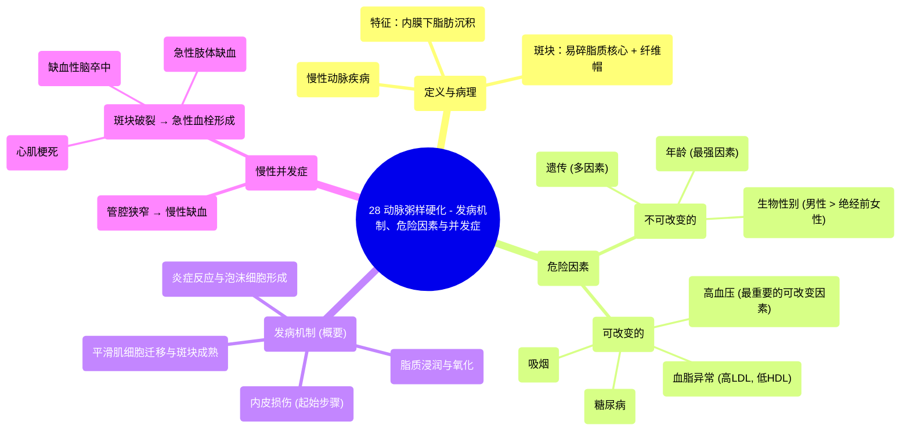

# 28 Atherosclerosis - Pathogenesis, risk factors and complications

  <video controls preload="metadata" playsinline>
    <source src="https://helly.s3.bitiful.net/心血管学科/%E4%B8%93%E8%BE%91%2020%EF%BC%9A%E5%BF%83%E5%86%85%E7%A7%91%E7%BB%88%E6%9E%81%E8%BE%9E%E5%85%B8%E7%96%BE%E7%97%85%E6%9C%BA%E5%88%B6%E7%AF%87%20%28PathologyMechanisms%29/28%20Atherosclerosis%20-%20Pathogenesis%2C%20risk%20factors%20and%20complications.mp4" type="video/mp4">
    
您的浏览器不支持播放，请升级。

  </video>

::: tip ⚡️ 核心考点 (30s速读)
*   **核心考点**：动脉粥样硬化是一种慢性动脉疾病，核心特征是血管内膜下形成富含脂质的易碎斑块。其发生发展是多种危险因素共同作用的结果。
*   **临床意义**：斑块破裂是导致急性心血管事件（如心肌梗死、脑卒中）的关键环节。识别并干预可改变的危险因素（如高血压、血脂异常、糖尿病、吸烟）是预防和治疗的核心。
:::

## 🧠 深度精讲

*   **概念1：动脉粥样硬化的定义与病理特征**
    动脉粥样硬化是一种主要累及大中型动脉（如主动脉、冠状动脉、颈动脉）的慢性疾病。其病理本质是**脂质（主要是低密度脂蛋白胆固醇）在动脉血管内膜下沉积**，形成所谓的“纤维脂肪斑块”。这个斑块有一个**易碎的脂质核心**，核心内常伴有坏死，外部覆盖一层纤维帽。斑块的脆弱性（易破裂）是引发后续急性血栓事件（如心梗、脑梗）的病理基础。

*   **概念2：危险因素分类**
    动脉粥样硬化的危险因素可分为两大类：
    1.  **不可改变因素**：个人无法干预。
        *   **年龄**：是**最强**的危险因素。疾病随年龄增长而进展，40-60岁后并发症风险显著增加。
        *   **生物性别**：男性风险高于绝经前女性。雌激素对绝经前女性有保护作用，但绝经后女性风险迅速上升至与男性相当。**注意**：绝经后激素替代治疗可能加重风险。
        *   **遗传**：为多因素遗传，可能通过影响血压、血脂、血糖等表型来增加患病风险。
    2.  **可改变因素**：个人可以干预，是临床防治的重点。
        *   **高血压**：**最重要的可改变因素**。血流对血管壁的剪切应力造成内皮持续损伤，是启动斑块形成的关键。病变好发于血流冲击力大或湍流部位（如腹主动脉后壁、血管分叉处）。
        *   **血脂异常**：指血液中“坏”脂肪（**低密度脂蛋白，LDL**）过高，而“好”脂肪（**高密度脂蛋白，HDL**）过低的状态。LDL是形成斑块脂质核心的主要原料。
        *   **糖尿病**：通过加剧血脂异常、促进炎症和氧化应激等多重机制，显著加速动脉粥样硬化进程。
        *   **吸烟**：烟草中的数千种毒素直接损伤血管内皮，促进炎症和氧化应激，是明确的强风险因素。

*   **概念3：发病机制与并发症（概要）**
    根据视频线索，发病机制始于**内皮损伤**（由高血压、吸烟、高LDL等因素引起）。损伤后，LDL进入内膜并被氧化，吸引单核细胞进入并转化为巨噬细胞，吞噬氧化LDL后成为“泡沫细胞”，形成早期病变（脂纹）。平滑肌细胞迁移增殖并分泌胶原，形成纤维帽，最终发展为成熟斑块。
    主要**慢性并发症**源于斑块本身：
    *   **管腔狭窄**：斑块逐渐增大，导致器官（如心脏、大脑、下肢）慢性缺血。
    *   **斑块破裂/侵蚀**：最危险的急性并发症。斑块破裂后，脂质核心暴露于血液，引发血小板聚集和血栓形成，可迅速堵塞血管，导致**急性心肌梗死**、**缺血性脑卒中**或**下肢动脉急性缺血**。

## 📚 双语术语表 (Terminology)
| 英文术语 | 中文翻译 | 定义/解释 |
| :--- | :--- | :--- |
| Atherosclerosis | 动脉粥样硬化 | 一种动脉疾病，特征为脂肪沉积物（斑块）在动脉内膜下积聚。 |
| Pathogenesis | 发病机制 | 疾病发生和发展的具体过程与原理。 |
| Fibro-fatty plaque | 纤维脂肪斑块 | 动脉粥样硬化的典型病变，由脂质核心和覆盖的纤维帽构成。 |
| Intima / Tunica intima | 内膜 | 血管壁的最内层，直接与血液接触，是动脉粥样硬化的起始部位。 |
| Non-modifiable risk factors | 不可改变的危险因素 | 个人无法控制的风险因素，如年龄、性别、遗传。 |
| Modifiable risk factors | 可改变的危险因素 | 个人可以通过生活方式或药物干预的风险因素，如高血压、吸烟。 |
| Dyslipidemia | 血脂异常 | 血液中脂质（如胆固醇、甘油三酯）水平异常，通常指LDL-C升高和/或HDL-C降低。 |
| LDL (Low-Density Lipoprotein) | 低密度脂蛋白 | 俗称“坏胆固醇”，负责将胆固醇从肝脏运至外周组织，过高易沉积于动脉壁。 |
| HDL (High-Density Lipoprotein) | 高密度脂蛋白 | 俗称“好胆固醇”，负责将外周组织的胆固醇运回肝脏代谢，具有保护作用。 |
| Shear stress | 剪切应力 | 血流对血管壁产生的平行摩擦力，高血压可增加此应力，导致内皮损伤。 |

## 🗺️ 知识图谱

