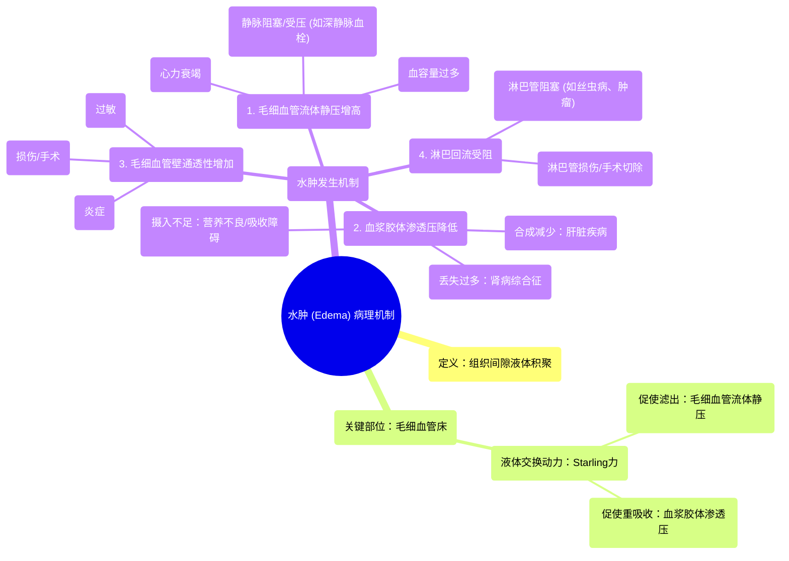

# 29 Edema (Oedema) In 2 minutes!

  <video controls preload="metadata" playsinline>
    <source src="https://helly.s3.bitiful.net/心血管学科/%E4%B8%93%E8%BE%91%2020%EF%BC%9A%E5%BF%83%E5%86%85%E7%A7%91%E7%BB%88%E6%9E%81%E8%BE%9E%E5%85%B8%E7%96%BE%E7%97%85%E6%9C%BA%E5%88%B6%E7%AF%87%20%28PathologyMechanisms%29/29%20Edema%20%28Oedema%29%20In%202%20minutes%21.mp4" type="video/mp4">
    
您的浏览器不支持播放，请升级。

  </video>

::: tip ⚡️ 核心考点 (30s速读)
*   **核心考点**：水肿是组织间隙内液体积聚导致的肿胀。其发生机制主要取决于毛细血管处的“出”与“入”平衡被打破，以及淋巴系统回流障碍。
*   **临床意义**：水肿是多种疾病的共同表现，分析其成因（如心衰、肝病、肾病、营养不良、静脉阻塞、炎症等）对诊断和治疗至关重要。
:::

## 🧠 深度精讲

*   **概念1：水肿的定义与发生部位**
    水肿是指**组织间隙**（细胞与细胞之间的空隙）内液体的异常积聚，导致局部或全身性肿胀。正常情况下，组织间隙的液体量通过毛细血管的滤过与重吸收，以及淋巴系统的引流维持动态平衡。

*   **概念2：毛细血管处的液体交换——Starling力**
    这是理解水肿的核心。在毛细血管处，决定液体“出”与“入”的主要有两种力量：
    1.  **毛细血管流体静压**：一种向外的推力，主要来自心脏收缩产生的血压，促使含有氧气和营养物质的液体从毛细血管滤出到组织间隙。
    2.  **血浆胶体渗透压**：一种向内的拉力，主要由血浆中的**蛋白质**（尤其是白蛋白）产生。蛋白质带负电荷，能吸引水分子，将组织间隙的液体“拉”回血管内。
    正常情况下，这两种力量在毛细血管的动脉端和静脉端达到动态平衡。任何破坏此平衡的因素都可能导致水肿。

*   **概念3：水肿的四大病理生理机制**
    基于Starling力的平衡被打破，水肿的成因可分为四类：
    1.  **毛细血管流体静压增高**：向外的推力过大。常见于：**心力衰竭**（左心衰使肺循环压力增高，右心衰使体循环静脉压增高）、**静脉阻塞或受压**（如深静脉血栓、肿瘤压迫）、**血容量过多**。
    2.  **血浆胶体渗透压降低**：向内的拉力不足。根本原因是血浆蛋白（尤其是白蛋白）减少。常见于：**肝脏疾病**（合成白蛋白减少）、**肾病综合征**（大量蛋白从尿中丢失）、**营养不良或吸收障碍**（蛋白质摄入或吸收不足）。
    3.  **毛细血管壁通透性增加**：血管“漏洞”变大，不仅液体渗出增多，连原本不该漏出的血浆蛋白也漏到组织间隙。这既增加了组织间隙的胶体渗透压（把水拉出去），又降低了血管内的胶体渗透压。常见于：**炎症**（如感染、烧伤）、**过敏反应**、**创伤或手术**。
    4.  **淋巴回流受阻**：组织间隙的液体除了被毛细血管重吸收，还有一部分依赖**淋巴系统**引流回血液循环。如果淋巴管**受损**、**阻塞**（如丝虫病、肿瘤转移）或被**手术切除**（如乳腺癌腋窝淋巴结清扫），液体就会在组织间隙积聚，形成通常较硬、不易压陷的“淋巴性水肿”。

## 📚 双语术语表 (Terminology)
| 英文术语 | 中文翻译 | 定义/解释 |
| :--- | :--- | :--- |
| Edema (Oedema) | 水肿 | 组织间隙内液体的异常积聚，导致肿胀。 |
| Interstitial Fluid | 组织间液 | 存在于细胞与细胞之间的液体。 |
| Capillary Bed | 毛细血管床 | 微动脉与微静脉之间庞大的微血管网络，是物质交换的主要场所。 |
| Hydrostatic Pressure | 流体静压 | 在心血管系统中，指血液对血管壁产生的侧压力，是促使液体滤出毛细血管的力量。 |
| Oncotic Pressure | 胶体渗透压 | 由血浆中的蛋白质（主要是白蛋白）产生的渗透压，是促使液体重吸收入毛细血管的力量。 |
| Lymphatic System | 淋巴系统 | 由淋巴管、淋巴结和淋巴器官组成的系统，负责回收组织间液中的多余液体和蛋白质，并参与免疫防御。 |
| Heart Failure | 心力衰竭 | 心脏泵血功能受损，无法满足机体代谢需要的病理状态，是导致水肿的常见原因。 |
| Deep Vein Thrombosis (DVT) | 深静脉血栓形成 | 深静脉内血液凝结形成血栓，阻塞静脉回流，可导致下肢水肿。 |

## 🗺️ 知识图谱

