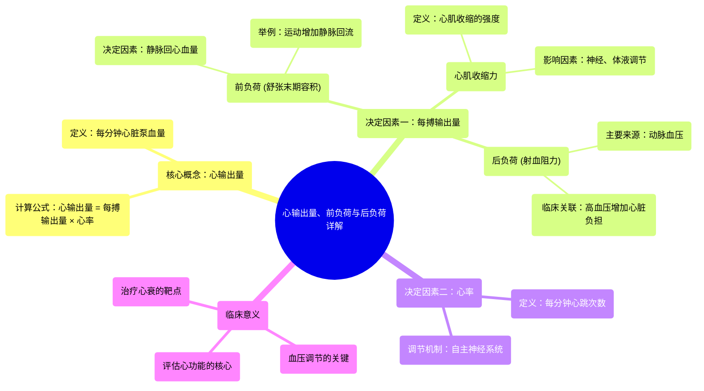

# 30 Cardiac Output Preload and Afterload EXPLAINED!

  <video controls preload="metadata" playsinline>
    <source src="https://helly.s3.bitiful.net/心血管学科/%E4%B8%93%E8%BE%91%2020%EF%BC%9A%E5%BF%83%E5%86%85%E7%A7%91%E7%BB%88%E6%9E%81%E8%BE%9E%E5%85%B8%E7%96%BE%E7%97%85%E6%9C%BA%E5%88%B6%E7%AF%87%20%28PathologyMechanisms%29/30%20Cardiac%20Output%20Preload%20and%20Afterload%20EXPLAINED%21.mp4" type="video/mp4">
    
您的浏览器不支持播放，请升级。

  </video>

::: tip ⚡️ 核心考点 (30s速读)
*   **核心考点**：心输出量是心脏每分钟泵出的血液总量，由**每搏输出量**和**心率**共同决定。理解其构成及影响因素是掌握心血管生理和病理的关键。
*   **临床意义**：心输出量直接影响血压和组织灌注。通过调节前负荷、后负荷、心肌收缩力和心率，可以治疗心力衰竭、休克等多种心血管疾病。
:::

## 🧠 深度精讲

*   **心输出量**：指心脏每分钟泵入体循环的血液总量。它是评估心脏泵血功能的核心指标。计算公式为：**心输出量 = 每搏输出量 × 心率**。
*   **每搏输出量**：指心脏每次收缩（一次心跳）从左心室射入主动脉的血液量。它由三个关键因素决定：
    1.  **前负荷**：即心脏在舒张末期（收缩开始前）心室内的血容量（舒张末期容积）。这反映了心肌纤维在收缩前的初始长度。**静脉回心血量**是决定前负荷的主要因素（如运动时肌肉泵作用增加回心血量）。
    2.  **心肌收缩力**：指心肌细胞本身收缩的强度和速度。它决定了心脏能将多少血液泵出。收缩力强，则射血更充分，收缩末期容积减小。
    3.  **后负荷**：指心室收缩射血时需要克服的阻力，主要取决于**体循环动脉血压**（尤其是主动脉压）。后负荷增高（如高血压）会增加心脏射血负担，可能减少每搏输出量。
*   **心率**：指心脏每分钟搏动的次数。它是调节心输出量的快速机制。
*   **相互关系**：心输出量、每搏输出量和心率相互关联。例如，运动时，静脉回心血量增加（前负荷↑）、交感神经兴奋（心肌收缩力↑、心率↑），共同导致心输出量显著增加，以满足组织代谢需求。

## 📚 双语术语表 (Terminology)
| 英文术语 | 中文翻译 | 定义/解释 |
| :--- | :--- | :--- |
| Cardiac Output (CO) | 心输出量 | 心脏每分钟泵出的血液总量。 |
| Stroke Volume (SV) | 每搏输出量 | 心脏每次收缩射出的血液量。 |
| Heart Rate (HR) | 心率 | 心脏每分钟搏动的次数。 |
| End Diastolic Volume (EDV) | 舒张末期容积 | 心室在舒张末期（收缩前）充盈的最大血容量，反映前负荷。 |
| End Systolic Volume (ESV) | 收缩末期容积 | 心室在收缩末期（射血后）剩余的血容量。 |
| Preload | 前负荷 | 心脏收缩前（舒张末期）心肌所承受的负荷，通常用EDV来代表。 |
| Afterload | 后负荷 | 心室收缩射血时需要克服的阻力，主要来自动脉血压。 |
| Contractility | 心肌收缩力 | 心肌纤维收缩的内在能力和强度。 |
| Systole | 收缩期 | 心脏（心室）收缩、泵血的时期。 |
| Diastole | 舒张期 | 心脏（心室）舒张、充盈血液的时期。 |
| Venous Return | 静脉回心血量 | 血液通过静脉返回心脏的速率和量，是决定前负荷的关键。 |

## 🗺️ 知识图谱

