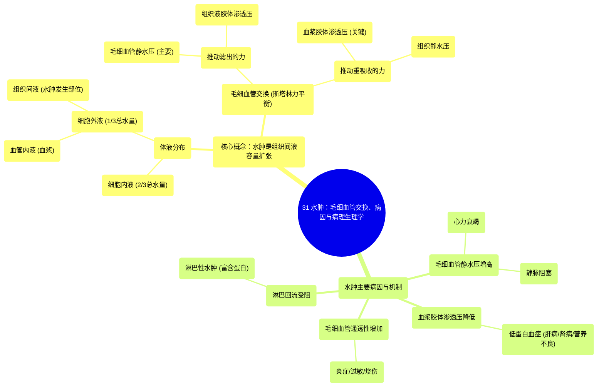

# 31 Oedema (Edema) Capillary Exchange, Causes, and Pathophysiology

  <video controls preload="metadata" playsinline>
    <source src="https://helly.s3.bitiful.net/心血管学科/%E4%B8%93%E8%BE%91%2020%EF%BC%9A%E5%BF%83%E5%86%85%E7%A7%91%E7%BB%88%E6%9E%81%E8%BE%9E%E5%85%B8%E7%96%BE%E7%97%85%E6%9C%BA%E5%88%B6%E7%AF%87%20%28PathologyMechanisms%29/31%20Oedema%20%28Edema%29%20Capillary%20Exchange%2C%20Causes%2C%20and%20Pathophysiology.mp4" type="video/mp4">
    
您的浏览器不支持播放，请升级。

  </video>

::: tip ⚡️ 核心考点 (30s速读)
*   **核心考点**：水肿是组织间隙液体容量异常扩张导致的肿胀。其发生取决于毛细血管处的“净滤过压”，由推动液体流出的“毛细血管静水压”和“组织液胶体渗透压”，与拉回液体的“血浆胶体渗透压”和“组织静水压”之间的平衡决定。
*   **临床意义**：理解水肿的病理生理是诊断其根本原因（如心力衰竭、肾病、低蛋白血症、静脉或淋巴管阻塞等）的关键，从而进行针对性治疗。
:::

## 🧠 深度精讲

*   **概念1：体液分布与水肿的定义**
    水肿是指组织间隙（细胞之间的空间）内液体异常积聚导致的肿胀。视频中通过按压皮肤后留下凹陷（凹陷性水肿）的实例直观展示了这一现象。要理解水肿，首先需了解人体内的体液分布。人体约50-60%的重量是水，这些水分为**细胞内液**（约占2/3，位于细胞内）和**细胞外液**（约占1/3，位于细胞外）。细胞外液又可细分为**血管内液**（在血管内，即血浆）和**组织间液**（在组织间隙）。水肿的本质就是组织间液容量的病理性增加。

*   **概念2：毛细血管交换与斯塔林力**
    组织间液和血管内液通过毛细血管壁进行持续交换，决定液体流向的关键是毛细血管处的“净滤过压”，由四股力量（即**斯塔林力**）共同决定：
    1.  **毛细血管静水压**：血管内的血压，推动液体和溶质（如氧气、营养物质）**滤出**血管进入组织间隙。在动脉端约为35 mmHg。
    2.  **组织液静水压**：组织间隙内的液体压力，通常较低，对抗液体滤出，将液体**推回**血管。
    3.  **血浆胶体渗透压**：主要由血管内不能自由透过的蛋白质（尤其是白蛋白）产生。蛋白质带负电荷，能吸引带正电的离子（如钠离子），进而通过渗透作用将组织间隙的水分**拉回**血管。这是最重要的**重吸收力**。
    4.  **组织液胶体渗透压**：由组织间隙中的蛋白质产生，将水分**拉出**血管。

    **净滤过压 = (毛细血管静水压 + 组织液胶体渗透压) - (血浆胶体渗透压 + 组织静水压)**。若结果为正值，则液体净滤出，可能导致水肿；若为负值，则液体净重吸收。

*   **概念3：水肿的病理生理机制**
    任何破坏上述平衡，导致液体滤出增加或重吸收减少的因素都可能引起水肿。主要机制包括：
    1.  **毛细血管静水压增高**：如心力衰竭（静脉回流受阻）、静脉血栓、长时间站立（重力作用）。
    2.  **血浆胶体渗透压降低**：如肝硬化、肾病综合征、营养不良导致的低蛋白血症。
    3.  **毛细血管通透性增加**：如炎症、过敏、烧伤时，血管壁孔隙变大，蛋白质漏出到组织间隙，使组织液胶体渗透压升高，拉出更多液体。
    4.  **淋巴回流受阻**：淋巴系统像“排水系统”，负责回收从血管滤出的多余液体和蛋白质。当淋巴管阻塞（如肿瘤压迫、丝虫病、淋巴结清扫术后），组织液积聚，形成**淋巴性水肿**，其特点是富含蛋白质，质地硬，凹陷性不明显。

## 📚 双语术语表 (Terminology)
| 英文术语 | 中文翻译 | 定义/解释 |
| :--- | :--- | :--- |
| Edema (Oedema) | 水肿 | 组织间隙内异常积聚过多的组织间液，导致的肿胀。 |
| Interstitial Fluid | 组织间液 | 存在于细胞之间、血管之外的细胞外液。 |
| Intravascular Fluid | 血管内液 | 存在于血管内的细胞外液部分，即血浆。 |
| Intracellular Fluid (ICF) | 细胞内液 | 存在于细胞内部的体液。 |
| Extracellular Fluid (ECF) | 细胞外液 | 存在于细胞外部的体液，包括组织间液和血管内液。 |
| Capillary Bed | 毛细血管床 | 连接微动脉和微静脉的微小血管网络，是物质交换的主要场所。 |
| Hydrostatic Pressure | 静水压 | 液体本身由于重力或心脏泵血产生的压力。在毛细血管处指**毛细血管静水压**。 |
| Oncotic Pressure (Colloid Osmotic Pressure) | 胶体渗透压 | 由溶液中不能自由透过半透膜的大分子（主要是蛋白质）产生的渗透压。在血管内指**血浆胶体渗透压**。 |
| Starling Forces | 斯塔林力 | 决定毛细血管处液体滤过和重吸收的四组力量的总称。 |
| Pitting Edema | 凹陷性水肿 | 用手指按压水肿部位皮肤，松开后留下凹陷，且凹陷缓慢恢复。常见于低蛋白血症或静脉性水肿。 |
| Lymphatic System | 淋巴系统 | 由淋巴管、淋巴结和淋巴器官组成的系统，负责回收组织间液中的多余液体和蛋白质，并参与免疫。 |

## 🗺️ 知识图谱

