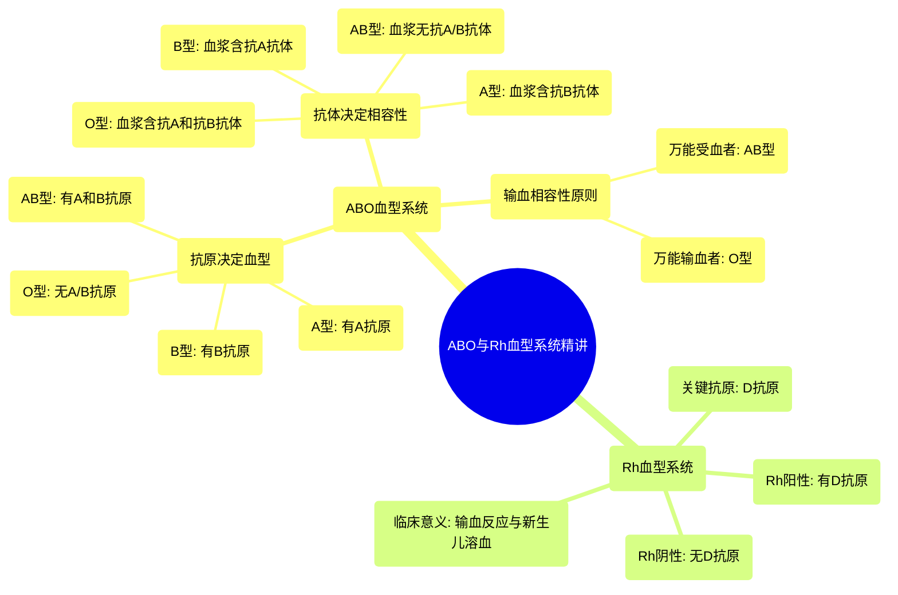

# 32 ABO Blood Types Made Easy!

  <video controls preload="metadata" playsinline>
    <source src="https://helly.s3.bitiful.net/心血管学科/%E4%B8%93%E8%BE%91%2020%EF%BC%9A%E5%BF%83%E5%86%85%E7%A7%91%E7%BB%88%E6%9E%81%E8%BE%9E%E5%85%B8%E7%96%BE%E7%97%85%E6%9C%BA%E5%88%B6%E7%AF%87%20%28PathologyMechanisms%29/32%20ABO%20Blood%20Types%20Made%20Easy%21.mp4" type="video/mp4">
    
您的浏览器不支持播放，请升级。

  </video>

::: tip ⚡️ 核心考点 (30s速读)
*   **核心考点**：ABO血型系统由红细胞表面的**抗原**决定，血浆中存在针对非自身抗原的**抗体**。抗原与抗体的匹配是安全输血的关键。
*   **临床意义**：**O型血**是“万能输血者”，可输给任何血型；**AB型血**是“万能受血者”，可接受任何血型的血液。输血前必须进行交叉配血，防止因血型不合导致的致命性溶血反应。
:::

## 🧠 深度精讲

*   **概念1：抗原与抗体**
    *   **抗原**：位于红细胞表面的“旗帜”或标记，本质是糖蛋白。它决定了你的血型是A、B、AB还是O。
        *   A型血：有A抗原。
        *   B型血：有B抗原。
        *   AB型血：同时有A和B抗原。
        *   O型血：没有A或B抗原。
    *   **抗体**：存在于血浆中的“军队”。你的免疫系统会产生针对你所**没有**的抗原的抗体。
        *   A型血：血浆中有**抗B抗体**。
        *   B型血：血浆中有**抗A抗体**。
        *   AB型血：血浆中**既无抗A也无抗B抗体**。
        *   O型血：血浆中**既有抗A也有抗B抗体**。

*   **概念2：输血相容性原则**
    输血时，必须确保**受血者血浆中的抗体不会攻击供血者红细胞上的抗原**。简单来说，就是“受血者的军队不能攻击供血者的旗帜”。
    *   **A型血**：可接受**A型、O型**血。
    *   **B型血**：可接受**B型、O型**血。
    *   **AB型血**：可接受**A、B、AB、O型**血（万能受血者）。
    *   **O型血**：只能接受**O型**血，但可输给**A、B、AB、O型**（万能输血者）。

*   **概念3：Rh血型系统**
    *   这是另一个重要的血型系统，其关键抗原是**D抗原**（又称Rh因子）。
    *   有D抗原者为**Rh阳性（+）**，无D抗原者为**Rh阴性（-）**。
    *   Rh阴性者体内通常没有天然的抗D抗体，但如果在输血或怀孕时接触了D抗原，就可能产生抗D抗体，导致后续输血反应或新生儿溶血病。

## 📚 双语术语表 (Terminology)
| 英文术语 | 中文翻译 | 定义/解释 |
| :--- | :--- | :--- |
| Antigen | 抗原 | 存在于红细胞表面的糖蛋白标记，决定血型。 |
| Antibody | 抗体 | 存在于血浆中的免疫蛋白，能识别并攻击特定的外来抗原。 |
| ABO blood group | ABO血型系统 | 根据红细胞表面A、B抗原的有无进行分类的血型系统。 |
| Erythrocyte | 红细胞 | 血液中负责运输氧气的细胞，表面携带血型抗原。 |
| Universal donor | 万能输血者 | 指O型血，因其红细胞无A、B抗原，可输给其他血型。 |
| Universal acceptor | 万能受血者 | 指AB型血，因其血浆中无抗A、抗B抗体，可接受所有ABO血型的血液。 |
| Rhesus (Rh) factor | 恒河猴（Rh）因子 | 红细胞表面的D抗原，是Rh血型系统的关键抗原。 |
| Rh positive/negative | Rh阳性/阴性 | 指红细胞表面有/无D抗原。 |

## 🗺️ 知识图谱

