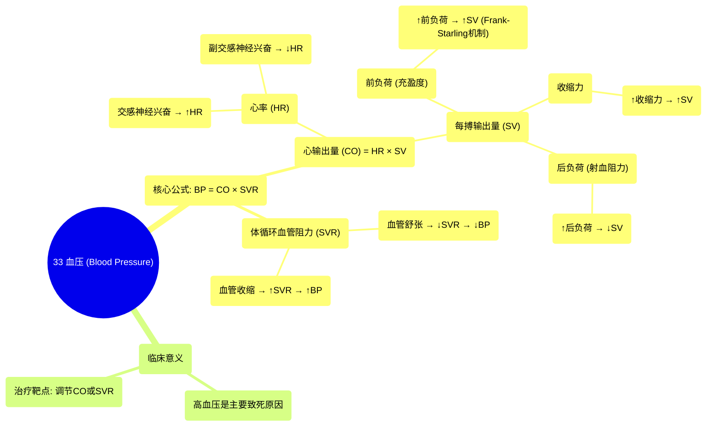

# 33 Blood Pressure

  <video controls preload="metadata" playsinline>
    <source src="https://helly.s3.bitiful.net/心血管学科/%E4%B8%93%E8%BE%91%2020%EF%BC%9A%E5%BF%83%E5%86%85%E7%A7%91%E7%BB%88%E6%9E%81%E8%BE%9E%E5%85%B8%E7%96%BE%E7%97%85%E6%9C%BA%E5%88%B6%E7%AF%87%20%28PathologyMechanisms%29/33%20Blood%20Pressure.mp4" type="video/mp4">
    
您的浏览器不支持播放，请升级。

  </video>

::: tip ⚡️ 核心考点 (30s速读)
*   **核心考点**：血压（BP）由心输出量（CO）和体循环血管阻力（SVR）共同决定，即 **BP = CO × SVR**。理解并掌握影响CO和SVR的各个因素，是分析血压变化机制和治疗高血压的关键。
*   **临床意义**：高血压是全球主要致死原因之一。通过药物或生活方式干预，调节心率、每搏输出量或血管阻力，是降低血压、预防心脑血管疾病的核心策略。
:::

## 🧠 深度精讲

*   **血压的定义与重要性**：血压是血液对血管壁产生的侧压力。全球约四分之一的人患有慢性高血压，即血管壁长期承受过高压力，这会损伤血管，最终导致血管性疾病，这是全球最主要的致死原因之一。因此，理解血压是治疗高血压的基础。

*   **血压的决定公式**：血压（BP）由两个核心因素决定：**心输出量（CO）** 和 **体循环血管阻力（SVR，也称总外周阻力）**。公式为：**BP = CO × SVR**。任何导致CO或SVR升高的因素都会使血压升高，反之则使血压降低。

*   **心输出量（CO）的分解**：心输出量是指每分钟从左心室射入主动脉的总血量。它由 **心率（HR）** 和 **每搏输出量（SV）** 共同决定，公式为：**CO = HR × SV**。
    *   **心率（HR）**：每分钟心跳的次数。平均约为70次/分钟。
    *   **每搏输出量（SV）**：每次心跳从左心室射出的血量。平均约为70毫升。
    *   因此，平均心输出量约为 70次/分 × 70毫升/次 = 4900毫升/分 ≈ 5升/分。

*   **影响心率的因素**：
    *   **交感神经系统（“战或逃”）**：释放肾上腺素和去甲肾上腺素，刺激心脏的窦房结和房室结，**增加心率**，从而增加心输出量和血压。
    *   **副交感神经系统（“休息与消化”）**：主要通过迷走神经（第10对脑神经）发挥作用，**降低心率**，从而减少心输出量和血压。

*   **影响每搏输出量（SV）的因素**：SV受三个主要因素影响：
    1.  **前负荷**：指心室在收缩前（舒张末期）被血液充盈的程度，即心肌纤维被拉伸的长度。根据 **法兰克-斯特林机制**，在一定范围内，心肌被拉伸得越多（前负荷越大），收缩力就越强，从而**增加每搏输出量**。
    2.  **收缩力**：指心肌细胞本身的收缩能力。**交感神经兴奋**或某些正性肌力药物可以增强收缩力，从而**增加每搏输出量**。
    3.  **后负荷**：指心室射血时需要克服的阻力，主要来自主动脉血压和体循环血管阻力。**后负荷增加**（如动脉收缩、血压升高）会使心室射血更困难，从而**减少每搏输出量**。

## 📚 双语术语表 (Terminology)
| 英文术语 | 中文翻译 | 定义/解释 |
| :--- | :--- | :--- |
| Blood Pressure (BP) | 血压 | 血液对血管壁产生的侧压力。 |
| Cardiac Output (CO) | 心输出量 | 每分钟从左心室射入主动脉的总血量。 |
| Systemic Vascular Resistance (SVR) / Total Peripheral Resistance (TPR) | 体循环血管阻力 / 总外周阻力 | 血液在体循环中流动所遇到的总阻力。 |
| Heart Rate (HR) | 心率 | 每分钟心脏跳动的次数。 |
| Stroke Volume (SV) | 每搏输出量 | 每次心跳从左心室射出的血量。 |
| Sympathetic Nervous System | 交感神经系统 | 负责“战或逃”反应的自主神经系统部分，能增快心率、增强心肌收缩力。 |
| Parasympathetic Nervous System | 副交感神经系统 | 负责“休息与消化”的自主神经系统部分，主要通过迷走神经减慢心率。 |
| Preload | 前负荷 | 心室在收缩前（舒张末期）被血液充盈的程度，即心肌纤维的初始长度。 |
| Frank-Starling Mechanism | 法兰克-斯特林机制 | 在一定范围内，心室肌纤维被拉伸得越长（前负荷越大），其收缩力就越强。 |
| Contractility | 收缩力 | 心肌细胞本身收缩的能力，与初长度无关。 |
| Afterload | 后负荷 | 心室开始收缩射血时需要克服的阻力，主要取决于主动脉血压和外周血管阻力。 |

## 🗺️ 知识图谱

