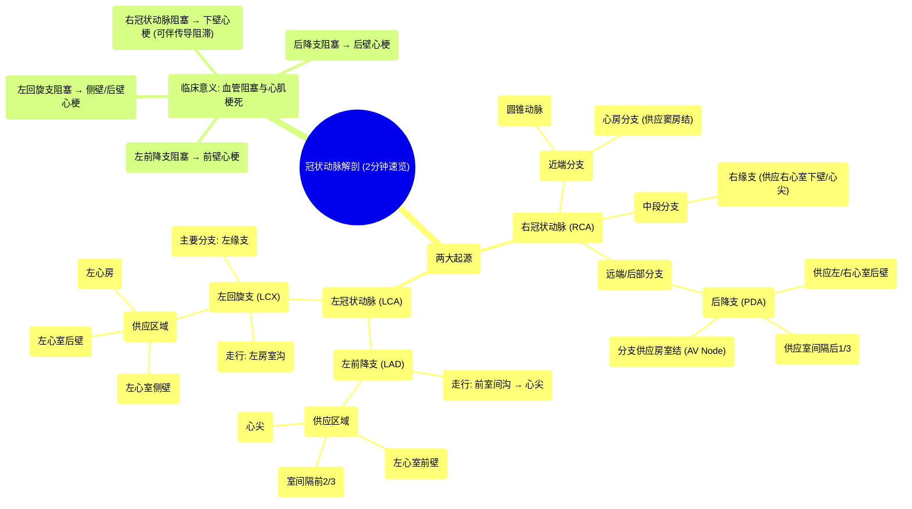

# 34 Coronary Arteries - in 2mins

  <video controls preload="metadata" playsinline>
    <source src="https://helly.s3.bitiful.net/心血管学科/%E4%B8%93%E8%BE%91%2020%EF%BC%9A%E5%BF%83%E5%86%85%E7%A7%91%E7%BB%88%E6%9E%81%E8%BE%9E%E5%85%B8%E7%96%BE%E7%97%85%E6%9C%BA%E5%88%B6%E7%AF%87%20%28PathologyMechanisms%29/34%20Coronary%20Arteries%20-%20in%202mins.mp4" type="video/mp4">
    
您的浏览器不支持播放，请升级。

  </video>

::: tip ⚡️ 核心考点 (30s速读)
*   **核心考点**：心脏的血液供应主要依靠**右冠状动脉 (RCA)** 和**左冠状动脉 (LCA)** 两大系统。左冠状动脉主干分为**左前降支 (LAD)** 和**左回旋支 (LCX)**。不同血管的阻塞会导致其供血区域的心肌梗死，临床表现各异。
*   **临床意义**：理解冠状动脉的解剖分布是诊断心肌梗死部位、判断受累血管和制定治疗策略（如介入或搭桥手术）的基础。例如，LAD阻塞导致前壁心梗，RCA阻塞常导致下壁心梗，并可影响窦房结或房室结功能。
:::

## 🧠 深度精讲

*   **冠状动脉系统概述**：心脏自身的血液供应由发自主动脉根部的左、右冠状动脉完成。它们走行于心外膜下的结缔组织中，发出分支深入心肌，为心脏这个高耗能器官提供氧气和营养。
*   **右冠状动脉 (RCA) 及其分支**：
    *   **走行与主要分支**：RCA起源于主动脉右窦，沿右房室沟走行。其近端发出**圆锥动脉**和**心房分支**，供应右心房、右心室前壁及**窦房结 (SA node)**。中段发出重要的**右缘支**，沿右心室下缘走向心尖。RCA继续绕至心脏膈面，移行为**后降支 (PDA)**，供应左、右心室后壁及室间隔后1/3，并发出分支供应**房室结 (AV node)**。
    *   **供血区域**：主要供应右心房、右心室、室间隔后部、窦房结和房室结（在多数“右优势型”心脏中）。
*   **左冠状动脉 (LCA) 及其分支**：
    *   **主干与分支**：LCA起源于主动脉左窦，较RCA粗大，供应心脏大部分区域。在左房室沟内，主干很快分为两大终支：**左前降支 (LAD)** 和**左回旋支 (LCX)**。
    *   **左前降支 (LAD)**：沿前室间沟下行，绕过心尖至后室间沟上部，常与后降支吻合。它供应**左心室前壁**、**室间隔前2/3**和**心尖部**，是冠心病最常累及的血管。
    *   **左回旋支 (LCX)**：沿左房室沟向左后走行，主要分支为**左缘支**（或称钝缘支）。它供应**左心室侧壁**和**后壁**，以及**左心房**。
*   **临床联系：血管阻塞与心肌梗死**：冠状动脉粥样硬化导致血管狭窄或闭塞，其供血区域的心肌会因缺血坏死。
    *   **LAD阻塞** → **前壁心肌梗死**（影响左心室泵血功能，常较严重）。
    *   **LCX阻塞** → **侧壁或后壁心肌梗死**。
    *   **RCA阻塞** → **下壁心肌梗死**（常伴有心动过缓、传导阻滞，因可能影响窦房结或房室结血供）。
    *   **后降支 (PDA) 阻塞** → **后壁心肌梗死**（心电图表现可能隐匿）。

## 📚 双语术语表 (Terminology)
| 英文术语 | 中文翻译 | 定义/解释 |
| :--- | :--- | :--- |
| Right Coronary Artery (RCA) | 右冠状动脉 | 起源于主动脉右窦，主要供应右心系统、室间隔后部及心脏传导系统（窦房结、房室结）。 |
| Left Coronary Artery (LCA) | 左冠状动脉 | 起源于主动脉左窦，主干分为左前降支和左回旋支，供应左心室大部分区域。 |
| Left Anterior Descending (LAD) | 左前降支 | 左冠状动脉的主要分支，走行于前室间沟，供应左心室前壁、室间隔前2/3和心尖。 |
| Left Circumflex (LCX) | 左回旋支 | 左冠状动脉的分支，走行于左房室沟，供应左心室侧壁和后壁。 |
| Posterior Descending Artery (PDA) | 后降支 | 多由右冠状动脉延续而来（右优势型），走行于后室间沟，供应左、右心室后壁及室间隔后1/3。 |
| Right Marginal Branch | 右缘支 | 右冠状动脉的分支，沿右心室下缘走行，供应右心室下壁。 |
| Left Marginal Branch | 左缘支 | 左回旋支的分支，供应左心室侧壁（又称钝缘支）。 |
| SA Node | 窦房结 | 心脏的正常起搏点，其血供多来自右冠状动脉（约55%-60%）或左回旋支。 |
| AV Node | 房室结 | 心房与心室间的电传导枢纽，其血供多来自右冠状动脉（约90%）。 |
| Myocardial Infarction (MI) | 心肌梗死 | 因冠状动脉血流急剧减少或中断，导致相应心肌严重而持久的缺血、坏死。 |
| Anastomosis | 吻合 | 血管之间的连接，冠状动脉间存在少量吻合支，可在一定程度上建立侧支循环。 |

## 🗺️ 知识图谱

