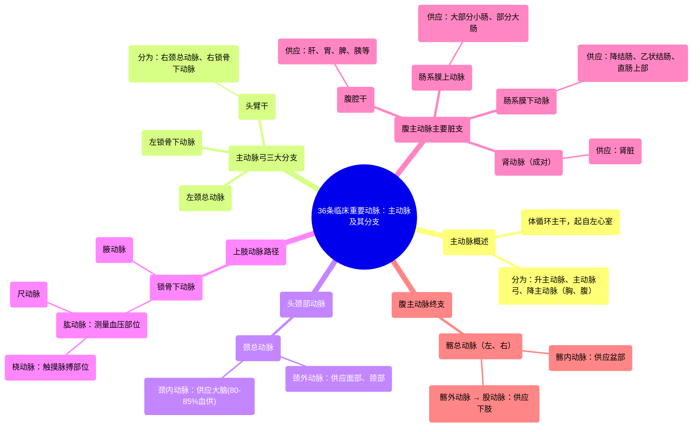

# 36 Clinically Important Arteries

  <video controls preload="metadata" playsinline>
    <source src="https://helly.s3.bitiful.net/心血管学科/%E4%B8%93%E8%BE%91%2020%EF%BC%9A%E5%BF%83%E5%86%85%E7%A7%91%E7%BB%88%E6%9E%81%E8%BE%9E%E5%85%B8%E7%96%BE%E7%97%85%E6%9C%BA%E5%88%B6%E7%AF%87%20%28PathologyMechanisms%29/36%20Clinically%20Important%20Arteries.mp4" type="video/mp4">
    
您的浏览器不支持播放，请升级。

  </video>

::: tip ⚡️ 核心考点 (30s速读)
*   **核心考点**：主动脉是体循环的“总干道”，从左心室发出，其分支供应全身（除肺脏）。掌握其三大段（升主动脉、主动脉弓、降主动脉）及主要分支的走行、名称和供血区域是解剖学基础。
*   **临床意义**：颈内动脉是脑血供（80-85%）的主要来源；肱动脉是测量血压的常用部位；桡动脉是触摸脉搏的常用点；腹腔干、肠系膜上/下动脉是腹部脏器血供的关键，其阻塞可导致相应器官缺血坏死。
:::

## 🧠 深度精讲

*   **主动脉概述**：主动脉是人体最粗大的动脉，起自左心室，是体循环的起始主干。它将富含氧气的血液从左心室泵出，通过各级分支输送到全身各组织和器官（除肺循环外）。
*   **主动脉弓三大分支**：主动脉在上升后形成弓形弯曲，称为主动脉弓。从主动脉弓上缘自右向左依次发出三大分支：
    1.  **头臂干**：为一短干，向右上方斜行，至右胸锁关节后方分为**右颈总动脉**和**右锁骨下动脉**。
    2.  **左颈总动脉**：直接发自主动脉弓，沿气管和食管左侧上行，供应左侧头颈部。
    3.  **左锁骨下动脉**：直接发自主动脉弓，沿左肺尖内侧上行，出胸廓上口至颈根部，供应左上肢。
*   **头颈部动脉详解**：
    *   **颈总动脉**：在甲状软骨上缘水平分为**颈内动脉**和**颈外动脉**。
    *   **颈内动脉**：垂直上行，经颈动脉管入颅，**供应大脑半球前2/3和部分间脑，约占脑血供的80-85%**，是脑血供的最主要来源。
    *   **颈外动脉**：主要分支供应面部、颈部、颅骨及硬脑膜等头颈外部结构。
*   **上肢动脉路径**：
    *   **锁骨下动脉** → 出第一肋外缘移行为**腋动脉** → 进入臂部为**肱动脉**（**测量血压的常用部位**） → 在肘窝深部分为**桡动脉**（**位于前臂桡侧，是触摸脉搏的常用点**）和**尺动脉**（位于前臂尺侧）。
*   **胸主动脉与腹主动脉主要分支**：
    *   主动脉穿过膈肌的主动脉裂孔后，称为腹主动脉。
    *   **腹腔干**：在膈肌下方立即发出，为一短干，分为**胃左动脉、肝总动脉和脾动脉**，主要供应肝、胆、胃、脾、胰及十二指肠上部。
    *   **肠系膜上动脉**：约平第1腰椎高度发自腹主动脉，供应**大部分小肠（空肠、回肠）和部分大肠（盲肠、升结肠、横结肠右半部）**。
    *   **肾动脉**：成对，约平第2腰椎水平发出，横向外侧入肾。
    *   **肠系膜下动脉**：约平第3腰椎高度发出，供应**横结肠左半部、降结肠、乙状结肠和直肠上部**。
    *   **髂总动脉**：腹主动脉约在第4腰椎体下缘水平分为左、右**髂总动脉**，后者再分为**髂内动脉**（供应盆部）和**髂外动脉**（向下延续为**股动脉**，供应下肢）。

## 📚 双语术语表 (Terminology)
| 英文术语 | 中文翻译 | 定义/解释 |
| :--- | :--- | :--- |
| Aorta | 主动脉 | 体循环的动脉主干，起自左心室，分为升部、弓部和降部。 |
| Aortic arch | 主动脉弓 | 主动脉的弓形弯曲部分，发出供应头颈和上肢的三大分支。 |
| Brachiocephalic trunk | 头臂干 | 主动脉弓的第一个分支，供应右侧头颈部和右上肢。 |
| Common carotid artery | 颈总动脉 | 供应头颈部的主要动脉，在颈部上端分为颈内和颈外动脉。 |
| Internal carotid artery | 颈内动脉 | 颈总动脉的分支，主要供应大脑前部，是脑血供的主要来源。 |
| External carotid artery | 颈外动脉 | 颈总动脉的分支，主要供应面部、颈部、颅外结构。 |
| Subclavian artery | 锁骨下动脉 | 供应上肢、肩部及部分胸壁的动脉，延续为腋动脉。 |
| Brachial artery | 肱动脉 | 位于上臂的动脉，是测量血压的常用部位。 |
| Radial artery | 桡动脉 | 前臂桡侧的动脉，位置表浅，是触摸脉搏的常用点。 |
| Ulnar artery | 尺动脉 | 前臂尺侧的动脉，与桡动脉共同供应前臂和手部。 |
| Celiac trunk | 腹腔干 | 腹主动脉的第一个主要脏支，供应上腹部多个重要脏器。 |
| Superior mesenteric artery | 肠系膜上动脉 | 腹主动脉的分支，主要供应大部分小肠和部分大肠。 |
| Renal artery | 肾动脉 | 成对发自腹主动脉，供应肾脏。 |
| Inferior mesenteric artery | 肠系膜下动脉 | 腹主动脉的分支，主要供应降结肠、乙状结肠和直肠上部。 |
| Common iliac artery | 髂总动脉 | 腹主动脉的终末分支，向下分为髂内、外动脉。 |
| Femoral artery | 股动脉 | 髂外动脉的延续，位于大腿部，是下肢的主要供血动脉。 |

## 🗺️ 知识图谱

