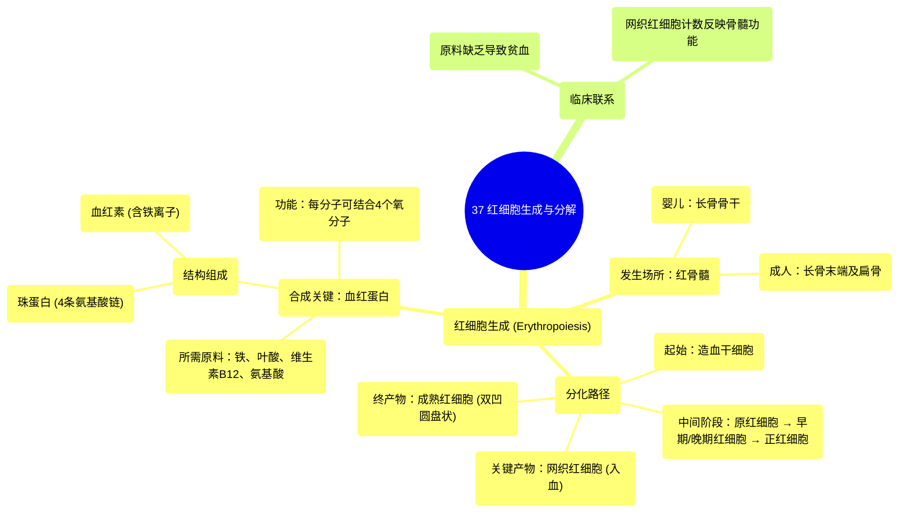

# 37 Red Blood Cell Production (erythropoiesis) and Breakdown (bilirubin metabolism)

  <video controls preload="metadata" playsinline>
    <source src="https://helly.s3.bitiful.net/心血管学科/%E4%B8%93%E8%BE%91%2020%EF%BC%9A%E5%BF%83%E5%86%85%E7%A7%91%E7%BB%88%E6%9E%81%E8%BE%9E%E5%85%B8%E7%96%BE%E7%97%85%E6%9C%BA%E5%88%B6%E7%AF%87%20%28PathologyMechanisms%29/37%20Red%20Blood%20Cell%20Production%20%28erythropoiesis%29%20and%20Breakdown%20%28bilirubin%20metabolism%29.mp4" type="video/mp4">
    
您的浏览器不支持播放，请升级。

  </video>

::: tip ⚡️ 核心考点 (30s速读)
*   **核心考点**：红细胞生成（Erythropoiesis）是骨髓中造血干细胞分化为成熟红细胞的过程，核心产物是**血红蛋白**。该过程需要**铁、叶酸、维生素B12**等关键原料。
*   **临床意义**：原料缺乏（如缺铁、缺叶酸/B12）会导致贫血。监测血液中的**网织红细胞**计数，可评估骨髓的造血功能。
:::

## 🧠 深度精讲

*   **概念1：红细胞生成的定义与场所**
    *   **定义**：红细胞生成（Erythropoiesis）指红细胞（Red Blood Cells, RBCs）的生成过程。词源上，“erythro-”意为红色，“-poiesis”意为生成。
    *   **场所**：主要发生在**红骨髓**中。婴儿时期，红骨髓位于长骨的骨干（diaphysis）；成年后，则主要位于长骨的末端以及髋骨、胸骨、颅骨等扁骨中。

*   **概念2：红细胞生成的分化路径**
    *   该过程始于**造血干细胞**，它能够分化成所有类型的血细胞（白细胞、血小板、红细胞）。
    *   在红细胞谱系中，分化路径为：**造血干细胞 → 原红细胞 → 早期红细胞 → 晚期红细胞 → 正红细胞 → 网织红细胞 → 成熟红细胞**。
    *   **关键节点**：**网织红细胞**是未完全成熟的红细胞，已无细胞核，但含有残留的RNA。它从骨髓释放入血，并在1-2天内发育为成熟红细胞。网织红细胞计数是反映骨髓造血活性的重要指标。

*   **概念3：血红蛋白的合成与结构**
    *   **合成需求**：在红细胞成熟过程中，细胞需要摄取**铁、叶酸、维生素B12和氨基酸**等原料来合成血红蛋白。
    *   **结构组成**：血红蛋白是红细胞内携带氧气的蛋白质，由**珠蛋白**和**血红素**组成。
        *   **珠蛋白**：由4条氨基酸链构成。
        *   **血红素**：每个血红素中心含有一个**铁离子**。
    *   **整体结构**：一个血红蛋白分子包含**4个珠蛋白亚基**，每个亚基结合一个**血红素**，因此共能结合**4个氧分子**。一个红细胞内含有数百万个血红蛋白分子，使其具有高效的携氧能力。

*   **概念4：红细胞的最终形态**
    *   网织红细胞在充满血红蛋白后，形态发生变化，成为成熟的**红细胞**。
    *   成熟红细胞呈**双凹圆盘状**（像中间没有洞的甜甜圈），这种形态极大增加了表面积，有利于气体交换，并使其具有柔韧性，能通过狭窄的毛细血管。

## 📚 双语术语表 (Terminology)
| 英文术语 | 中文翻译 | 定义/解释 |
| :--- | :--- | :--- |
| Erythropoiesis | 红细胞生成 | 红细胞在骨髓中的产生过程。 |
| Hematopoietic Stem Cell | 造血干细胞 | 存在于骨髓中，能分化成所有血细胞（红细胞、白细胞、血小板）的始祖细胞。 |
| Bone Marrow | 骨髓 | 骨骼内的软组织，是血细胞生成的主要场所。 |
| Red Bone Marrow | 红骨髓 | 富含造血组织的骨髓，是成人红细胞生成的主要部位。 |
| Reticulocyte | 网织红细胞 | 从骨髓释放入血液的、未完全成熟的红细胞，无细胞核，是评估骨髓造血功能的指标。 |
| Hemoglobin | 血红蛋白 | 红细胞内负责运输氧气的蛋白质，由珠蛋白和血红素组成。 |
| Heme | 血红素 | 血红蛋白的辅基，内含一个铁离子，是结合氧的部位。 |
| Globin | 珠蛋白 | 血红蛋白的蛋白质部分，由四条多肽链构成。 |
| Iron | 铁 | 合成血红素所必需的矿物质，缺乏会导致缺铁性贫血。 |
| Folate / Vitamin B12 | 叶酸 / 维生素B12 | 红细胞DNA合成所必需的维生素，缺乏会导致巨幼细胞性贫血。 |

## 🗺️ 知识图谱

