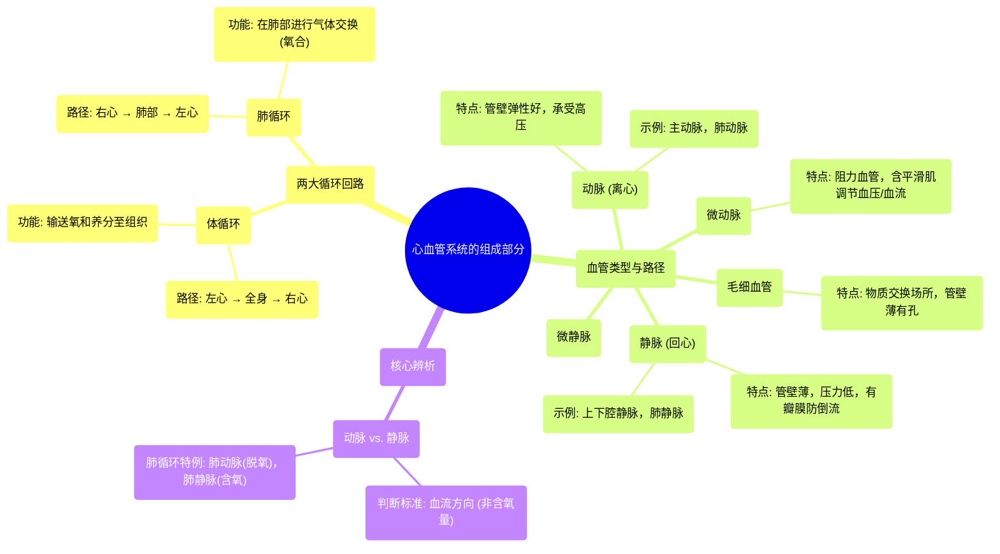

# 38 Parts of the Cardiovascular System

  <video controls preload="metadata" playsinline>
    <source src="https://helly.s3.bitiful.net/心血管学科/%E4%B8%93%E8%BE%91%2020%EF%BC%9A%E5%BF%83%E5%86%85%E7%A7%91%E7%BB%88%E6%9E%81%E8%BE%9E%E5%85%B8%E7%96%BE%E7%97%85%E6%9C%BA%E5%88%B6%E7%AF%87%20%28PathologyMechanisms%29/38%20Parts%20of%20the%20Cardiovascular%20System.mp4" type="video/mp4">
    
您的浏览器不支持播放，请升级。

  </video>

::: tip ⚡️ 核心考点 (30s速读)
*   **核心考点**：心血管系统包含“体循环”与“肺循环”两大回路。血管分为“动脉”、“微动脉”、“毛细血管”、“微静脉”和“静脉”，其分类依据是血流方向（“动脉”离心，“静脉”回心），而非含氧量。不同血管在结构（弹性、肌肉、瓣膜）和功能（输送、阻力调节、物质交换）上存在关键差异。
*   **临床意义**：理解血管结构与功能是诊断和治疗高血压、静脉曲张、动脉粥样硬化等疾病的基础。例如，“微动脉”的舒缩是调节血压的关键环节；“静脉瓣膜”功能不全可导致血液淤积，形成静脉曲张。
:::

## 🧠 深度精讲

*   **两大循环回路**：心血管系统由“体循环”和“肺循环”构成。“体循环”负责将含氧血从左心室泵出，经“主动脉”输送至全身组织，进行气体和物质交换后，将脱氧血经各级“静脉”送回右心房。“肺循环”则负责将右心室的脱氧血泵入“肺动脉”至肺部进行氧合，再将含氧血经“肺静脉”送回左心房。两者串联，构成完整的血液循环路径。

*   **血管的分类与功能**：血管根据其结构和功能，形成一个连续的序列：`动脉` → `微动脉` → `毛细血管` → `微静脉` → `静脉`。
    *   **动脉 (Arteries)**：核心特征是**离开心脏**。管壁富含弹性纤维，以适应心脏收缩时的高压（如“主动脉”）。在体循环中，动脉通常含氧；在肺循环中，“肺动脉”则含脱氧血。
    *   **微动脉 (Arterioles)**：小动脉的分支，是**阻力血管**。管壁有丰富的平滑肌，通过收缩和舒张来调节血管阻力，是控制局部血流量和全身血压的主要部位。
    *   **毛细血管 (Capillillaries)**：管壁极薄且有孔隙，是**物质交换的场所**。氧气、营养物质和代谢废物在此处通过扩散在血液和组织液之间进行交换。
    *   **微静脉 (Venules) 与静脉 (Veins)**：核心特征是**返回心脏**。管壁薄，弹性小，压力低。它们**含有瓣膜**，可防止血液因重力作用而倒流。静脉血回流主要依靠骨骼肌收缩产生的“肌肉泵”作用进行挤压。在体循环中，静脉通常含脱氧血；在肺循环中，“肺静脉”则含氧血。

*   **关键辨析：含氧量 vs. 血流方向**：判断血管是“动脉”还是“静脉”的**唯一标准是血流方向**（离心为“动脉”，回心为“静脉”），而不是血液的含氧状态。这是理解肺循环（“肺动脉”含脱氧血，“肺静脉”含氧血）与体循环差异的关键。

## 📚 双语术语表 (Terminology)
| 英文术语 | 中文翻译 | 定义/解释 |
| :--- | :--- | :--- |
| Circulatory System | 循环系统 | 负责血液在全身循环的系统，包括心脏、血管和血液。 |
| Pulmonary Circulation | 肺循环 | 血液从心脏流向肺部进行氧合，再返回心脏的循环路径。 |
| Systemic Circulation | 体循环 | 血液从心脏流向全身各组织供应氧气和养分，再返回心脏的循环路径。 |
| Artery | 动脉 | 将血液从心脏输送出去的血管。管壁厚，弹性好。 |
| Aorta | 主动脉 | 体循环的起始主干动脉，从左心室发出，将含氧血输送至全身。 |
| Arteriole | 微动脉 | 小动脉的分支，管壁富含平滑肌，是调节血压和血流的主要阻力血管。 |
| Capillary | 毛细血管 | 连接微动脉和微静脉的微小血管网，管壁极薄，是物质交换的主要场所。 |
| Venule | 微静脉 | 收集毛细血管血液的小静脉。 |
| Vein | 静脉 | 将血液输送回心脏的血管。管壁较薄，内有瓣膜防止血液倒流。 |
| Pulmonary Artery | 肺动脉 | 将右心室的脱氧血输送至肺部的动脉。 |
| Pulmonary Vein | 肺静脉 | 将肺部氧合后的血液输送回左心房的静脉。 |
| Valve | 瓣膜 | 主要存在于静脉和心脏内的结构，确保血液单向流动，防止倒流。 |
| Oxygenated | 氧合的 / 含氧的 | 血液中富含氧气，通常呈鲜红色。 |
| Deoxygenated | 脱氧的 / 缺氧的 | 血液中氧气含量低，通常呈暗红色。 |

## 🗺️ 知识图谱

