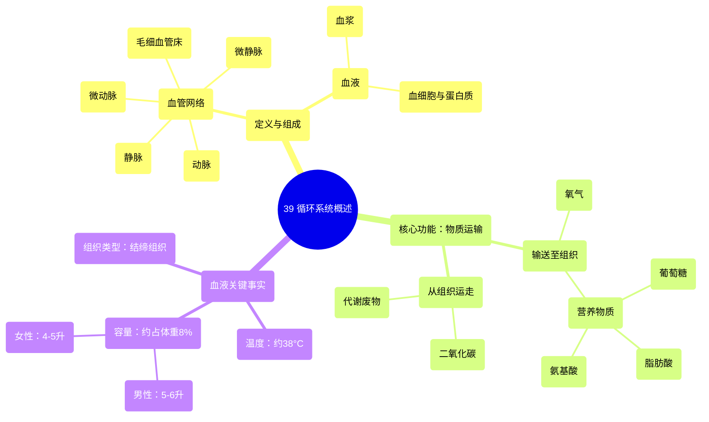

# 39 Circulatory System Overview

  <video controls preload="metadata" playsinline>
    <source src="https://helly.s3.bitiful.net/心血管学科/%E4%B8%93%E8%BE%91%2020%EF%BC%9A%E5%BF%83%E5%86%85%E7%A7%91%E7%BB%88%E6%9E%81%E8%BE%9E%E5%85%B8%E7%96%BE%E7%97%85%E6%9C%BA%E5%88%B6%E7%AF%87%20%28PathologyMechanisms%29/39%20Circulatory%20System%20Overview.mp4" type="video/mp4">
    
您的浏览器不支持播放，请升级。

  </video>

::: tip ⚡️ 核心考点 (30s速读)
*   **核心考点**：循环系统的主要功能是运输，即向全身组织输送氧气和营养物质，同时运走代谢废物（如二氧化碳）。
*   **临床意义**：理解循环系统的组成和功能是诊断和治疗心血管疾病（如高血压、冠心病、心力衰竭）的基础。血液作为结缔组织，其成分和理化性质（如温度、容量）的变化是重要的临床指标。
:::

## 🧠 深度精讲
*   **循环系统的定义与组成**：循环系统不仅仅是一系列血管（动脉、微动脉、毛细血管、微静脉、静脉）的集合，还包括在这些血管内流动的血液。血液本身由血浆（液体成分）和血细胞、蛋白质等有形成分组成，共同构成一个完整的运输网络。
*   **循环系统的核心功能**：其核心功能是维持内环境稳定，具体表现为**物质运输**。一方面，它将氧气和营养物质（如葡萄糖、脂肪酸、氨基酸）从肺和消化道运送到全身各组织，供其进行新陈代谢、产生能量和生长发育。另一方面，它又将组织代谢产生的废物（如二氧化碳、尿素等）运送到肺、肾等排泄器官排出体外。这是一个动态的“供给”与“清理”过程。
*   **关于血液的快速事实**：
    *   **容量**：血液总量约占体重的8%。成年男性约为5-6升，女性约为4-5升。
    *   **温度**：血液温度约为38摄氏度（约100.4华氏度），略高于平均体表温度，有助于维持体温。
    *   **组织类型**：血液属于**结缔组织**。人体四大基本组织包括：上皮组织、结缔组织、肌肉组织和神经组织。结缔组织的特征是细胞分散在大量的细胞外基质（凝胶和纤维）中，血液完全符合这一定义。

## 📚 双语术语表 (Terminology)
| 英文术语 | 中文翻译 | 定义/解释 |
| :--- | :--- | :--- |
| Circulatory System | 循环系统 | 由心脏、血管和血液组成的封闭网络系统，负责物质运输。 |
| Blood Vessels | 血管 | 输送血液的管道，包括动脉、静脉和毛细血管。 |
| Arteries | 动脉 | 将血液从心脏运往全身各部位的血管，管壁较厚，弹性好。 |
| Arterioles | 微动脉 | 小动脉，是调节外周阻力和局部血流量的主要血管。 |
| Capillary Beds | 毛细血管床 | 由大量毛细血管组成的网络，是血液与组织液进行物质交换的主要场所。 |
| Venules | 微静脉 | 小静脉，收集来自毛细血管的血液。 |
| Veins | 静脉 | 将血液从全身各部位运回心脏的血管，管壁较薄，有静脉瓣。 |
| Blood | 血液 | 一种液态结缔组织，由血浆和血细胞组成，在循环系统中流动。 |
| Plasma | 血浆 | 血液的液体成分，呈淡黄色，含有水、蛋白质、电解质、营养物质和代谢废物。 |
| Metabolic By-products | 代谢副产物 | 组织细胞在新陈代谢过程中产生的物质，如二氧化碳、乳酸、尿素等。 |
| Connective Tissue | 结缔组织 | 四大基本组织之一，特点为细胞少、细胞外基质多，起连接、支持、营养和保护作用。 |

## 🗺️ 知识图谱

