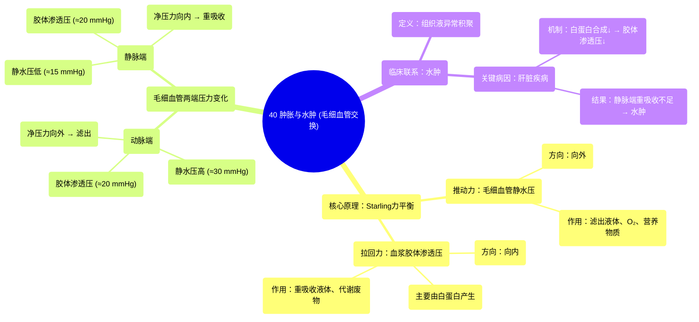

# 40 Swelling and Oedema (Capillary Exchange)

  <video controls preload="metadata" playsinline>
    <source src="https://helly.s3.bitiful.net/心血管学科/%E4%B8%93%E8%BE%91%2020%EF%BC%9A%E5%BF%83%E5%86%85%E7%A7%91%E7%BB%88%E6%9E%81%E8%BE%9E%E5%85%B8%E7%96%BE%E7%97%85%E6%9C%BA%E5%88%B6%E7%AF%87%20%28PathologyMechanisms%29/40%20Swelling%20and%20Oedema%20%28Capillary%20Exchange%29.mp4" type="video/mp4">
    
您的浏览器不支持播放，请升级。

  </video>

::: tip ⚡️ 核心考点 (30s速读)
*   **核心考点**：毛细血管交换的驱动力是“静水压”与“胶体渗透压”的平衡。动脉端以静水压（向外推）为主，促进物质滤出；静脉端以胶体渗透压（向内拉）为主，促进物质重吸收。
*   **临床意义**：当这种平衡被打破（如肝脏疾病导致白蛋白合成减少，胶体渗透压下降），会导致组织液回流障碍，引发**水肿**。
:::

## 🧠 深度精讲

*   **概念1：毛细血管交换的驱动力**
    毛细血管交换是血液与组织液之间进行物质交换的关键过程，主要受两种压力驱动：
    1.  **毛细血管静水压**：血液对血管壁产生的压力，方向向外，推动液体和溶质（如氧气、营养物质、离子）从血管内滤出到组织间隙。
    2.  **血浆胶体渗透压**：主要由血浆中的蛋白质（特别是白蛋白）产生。由于蛋白质分子大，不易透过毛细血管壁，因此在血管内形成一种“吸水”的力量，方向向内，将组织液中的水分拉回血管内。

*   **概念2：动脉端与静脉端的压力差**
    血液流经毛细血管床时，压力会发生显著变化，导致交换方向不同：
    *   **动脉端**：毛细血管静水压较高（约30 mmHg），大于血浆胶体渗透压（约20 mmHg），**净压力向外（约10 mmHg）**。因此，液体和营养物质在此处被**滤出**，滋养周围细胞。
    *   **静脉端**：由于血液流动和滤出，毛细血管静水压下降（约15 mmHg），此时血浆胶体渗透压（约20 mmHg）占优势，**净压力向内（约5 mmHg）**。因此，代谢废物（如二氧化碳）和多余的液体在此处被**重吸收**回血管。

*   **概念3：水肿的形成机制**
    当上述平衡被破坏，导致组织液生成多于回流时，就会发生水肿。视频中强调的一个关键临床例子是**肝脏疾病**：
    *   **肝脏合成白蛋白减少** → **血浆胶体渗透压下降** → 静脉端重吸收组织液的能力减弱。
    *   结果：虽然动脉端滤出正常，但静脉端回流不足，导致液体在组织间隙积聚，形成**水肿**。

## 📚 双语术语表 (Terminology)
| 英文术语 | 中文翻译 | 定义/解释 |
| :--- | :--- | :--- |
| Capillary Exchange | 毛细血管交换 | 血液与组织液在毛细血管水平进行的氧气、营养物质和代谢废物的交换过程。 |
| Hydrostatic Pressure | 静水压 | 液体对容器壁产生的压力。在毛细血管中指血液对血管壁的侧压力，推动液体滤出。 |
| Colloid Osmotic Pressure (Oncotic Pressure) | 胶体渗透压（血浆胶体渗透压） | 由血浆中蛋白质（主要是白蛋白）产生的渗透压，能将组织液中的水分拉回毛细血管内。 |
| Edema | 水肿 | 组织间隙或体腔内异常积聚过多液体。 |
| Albumin | 白蛋白 | 肝脏合成的一种血浆蛋白，是维持血浆胶体渗透压的最主要成分。 |
| Arterial End | 动脉端 | 毛细血管床中靠近小动脉的一端，静水压较高，以滤出为主。 |
| Venous End | 静脉端 | 毛细血管床中靠近小静脉的一端，静水压较低，以重吸收为主。 |
| Net Filtration Pressure | 净滤过压 | 决定毛细血管液体交换方向的净压力，等于（毛细血管静水压 - 组织液静水压） - （血浆胶体渗透压 - 组织液胶体渗透压）。视频中进行了简化讨论。 |

## 🗺️ 知识图谱

