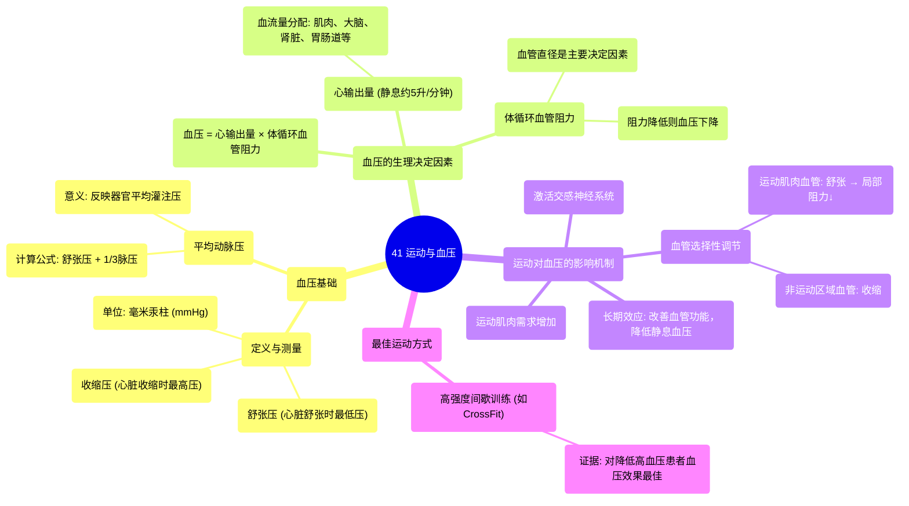

# 41 Exercise & Blood Pressure

  <video controls preload="metadata" playsinline>
    <source src="https://helly.s3.bitiful.net/心血管学科/%E4%B8%93%E8%BE%91%2020%EF%BC%9A%E5%BF%83%E5%86%85%E7%A7%91%E7%BB%88%E6%9E%81%E8%BE%9E%E5%85%B8%E7%96%BE%E7%97%85%E6%9C%BA%E5%88%B6%E7%AF%87%20%28PathologyMechanisms%29/41%20Exercise%20%26%20Blood%20Pressure.mp4" type="video/mp4">
    
您的浏览器不支持播放，请升级。

  </video>

::: tip ⚡️ 核心考点 (30s速读)
*   **核心考点**：高强度间歇训练（如CrossFit）对降低高血压患者血压效果最佳。血压是血液对动脉壁的压力，由收缩压（心脏收缩时）和舒张压（心脏舒张时）组成。
*   **临床意义**：理解血压的生理机制（心输出量与体循环血管阻力）有助于解释运动如何通过调节血管阻力（舒张肌肉血管）来降低血压，为高血压的非药物治疗提供依据。
:::

## 🧠 深度精讲
*   **血压的定义与测量**：血压是血液对动脉壁产生的压力，通常以毫米汞柱为单位测量。测量时获得两个数值：收缩压（高压，心脏收缩时动脉壁承受的最大压力）和舒张压（低压，心脏舒张时动脉壁回弹后的最低压力）。临床上常用120/80 mmHg作为参考平均值。
*   **平均动脉压**：由于血压在心动周期中波动，平均动脉压能更好地反映器官的灌注压力。其计算公式为：**平均动脉压 = 舒张压 + 1/3 × (收缩压 - 舒张压)**。例如，120/80 mmHg的平均动脉压约为93 mmHg。
*   **血压的生理决定因素**：血压由**心输出量**（心脏每分钟泵出的血量，约5升/分钟）和**体循环血管阻力**（血液流经全身血管时遇到的阻力）共同决定，公式为：**血压 = 心输出量 × 体循环血管阻力**。
*   **血流量分配**：静息时，心输出量按需分配给各器官：肌肉约20%（1升/分钟），大脑约15%，胃肠道约25%，肾脏约20%，心脏（冠状动脉）约5%，皮肤约5%。
*   **运动对血压的调节机制**：
    1.  **需求增加**：运动时肌肉收缩，耗氧量和能量需求上升，需要更多血液供应。
    2.  **神经调节**：肌肉感受器向大脑发送信号，激活**交感神经系统**（“战斗或逃跑”系统）。
    3.  **血管阻力变化**：交感神经系统发出指令，使非关键器官（如胃肠道）的血管**收缩**，同时使运动肌肉的血管**舒张**。
    4.  **血压影响**：运动肌肉血管舒张导致该区域的**体循环血管阻力下降**。根据血压公式，在运动初期心输出量大幅增加的主导下，血压会升高；但长期规律运动后，静息血压会因血管功能改善、阻力下降而降低。
*   **最佳运动方式**：视频指出，近期文献证据表明，**高强度间歇训练**（如CrossFit）在降低高血压患者血压方面效果最佳。

## 📚 双语术语表 (Terminology)
| 英文术语 | 中文翻译 | 定义/解释 |
| :--- | :--- | :--- |
| Blood Pressure | 血压 | 血液对动脉血管壁产生的侧压力。 |
| Systolic Pressure | 收缩压 | 心脏收缩射血时，动脉内的最高压力。 |
| Diastolic Pressure | 舒张压 | 心脏舒张时，动脉内的最低压力。 |
| Millimetres of Mercury (mmHg) | 毫米汞柱 | 血压的常用计量单位。 |
| Mean Arterial Pressure (MAP) | 平均动脉压 | 一个心动周期中动脉血压的平均值，反映器官灌注水平。 |
| Cardiac Output | 心输出量 | 一侧心室每分钟射出的血液总量。 |
| Systemic Vascular Resistance (SVR) | 体循环血管阻力 | 血液流经全身动脉血管时所遇到的外周总阻力。 |
| Sympathetic Nervous System | 交感神经系统 | 自主神经系统的一部分，负责调动身体资源应对压力或紧急情况（“战斗或逃跑”反应）。 |
| High-Intensity Interval Training (HIIT) | 高强度间歇训练 | 一种交替进行短时间高强度运动和短暂休息或低强度运动的训练方式。 |

## 🗺️ 知识图谱

